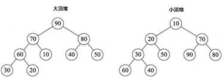
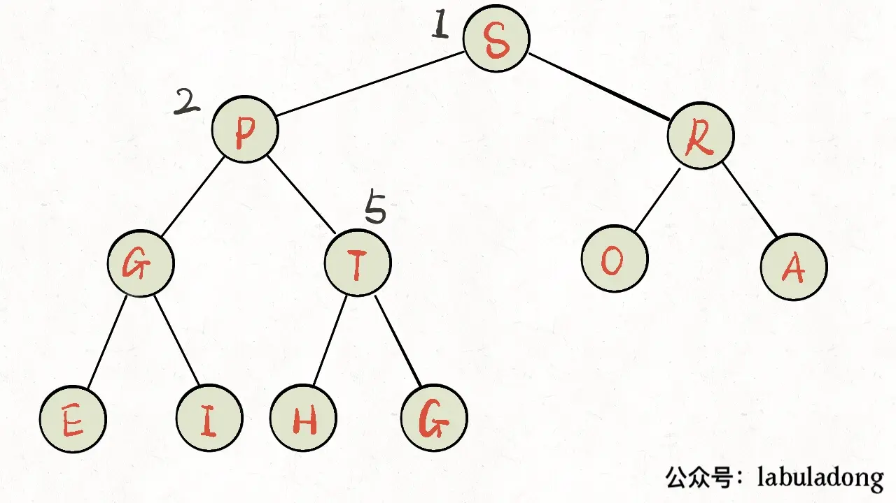
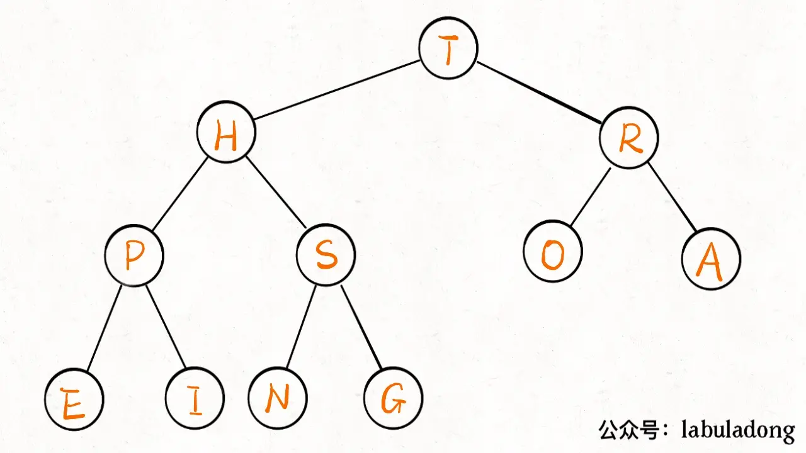

注：接下来的讨论和实现只针对大顶堆

完整代码地址：[优先队列](https://github.com/xiaoyangst/Code/tree/master/%E6%95%B0%E6%8D%AE%E7%BB%93%E6%9E%84/%E8%A7%A3%E5%86%B3TopK%E9%97%AE%E9%A2%98%E4%B9%8B%E4%BC%98%E5%85%88%E9%98%9F%E5%88%97/PriorityQueue)

# 实现支持大顶堆的优先队列

```c++
#include <vector>
#include <stdexcept>

template<typename T>
class PriorityQueue {
public:
    PriorityQueue() = default;

    void push(const T &element) {
        data_.push_back(element);
        siftUp(data_, data_.size(), data_.size() - 1);
    }

    void push(const T &&element) {
        data_.push_back(element);
        siftUp(data_, data_.size(), data_.size() - 1);
    }

    void pop() {
        if (data_.empty()) {
            throw std::runtime_error("top from empty queue");
        }
        // 把堆顶和堆底元素交换，再把堆底元素 pop 出去
        // 然后对 堆顶元素 siftDown，保证堆合理性
        std::swap(data_[0], data_[data_.size() - 1]);
        data_.pop_back();
        siftDown(data_, data_.size(), 0);
    }

    const T &top() {
        if (data_.empty()) {
            throw std::runtime_error("top from empty queue");
        }
        return data_[0];
    }

    bool empty() {
        return data_.empty();
    }

private:
    void siftDown(std::vector<T> &data, int len, int cur) {    // 刪除元素，需要下沉
        while (true) {
            // 判断当前节点 当前节点左节点 当前节点右节点 谁最大
            int max_index = cur;
            int left_index = getLeft(cur);
            int right_index = getRight(cur);
            if (left_index < len && data[max_index] < data[left_index]) {
                max_index = left_index;
            }
            if (right_index < len && data[max_index] < data[right_index]) {
                max_index = right_index;
            }
            // 此刻 max_index 指向 三个节点中的最大节点

            if (max_index != cur) { // 只要 max_index != cur，就表明 max_index 已经被更改，那就意味着 还有堆化的必要
                std::swap(data[max_index], data[cur]);
                cur = max_index;
            } else {
                break;
            }
        }
    }

    void siftUp(std::vector<T> &data, int len, int cur) {     //插入元素，需要上浮
        while (cur > 0) {
            int parent = getParent(cur);
            if (data[cur] <= data[parent]) break;
            std::swap(data[cur],data[parent]);
            cur = parent;
        }
    }

    int getLeft(int index) {
        return 2 * index + 1;
    }

    int getRight(int index) {
        return 2 * index + 2;
    }

    int getParent(int index) {
        return (index - 1) / 2;
    }

private:
    std::vector<T> data_;
};

```

## 上浮



添加元素 element 从尾部添加，这个时候堆的性质可能已经被打破，需要对这个节点进行 上浮 操作。

通过和父节点比较，如果 element 大于父节点，就要与之交换，然后继续上述操作。直到 element 小于等于父节点或者到达根节点而无法再上浮为止。

## 下沉



删除元素是删除堆顶元素，数组中本不支持删除第一个元素，就算支持也是非常耗时。

因此，删除行为是通过将堆顶元素和堆底元素交换达到删除的目的。交换之后，堆顶元素导致堆的性质打破，需要对这个节点进行下沉操作。

下沉操作，需要获取当前节点和当前节点的左右节点的最大值下标。如果最大值下班就是指向当前节点，那就满足堆的性质，无需继续下沉。如果不是的话，就把当前节点和最大节点进行交换，然后重复之前的操作，直到无需继续下沉为止。

# 优化：支持用户指定大顶堆或小顶堆

```c++
#include <vector>
#include <stdexcept>

template<typename T, typename Compare = std::less<T>>
class PriorityQueue {
public:
    PriorityQueue() = default;

    void push(const T &element) {
        data_.push_back(element);
        siftUp(data_, data_.size(), data_.size() - 1);
    }

    void push(T &&element) {
        data_.push_back(std::move(element));
        siftUp(data_, data_.size(), data_.size() - 1);
    }

    void pop() {
        if (data_.empty()) {
            throw std::runtime_error("pop from empty queue");
        }
        std::swap(data_[0], data_[data_.size() - 1]);
        data_.pop_back();
        if (!data_.empty()) {
            siftDown(data_, data_.size(), 0);
        }
    }

    const T &top() const {
        if (data_.empty()) {
            throw std::runtime_error("top from empty queue");
        }
        return data_[0];
    }

    [[nodiscard]] bool empty() const {
        return data_.empty();
    }

private:
    void siftDown(std::vector<T> &data, int len, int cur) {
        while (true) {
            int best_index = cur;
            int left_index = getLeft(cur);
            int right_index = getRight(cur);

            if (left_index < len && comp(data[best_index], data[left_index])) {
                best_index = left_index;
            }
            if (right_index < len && comp(data[best_index], data[right_index])) {
                best_index = right_index;
            }

            if (best_index != cur) {
                std::swap(data[best_index], data[cur]);
                cur = best_index;
            } else {
                break;
            }
        }
    }

    void siftUp(std::vector<T> &data, int len, int cur) {
        while (cur > 0) {
            int parent_index = getParent(cur);
            if (comp(data[parent_index], data[cur])) {
                std::swap(data[parent_index], data[cur]);
                cur = parent_index;
            } else {
                break;
            }
        }
    }

    [[nodiscard]] int getLeft(int index) const { return 2 * index + 1; }

    [[nodiscard]] int getRight(int index) const { return 2 * index + 2; }

    [[nodiscard]] int getParent(int index) const { return (index - 1) / 2; }

private:
    std::vector<T> data_;
    Compare comp;
};
```