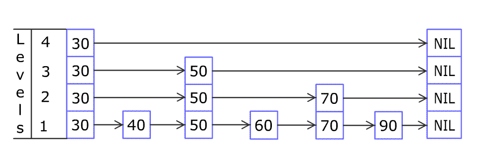

跳表是一种**概率型**数据结构，其平均操作复杂度为 O(log n)。它通过**多层链表**实现快速查找、插入和删除操作。

节点定义：

```c++
struct Node {
  int key_;
  int value_;
  int level_;
  Node **forward_;    // 存储该节点在不同层次上的后继节点的指针，即当前节点的下一个节点

  Node(int key, int value, int level) : key_(key), value_(value), level_(level) {
	  forward_ = new Node *[level + 1];	// 得 + 1 是因为 level 是从 0 开始的
	  for (int i = 0; i < level; ++i) {
		  forward_[i] = nullptr;
	  }
  }

  ~Node() {
	  delete[] forward_;
  }
};
```

示意图：


每个 Node 记录 key-value，还记录自己的 level（如果 level 是 4，就代表有 4 层都有该节点的记录，即 forward_ 数组的大小，如图中的元素 1）。

在一个就是最关键的 forward_，存储该节点在不同层次上的后继节点的指针。在链表操作中我们是通过 next 指针获取下一个节点，但是在跳表中不是。

跳表中 forward_[i] 记录着第 i 层的下一个节点（右侧方向）。至于下一层，由于是数组，有序访问即可（当前下标  + 1）。

完整的代码：[跳表](https://github.com/xiaoyangst/Code/tree/master/%E6%95%B0%E6%8D%AE%E7%BB%93%E6%9E%84/%E8%B7%B3%E8%A1%A8/SkipList)

# 查找

查找元素 16：


**逐层向下逼近目标值：**

- 从 **最高层（跨度最大）开始搜索**，先快速跳跃到 `key` **可能存在的区间**
- 一旦某个 `forward_[cur_level]` 指向的值 **大于等于 key**，说明已经越过了目标值，我们就**下降到下一层**继续搜索

**最低层（level 0）存储所有元素：**

- 在所有层级搜索完之后，`cur_node` 停留在 **最接近 key 但小于 key** 的位置
- 这时，`cur_node->forward_[0]` 可能正好是目标 `key`

```c++
  Node *search(int key) {
	  Node *cur_node = head_;
	  for (int cur_level = level_; cur_level >= 0; --cur_level) {    // 从跳表当前最高层开始查找
		  while (cur_node->forward_[cur_level] != nullptr
			  && cur_node->forward_[cur_level]->key_ < key) {
			  cur_node = cur_node->forward_[cur_level];
		  }
	  }
	  // 此时 cur_node 处在 跳表的最底层
	  cur_node = cur_node->forward_[0];
	  if (cur_node != nullptr && cur_node->key_ == key) {
		  return cur_node;
	  }
	  return nullptr;
  }
```

# 添加

添加元素 80：



forward_ 记录后驱节点，而代码中的局部 update 记录前驱节点，因为方便插入。

从最高层开始寻找，离开 while 循环，update 就会记录下 cur_node。

跳表中添加一个新节点，会随机得到一个 层数。如果大于当前跳表记录的当前层数，就得 更新 update，继续记录多出点层的前驱节点为 head_。

就可以开始在各层中插入了。

```c++
  void insert(int key, int value) {
	  Node *update[MAX_LEVEL + 1];    // 保存每层的前驱节点，方便插入

	  Node *cur_node = head_;
	  for (int cur_level = level_; cur_level >= 0; --cur_level) {    // 从跳表当前最高层开始查找
		  while (cur_node->forward_[cur_level] != nullptr
			  && cur_node->forward_[cur_level]->key_ < key) {
			  cur_node = cur_node->forward_[cur_level];
		  }
		  update[cur_level] = cur_node;
	  }
	  // 存在就更新
	  cur_node = cur_node->forward_[0];
	  if (cur_node != nullptr && cur_node->key_ == key) {
		  cur_node->value_ = value;
		  return;
	  }

	  // 开始插入
	  int new_level = randomLevel();
	  // 如果新层大于当前层，需要更新 update，记录新层的前驱节点为 head_
	  if (new_level > level_) {
		  for (int i = level_ + 1; i <= new_level; ++i) {
			  update[i] = head_;
		  }
		  level_ = new_level;
	  }

	  Node *new_node = new Node(key, value, new_level);

	  // 开始在完整保存前驱节点的 update 数组中插入新节点
	  for (int i = 0; i <= new_level; ++i) {
		  new_node->forward_[i] = update[i]->forward_[i];    // 同层中 新节点执行其前驱节点的下一个节点
		  update[i]->forward_[i] = new_node;    // 同层中 前驱节点的下一个节点指向新节点
	  }
  }
```


# 删除


同样，需要记录删除节点的前驱节点，通过 update 数组。

如果元素确实存在，就可以考虑删除。可能存在删除节点后，跳表层数减少的情况，记得调整跳表的 level。

```c++
  void remove(int key) {
	  Node *update[MAX_LEVEL + 1];    // 保存每层的前驱节点，方便插入

	  Node *cur_node = head_;
	  for (int cur_level = level_; cur_level >= 0; --cur_level) {    // 从跳表当前最高层开始查找
		  while (cur_node->forward_[cur_level] != nullptr
			  && cur_node->forward_[cur_level]->key_ < key) {
			  cur_node = cur_node->forward_[cur_level];
		  }
		  update[cur_level] = cur_node;
	  }
	  // 存在才考虑删除
	  cur_node = cur_node->forward_[0];
	  if (cur_node != nullptr && cur_node->key_ == key) {
		  for (int i = 0; i <= level_; ++i) {
			  if (update[i]->forward_[i] != cur_node) break;
			  update[i]->forward_[i] = cur_node->forward_[i];
		  }
		  delete cur_node;

		  // 调整跳表层数（可能存在删除节点后，跳表层数减少的情况）
		  while (level_ > 0 && head_->forward_[level_] == nullptr) {
			  level_--;
		  }
	  }
  }
```

