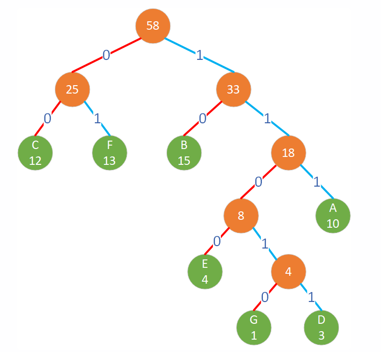
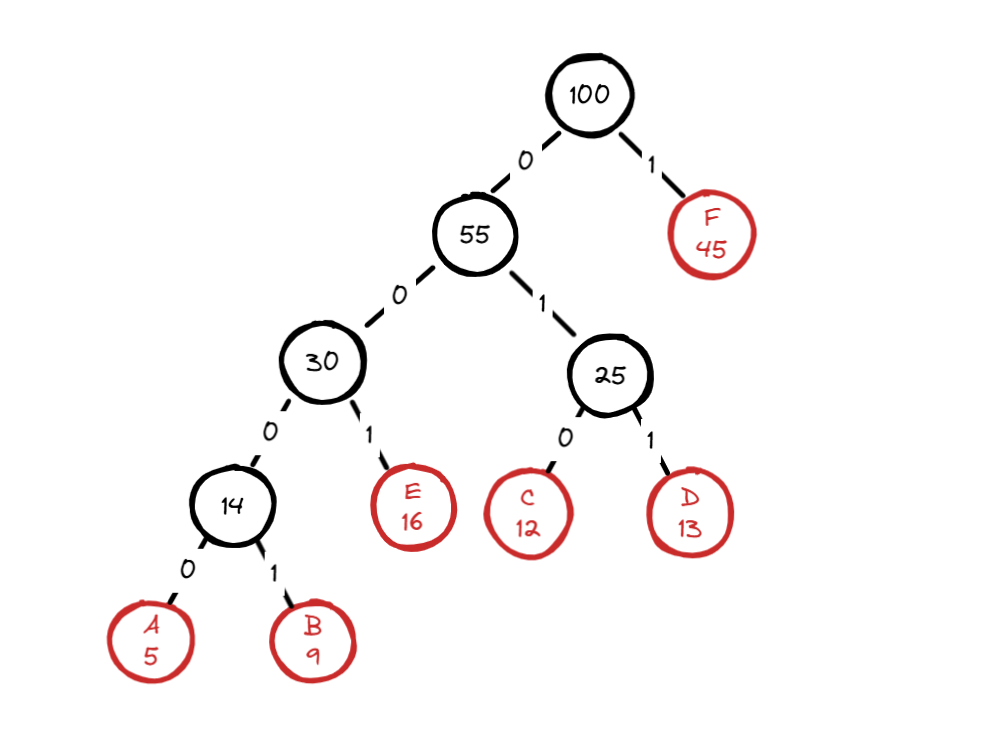

# 基础知识

霍夫曼编码是一种无损数据压缩算法。这个想法是为输入字符分配可变长度的代码，分配代码的长度基于相应字符的频率。

## 观察霍夫曼树



叶子节点存储字符和频率，非叶子节点子存储存储（是其两个子节点频率之和）。

左子树的路径上是 0，右子树上的路径是 1。

频率越高的字符，叶子节点越靠近根节点。

## 为什么采用前缀编码？

不会出现歧义，不需要额外的分隔符。

假设 bitstream 是 `0110111110`，按照前缀码的解码方式，我们从左到右匹配：

```
0 	 → 这是 A
1	 → 这是 C
0	 → 这是 A
111  → 这是 D
10   → 这是 B
```

所以 `0110111110` 只能解码为 `ACADB`，不会有歧义。

如果某个字符的编码是另一个字符编码的前缀（例如 `A = 0`，`B = 01`），那么当我们读取 `01` 时，我们无法确定它是 `A` 的 `0` 加上某个后续 bit，还是 `B` 的 `01`。

# 整个过程

## 统计字符串中字符及其频率

| 字符 | 频率 |
| ---- | ---- |
| A    | 5    |
| B    | 9    |
| C    | 12   |
| D    | 13   |
| E    | 16   |
| F    | 45   |

## 构建霍夫曼树

把如上信息加入到优先级队列中，按照频率从小到大排列：

```c++
(A,5) (B,9) (C,12) (D,13) (E,16) (F,45)
```

不断取两个最小的节点并进行合并为一个节点，直到不可再合并为止：

```
选取 (A,5) 和 (B,9)，合并为新节点 (A+B, 14)

选取 (C,12) 和 (D,13)，合并为新节点 (C+D, 25)

选取 (A+B,14) 和 (E,16)，合并为新节点 (A+B+E,30)

选取 (C+D,25) 和 (A+B+E,30)，合并为新节点 (A+B+C+D+E,55)

选取 (A+B+C+D+E,55) 和 (F,45)，合并为根节点 (A+B+C+D+E+F,100)
```

示意图如下：



## 编码和解码

| 字符 | 编码 |
| ---- | ---- |
| A    | 0000 |
| B    | 0001 |
| C    | 010  |
| D    | 011  |
| E    | 001  |
| F    | 1    |

由于字符太多，假定我们要编码字符串 `"ACFDEB"`，得到的编码结果为：0000 010 1 011 001 0001

解码就是它的逆向操作。

# 代码实现

完整代码：[霍夫曼树](https://github.com/xiaoyangst/Code/tree/master/%E6%95%B0%E6%8D%AE%E7%BB%93%E6%9E%84/%E6%95%B0%E6%8D%AE%E5%8E%8B%E7%BC%A9%E4%B9%8B%E9%9C%8D%E5%A4%AB%E6%9B%BC%E6%A0%91/Huffman)

## 节点定义

```c++
struct Node {
	char	data_;
	int	frequency_;
	Node	*left_;
	Node	*right_;

	Node( char data, int frequency ) : data_( data ), frequency_( frequency ), left_( nullptr ), right_( nullptr )
	{}


	bool operator<( const Node &right ) const /* 频率越低，越靠前 */
	{
		return(this->frequency_ > right.frequency_);
	}
};
```

## 构建霍夫曼树

```c++
void buildHuffman( const string &str )
{
	/* 统计词频 */
	std::unordered_map<char, int> wordFre;
	for ( char c : str )
	{
		wordFre[c]++;
	}
	/* 加入优先级队列 */
	priority_queue<Node *> NodeQue;
	for ( const auto &word : wordFre )
	{
		NodeQue.push( new Node( word.first, word.second ) );
	}
	/*
	 * 构建哈夫曼树
	 * 不断取出优先级队列中的两个节点，并创建一个节点记录两个节点的权值和，直到只剩下一个节点才终止
	 */
	while ( NodeQue.size() > 1 )
	{
		auto leftNode = NodeQue.top();
		NodeQue.pop();
		auto rightNode = NodeQue.top();
		NodeQue.pop();

		auto parent_node = new Node( '\0', leftNode->frequency_ + rightNode->frequency_ );
		parent_node->left_	= leftNode;
		parent_node->right_	= rightNode;
		NodeQue.push( parent_node );
	}
	root_ = NodeQue.top();
	NodeQue.pop();
}
```

## 生成哈夫曼表--方便后面编码操作

```c++
void generateCodes( Node *node, string code )
{
	if ( node == nullptr )
		return;
	if ( node->left_ == nullptr && node->right_ == nullptr ) /* 叶子节点，记录字符的编码 */
	{
		huffmanCodeTable_[node->data_] = code;
	}
	generateCodes( node->left_, code + "0" );
	generateCodes( node->right_, code + "1" );
}
```

## 编码

```c++
string encode( const string &text ) const               /* 把字符串编码 */
{
	string result;
	for ( char c : text )
	{
		result += huffmanCodeTable_.at( c );    /* at 确保能匹配到，否则报错 */
	}
	return(result);
}
```

有前面构建好的哈夫曼编码表，这里的编码操作就再简单不过了。

## 解码

```c++
string decode( const string &encodedString ) const      /* 解码--》字符串 */
{
	string	result;
	auto	cur_node = root_;

	for ( char c : encodedString )
	{
		if ( c == '0' )
		{
			cur_node = cur_node->left_;
		} else {
			cur_node = cur_node->right_;
		}

		if ( cur_node->left_ == nullptr && cur_node->right_ == nullptr )        /* 解析出一个字符 */
		{
			result		+= cur_node->data_;
			cur_node	= root_;                                        /* 回到根节点，因为任何字符串编码都是从根节点开始的 */
		}
	}
	return(result);
}
```

我们都知道，任何一个字符的对应的编码都是从根节点开始构建出来。

那么，我们只需要遍历字符串，0 就往左边走，1 就往右边走，当前节点成为叶子节点，那么这个节点的 data 就是解析出来的字符。

然后，把 cur_node 继续替换为 root_，再次重复上面的操作即可。

