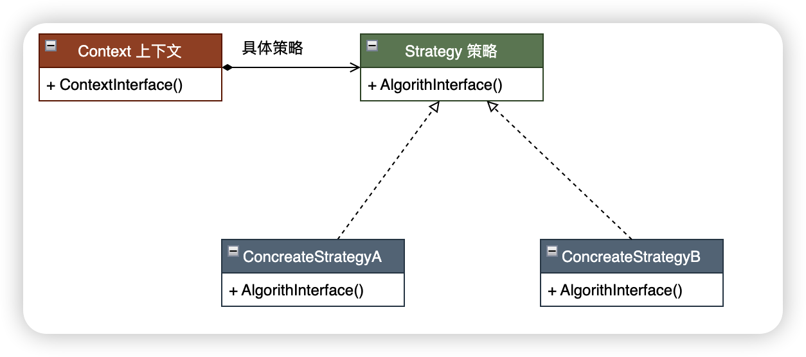
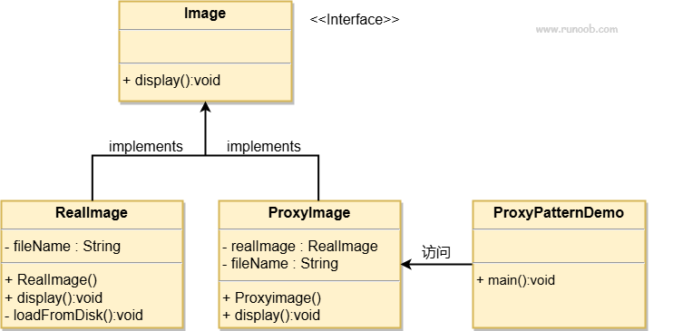
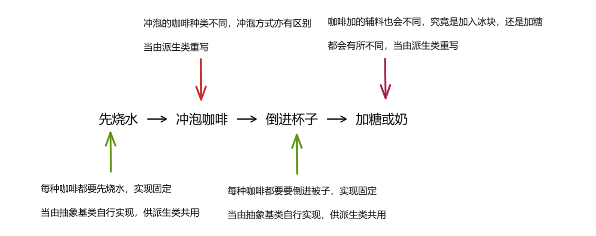
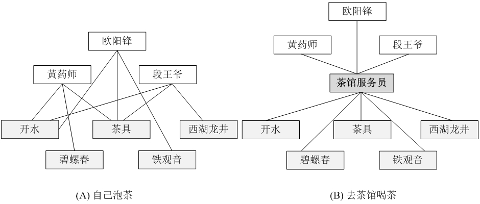
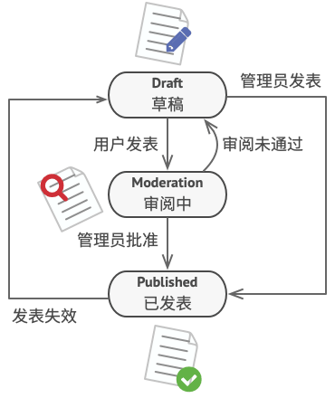
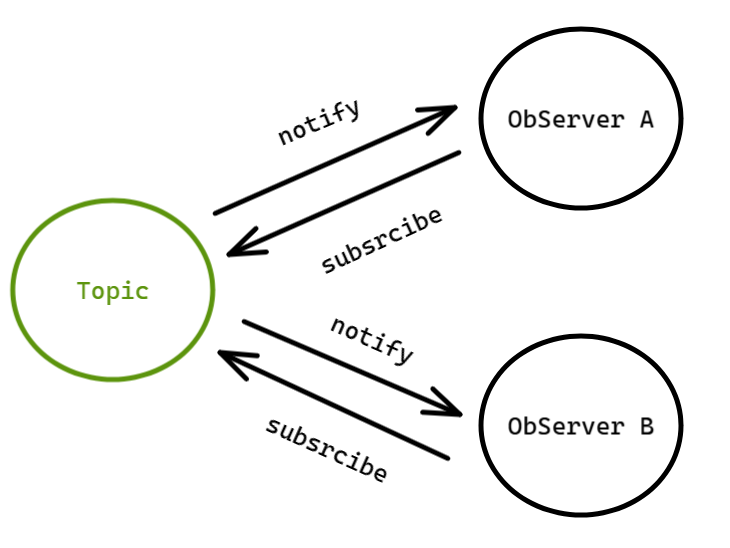
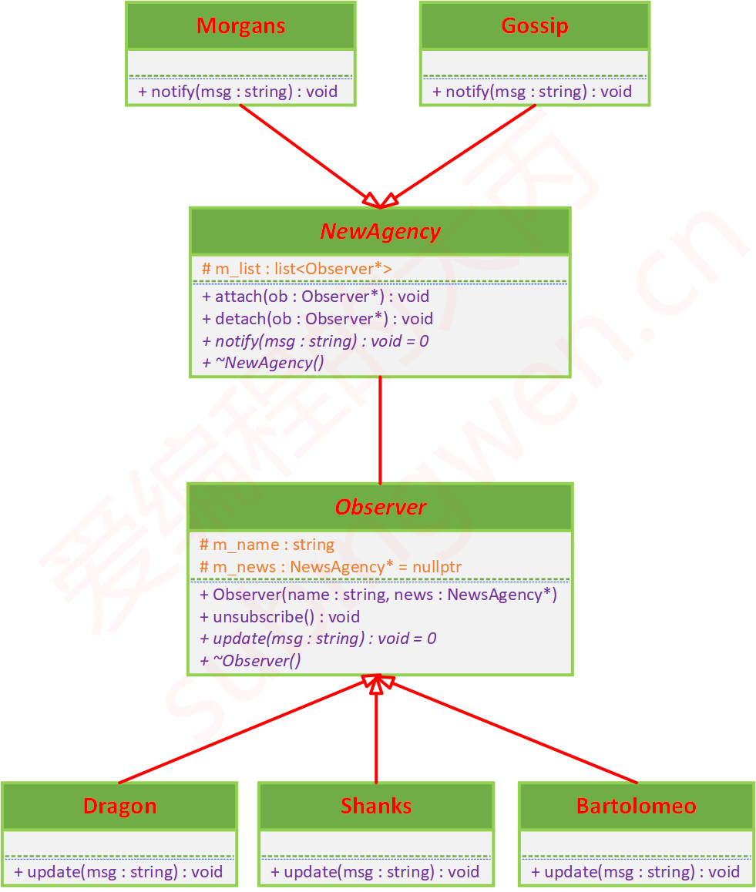
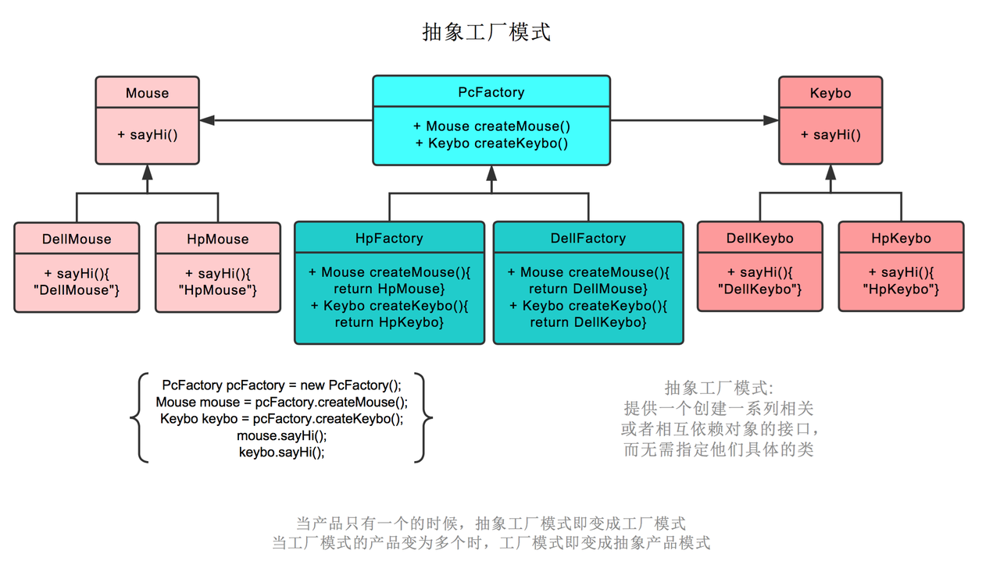
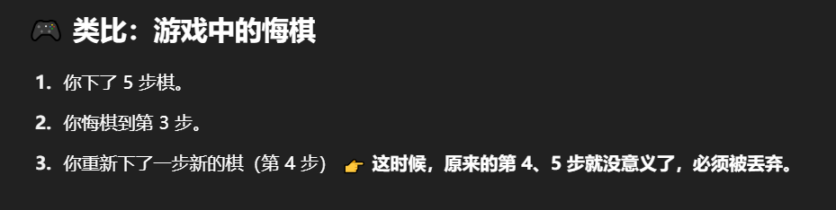

[TOC]


# 讲一讲策略模式

策略模式能让你定义一系列算法，并将每种算法分别封装起来，使它们**可以相互替换**。

就比方说我们要实现不同的排序算法，抽象基类的定义一个纯虚函数 Sort，那么不同派生类重写抽象基类的 Sort 方法来代表不同的排序算法。使用者只需要通过替换不同的算法对象就可以调用相同接口的情况下使用不同的排序算法。



# 讲一讲代理模式

代理对象允许你**通过创建一个代理对象来控制对另一个对象（即目标对象）的访问（代理对象和目标对象继承同一个基类）**。代理对象充当了目标对象的接口，客户端通过代理对象来间接访问目标对象，而不是直接访问。

代理模式还是很常见的，目标对象进行核心功能的实现，而不必关系那些细枝末节，而是把这些细枝末节交由代理对象完成，再由代理对象调用目标对象提供的接口。

比方说，目标对象提供 splitWord 的接口，但是它不会对即将分词的字符串进行预处理，而是假设字符串都是合乎规范的。此刻， 代理对象就起到作用了，代理对象实现 splitWord 的接口只需要完成两步骤：预处理字符串合符规范，调用目标对象的 splitWord 的接口。预处理字符串合符规范是对外界访问的一种控制，如果这个字符串不合法，代理可以选择拒绝访问实际提供服务的对象，或者选择将不合法的字符串进行修正再去访问实际提供服务者，这取决于个人的实现。可见，**代理模式不是在被代理的对象上新增功能，而是控制对被代理对象的访问**。

说到代理就容易想到 Nginx，用户发送的网络请求先通过 Nginx **一番处理**之后再把网络请求转发给后端服务器。至于一番处理究竟是什么完全看应用场景，可以拦截限制的用户，也可以选择负载均衡到相应的服务器。总的来讲，**代理模式就是在实际提供服务的一方设置一堵墙**，让实际提供服务者的访问得到限制。那么，不就把代理实现和底层功能实现给分离出来了吗？可以让不同的开发者开发各自的功能，且互不影响。



# 讲一讲模板方法模式

模板方法模式定义了一个算法的骨架，把某些步骤的具体实现推迟到子类中完成。骨架中的步骤，共用的方法可以由父类具体实现，其余的方法就由子类自行实现。

比如制作一杯咖啡：先烧水 --> 冲泡咖啡 --> 倒进杯子 --> 加糖或奶。

不管是制作一杯怎样的咖啡，上面的流程是固定的（模板），但是具体的细节可能有所变动：



# 讲一讲外观模式

**外观模式**为子系统中的一组接口提供一个**统一的高层接口**，使得子系统更容易使用。

我们在开发程序的时候，通常设计有日志系统，配置文件，连接池，网络服务。服务启动之初需要对这些模块进行初始化以及服务结束之后的回收操作。为了方便用户的使用，我们选择新建一个类，把这些模块的全部初始化操作放在一个简单的接口，回收操作放在一个简单接口中。使用者无需关心这些负责模块的创建和回收， 只需要调用已封装好的接口即可，非常方便。



**注**：不存在抽象基类和派生类重写的说法，是**一个**具体的类来把所有对象创建并把复杂的接口封装为一个简单接口

```c++
#include <iostream>

class DVDPlayer {
public:
    void on() { std::cout << "DVD Player ON\n"; }
    void play() { std::cout << "Playing movie...\n"; }
    void off() { std::cout << "DVD Player OFF\n"; }
};

class Projector {
public:
    void on() { std::cout << "Projector ON\n"; }
    void wideScreenMode() { std::cout << "Projector in widescreen mode\n"; }
    void off() { std::cout << "Projector OFF\n"; }
};

class Amplifier {
public:
    void on() { std::cout << "Amplifier ON\n"; }
    void setVolume(int level) { std::cout << "Volume set to " << level << "\n"; }
    void off() { std::cout << "Amplifier OFF\n"; }
};

class Lights {
public:
    void dim(int level) { std::cout << "Lights dimmed to " << level << "%\n"; }
};

// 没有抽象类，也没有重写等说法，只有一个纯粹的类
class HomeTheaterFacade {
private:    // 实例化全部功能的对象
    DVDPlayer* dvd;
    Projector* projector;
    Amplifier* amp;
    Lights* lights;

public:
    HomeTheaterFacade(DVDPlayer* d, Projector* p, Amplifier* a, Lights* l)
        : dvd(d), projector(p), amp(a), lights(l) {}

    void watchMovie() {
        std::cout << "--- Get ready to watch a movie ---\n";
        lights->dim(10);
        projector->on();
        projector->wideScreenMode();
        amp->on();
        amp->setVolume(5);
        dvd->on();
        dvd->play();
    }

    void endMovie() {
        std::cout << "--- Shutting down movie theater ---\n";
        dvd->off();
        amp->off();
        projector->off();
    }
};

int main() {
    DVDPlayer dvd;
    Projector projector;
    Amplifier amp;
    Lights lights;

    HomeTheaterFacade homeTheater(&dvd, &projector, &amp, &lights);
    homeTheater.watchMovie();
    std::cout << "\n";
    homeTheater.endMovie();
}
```

# 讲一讲状态模式

状态模式可以让物件在其内部状态有变化时，改为其行为。这种模式有点像有限状态机的概念。状态模式可以被当成一种策略模式，它能够在调用模式界面中所定义的方法来切换策略。

计算机编程中，状态模式用于，当同一物件基于其内部状态而有不同行为，将其行为进行封装。



# 讲一讲观察者模式

用于建立对象之间的**一对多依赖关系**，当一个对象状态发生改变时，其所有依赖者（观察者）都会自动收到通知并更新。

首先创建一个主题，以及多个观察者，这些观察者注册这个主题（相当于加入到主题中，主题记录这些观察者），等到主题更新消息的时候，这些消息就会逐一发给记录的观察者。当然，也是提供取消注册功能的，这样以后主题更新消息它也不会收到了。



所谓一对多，指的就是一个主题对应多个不同的观察者。

```c++
#include <iostream>
#include <vector>
#include <memory>

// 抽象观察者
class Observer {
public:
    virtual void update(const std::string& msg) = 0;
    virtual ~Observer() = default;
};

// 被观察者（主题）
class Subject {
private:
    std::vector<std::shared_ptr<Observer>> observers;

public:
    void attach(std::shared_ptr<Observer> obs) {
        observers.push_back(obs);
    }

    void notify(const std::string& msg) {
        for (auto& obs : observers) {
            obs->update(msg);
        }
    }
};

// 具体观察者 A
class EmailSubscriber : public Observer {
public:
    void update(const std::string& msg) override {
        std::cout << "[邮件] 收到通知：" << msg << "\n";
    }
};

// 具体观察者 B
class SMSSubscriber : public Observer {
public:
    void update(const std::string& msg) override {
        std::cout << "[短信] 收到通知：" << msg << "\n";
    }
};

// 使用
int main() {
    Subject topic;
    topic.attach(std::make_shared<EmailSubscriber>());
    topic.attach(std::make_shared<SMSSubscriber>());

    topic.notify("你关注的订单已发货！");
}
```

主题可以理解为数据的源头，而观察者是关心这些数据的实例，数据生成之后是转发给观察者集合，主题不与真正的用户见面，而是由观察者自行处理。比方说代码中接收到的消息，转发给不同的观察者（邮件观察者和短信观察者），即对应不同的服务平台（邮件平台和短信平台），对这些消息的加工处理就是观察者的事情，主题就不关心了。

可以看出，代码中只有一个具体的主题，并没有实现主题的抽象，来生成不同的主题。这并不难实现，只需要把主题抽象出一个基类即可，这依旧不影响观察者模式是一对多的模式，即一个主题管理多个观察者。



# 讲一讲工厂模式

## 简单工厂

简单工厂是一个具体的工厂和一个产品抽象类，通过用户传入的参数来通过工厂生成不同的实例对象：

```c++
#include <iostream>
#include <memory>
#include <string>

// 抽象产品
class Product {
public:
    virtual void use() = 0;
    virtual ~Product() = default;
};

// 具体产品A
class ProductA : public Product {
public:
    void use() override {
        std::cout << "使用产品 A\n";
    }
};

// 具体产品B
class ProductB : public Product {
public:
    void use() override {
        std::cout << "使用产品 B\n";
    }
};

// 工厂类
class SimpleFactory {
public:
    static std::shared_ptr<Product> createProduct(const std::string& type) {
        if (type == "A") {
            return std::make_shared<ProductA>();
        } else if (type == "B") {
            return std::make_shared<ProductB>();
        } else {
            return nullptr;
        }
    }
};

int main() {
    auto p1 = SimpleFactory::createProduct("A");
    auto p2 = SimpleFactory::createProduct("B");

    if (p1) p1->use();
    if (p2) p2->use();
}
```

## 工厂方法

简单工厂是一个具体的工厂和一个产品抽象类，而工厂方法是一个抽象的工厂和一个产品抽象类。

之前的简单工厂生产很杂，分工不明确，一个工厂可能既生产手机，也生产空调。

但是工厂方法把任务划分清楚，一个具体的工厂生产一个产品，因此工厂和产品都有抽象的基类。比如手机工厂生产小米手机，空调工厂生产小米空调。

```c++
#include <iostream>
#include <memory>

// 抽象产品
class Product {
public:
    virtual void use() = 0;
    virtual ~Product() = default;
};

// 具体产品 A
class ProductA : public Product {
public:
    void use() override {
        std::cout << "使用产品 A\n";
    }
};

// 具体产品 B
class ProductB : public Product {
public:
    void use() override {
        std::cout << "使用产品 B\n";
    }
};

// 抽象工厂
class Factory {
public:
    virtual std::shared_ptr<Product> createProduct() = 0;
    virtual ~Factory() = default;
};

// 具体工厂 A
class FactoryA : public Factory {
public:
    std::shared_ptr<Product> createProduct() override {
        return std::make_shared<ProductA>();
    }
};

// 具体工厂 B
class FactoryB : public Factory {
public:
    std::shared_ptr<Product> createProduct() override {
        return std::make_shared<ProductB>();
    }
};

int main() {
    std::unique_ptr<Factory> factoryA = std::make_unique<FactoryA>();
    auto productA = factoryA->createProduct();
    productA->use();

    std::unique_ptr<Factory> factoryB = std::make_unique<FactoryB>();
    auto productB = factoryB->createProduct();
    productB->use();
}
```

## 抽象工厂

抽象工厂是一个具体的工厂生产一系列的同类产品，因此工厂和产品都有抽象的基类。比如手机产品抽象基类对应小米手机和华为手机具体类，空调工厂抽象基类对应小米空调和华为空调具体类。工厂抽象基类对应小米工厂和华为工厂具体类，小米工厂生产小米手机和小米空调，华为工厂生产华为手机和华为空调。



注：如果一个工厂只生产一种产品，抽象工厂就退化为工厂方法。

# 讲一讲单例模式

- 希望整个系统中只有这一个类的实例
- 创建一个实例非常耗时，只希望创建一次

```c++
#include <iostream>
#include <mutex>

class Singleton {
private:
    Singleton() {
        std::cout << "构造 Singleton\n";
    }

    ~Singleton() = default;

    Singleton(const Singleton&) = delete;
    Singleton& operator=(const Singleton&) = delete;

public:
    static Singleton& getInstance() {
        static Singleton instance;  // C++11起线程安全
        return instance;
    }

    void doSomething() {
        std::cout << "调用 doSomething()\n";
    }
};

int main() {
    Singleton::getInstance().doSomething();
}
```

# 讲一讲访问者模式

作用于某对象结构中的各元素的操作。它使你可以在**不改变各元素的类的前提**下定义作用于这些元素的新操作。

访问者模式背后的思考本质还是，基础的元素数量一般不会随着程序迭代产生太大变化，而对这些基础元素的使用方式或组合使用会随着程序迭代不断更新，我们将变化更快的通过 Visitor 打包提取出来，自然会更利于维护。

```c++
#include <iostream>
#include <vector>

// 前向声明
class Book;
class Electronics;

// 访问者接口
class Visitor {
public:
    virtual void visit(Book& book) = 0;
    virtual void visit(Electronics& electronics) = 0;
    virtual ~Visitor() = default;
};

// 元素接口
class Element {
public:
    virtual void accept(Visitor& visitor) = 0;
    virtual ~Element() = default;
};

// 具体元素：书
class Book : public Element {
private:
    double price;
    std::string title;

public:
    Book(double p, std::string t) : price(p), title(std::move(t)) {}
    
    void accept(Visitor& visitor) override {
        visitor.visit(*this);
    }

    double getPrice() const { return price; }
    std::string getTitle() const { return title; }
};

// 具体元素：电子产品
class Electronics : public Element {
private:
    double price;
    std::string brand;

public:
    Electronics(double p, std::string b) : price(p), brand(std::move(b)) {}
    
    void accept(Visitor& visitor) override {
        visitor.visit(*this);
    }

    double getPrice() const { return price; }
    std::string getBrand() const { return brand; }
};

// 具体访问者：折扣计算器
class DiscountVisitor : public Visitor {
private:
    double totalDiscount;

public:
    DiscountVisitor() : totalDiscount(0.0) {}

    void visit(Book& book) override {
        // 书籍打8折
        double discount = book.getPrice() * 0.2;
        totalDiscount += discount;
        std::cout << "Book \"" << book.getTitle() << "\" discount: $" << discount << std::endl;
    }

    void visit(Electronics& electronics) override {
        // 电子产品打9折
        double discount = electronics.getPrice() * 0.1;
        totalDiscount += discount;
        std::cout << "Electronics \"" << electronics.getBrand() << "\" discount: $" << discount << std::endl;
    }

    double getTotalDiscount() const { return totalDiscount; }
};

// 对象结构：商店
class Store {
private:
    std::vector<Element*> items;

public:
    void addItem(Element* item) {
        items.push_back(item);
    }

    void accept(Visitor& visitor) {
        for (Element* item : items) {
            item->accept(visitor);
        }
    }

    ~Store() {
        for (Element* item : items) {
            delete item;
        }
    }
};

// 主函数
int main() {
    // 创建商店和商品
    Store store;
    store.addItem(new Book(50.0, "C++ Primer"));
    store.addItem(new Electronics(1000.0, "Laptop"));

    // 应用折扣访问者
    DiscountVisitor discountVisitor;
    store.accept(discountVisitor);

    // 输出总折扣
    std::cout << "Total discount: $" << discountVisitor.getTotalDiscount() << std::endl;

    return 0;
}
```

不管是基础元素，还是访问者都不可能只有一个，我们将基础的元素抽象出一个基类，而访问者也要抽象出一个基类。

我们设想这样一个场景，商店里面有很多商品（如果后续有新商品，只需要继承基础元素抽象基类就可以），但是这些商品在不同的节假日价格有所不同，甚至在超市营业额不同的情况下也不同，可见对这些商品以怎样的价格处理是不固定的。

因此，我们可以设计多个具体的访问者（如果后续有新的处理方式，只需要继承访问者抽象基类就可以）来应对这种情况。不同时间和营业额的情况下可以在不用管之前的设计的情况下，对基础元素进行当下的设计就可以。

比方说，母亲节的时候对已有商品（部分商品也可以，得自行设计）进行特价处理，每件商品打八折；儿童节的时候，对已有商品进行特价处理，每件商品打七折。这两个不同节日对商品的操作的是独立的，这对设计者是相当友好的。

但是，我们**选择访问者模式，基础元素应该一开始就固定（尽管随时可以添加），而访问者是可以随意添加和删除**。如果你每次对基础元素有增加或删除，那么已有的具体的访问者都得改动代码，这是相当恶心的，导致设计模式的意图削减。如果你只是添加或删除访问者，只需要单独创建一个文件去处理就可以，不会影响之前的访问者的代码，而且符合访问者模式本来就要解决的问题，即具体的访问者会根据场景而改变，只是这里的改变是新增一个具体的访问者，而不是改动之前的具体访问者代码。

# 讲一讲备忘录模式

用于在不破坏封装性的前提下，捕获并保存一个对象的内部状态，以便在需要时恢复到该状态。它常用于实现“撤销”功能或保存对象的快照。

```c++
#include <iostream>
#include <string>
#include <stack>
using namespace std;

// Memento：备忘录类，保存编辑器状态
class Memento {
private:
    string state; // 文本内容
public:
    Memento(const string& s) : state(s) {}
    string GetState() const { return state; }
};

// Originator：文本编辑器
class TextEditor {
private:
    string content; // 当前文本内容
public:
    void Type(const string& words) {
        content += words; // 输入内容
    }

    string GetContent() const {
        return content; // 获取当前内容
    }

    Memento Save() const {
        return Memento(content); // 创建快照
    }

    void Restore(const Memento& memento) {
        content = memento.GetState(); // 从快照恢复
    }
};

// Caretaker：撤销/重做管理器
class UndoManager {
private:
    stack<Memento> undoStack; // 撤销历史
    stack<Memento> redoStack; // 重做历史
public:
    // 保存当前状态到撤销栈，清空重做栈
    void SaveState(const Memento& m) {
        undoStack.push(m);
        while (!redoStack.empty()) redoStack.pop(); // 清除 redo 记录
    }

    // 执行撤销操作
    Memento Undo(const Memento& currentState) {
        if (undoStack.empty()) throw runtime_error("无法撤销");
        redoStack.push(currentState);         // 当前状态入 redo 栈
        Memento m = undoStack.top();          // 取出上一状态
        undoStack.pop();
        return m;
    }

    // 执行重做操作
    Memento Redo(const Memento& currentState) {
        if (redoStack.empty()) throw runtime_error("无法重做");
        undoStack.push(currentState);         // 当前状态入 undo 栈
        Memento m = redoStack.top();          // 取出 redo 状态
        redoStack.pop();
        return m;
    }

    bool CanUndo() const { return !undoStack.empty(); }
    bool CanRedo() const { return !redoStack.empty(); }
};

int main() {
    TextEditor editor;
    UndoManager undoManager;

    // 第一次输入并保存
    editor.Type("Hello");
    undoManager.SaveState(editor.Save());

    // 第二次输入并保存
    editor.Type(", world");
    undoManager.SaveState(editor.Save());

    // 第三次输入并保存
    editor.Type("!");
    undoManager.SaveState(editor.Save());

    // 当前内容
    cout << "当前内容: " << editor.GetContent() << endl;

    // 撤销1次
    if (undoManager.CanUndo()) {
        editor.Restore(undoManager.Undo(editor.Save()));
        cout << "撤销1次后: " << editor.GetContent() << endl;
    }

    // 撤销2次
    if (undoManager.CanUndo()) {
        editor.Restore(undoManager.Undo(editor.Save()));
        cout << "撤销2次后: " << editor.GetContent() << endl;
    }

    // 重做1次
    if (undoManager.CanRedo()) {
        editor.Restore(undoManager.Redo(editor.Save()));
        cout << "重做1次后: " << editor.GetContent() << endl;
    }

    return 0;
}
```

对下面这部分的代码的理解：为什么保存新状态要清空 redo 栈？

```c++
void SaveState(const Memento& m) {
    undoStack.push(m);
    while (!redoStack.empty()) redoStack.pop(); // 清除 redo 记录
}
```

因为 redo 的前提是你还没有进行“新的操作”，只是撤销了旧的操作，可以重做它。 但一旦你在撤销之后进行了新的操作，就像重新走了一条路线，**历史分支已经断开了**，**之前的 redo 路径就不成立了**。



# 讲一讲迭代器模式

提供一种方法顺序访问聚合对象中的各个元素，而又不暴露该对象的内部结构。

也许你想到 C++ 迭代器，由于 C++ 已经实现更丰富的迭代器，并且支持用户自定义内部元素的排序，重载运算符等。

下面就看看迭代器模式，C++ 实际开发用 STL 中的迭代器岂不美哉，除非你自己实现了一个数据结构。

```c++
#include <iostream>
#include <vector>
#include <memory>

// 前向声明
template <typename T> class ConcreteAggregate;

// 迭代器接口
template <typename T>
class Iterator {
public:
    virtual ~Iterator() = default;
    virtual bool hasNext() const = 0;
    virtual T next() = 0;
};

// 具体迭代器
template <typename T>
class ConcreteIterator : public Iterator<T> {
private:
    const std::vector<T>& collection;
    size_t position = 0;

public:
    explicit ConcreteIterator(const std::vector<T>& coll) : collection(coll) {}

    bool hasNext() const override {
        return position < collection.size();
    }

    T next() override {
        if (!hasNext()) {
            throw std::out_of_range("No more elements");
        }
        return collection[position++];
    }
};

// 聚合接口
template <typename T>
class Aggregate {
public:
    virtual ~Aggregate() = default;
    virtual std::unique_ptr<Iterator<T>> createIterator() const = 0;
};

// 具体聚合
template <typename T>
class ConcreteAggregate : public Aggregate<T> {
private:
    std::vector<T> items;

public:
    void addItem(const T& item) {
        items.push_back(item);
    }

    std::unique_ptr<Iterator<T>> createIterator() const override {
        return std::make_unique<ConcreteIterator<T>>(items);
    }
};

int main() {
    // 创建聚合对象
    auto aggregate = std::make_unique<ConcreteAggregate<int>>();
    aggregate->addItem(1);
    aggregate->addItem(2);
    aggregate->addItem(3);

    // 创建迭代器并遍历
    auto iterator = aggregate->createIterator();
    std::cout << "Items: ";
    while (iterator->hasNext()) {
        std::cout << iterator->next() << " ";
    }
    std::cout << std::endl;

    return 0;
}    
```

抽象聚合定义了一个接口，用来创建“迭代器对象”。

作用是提供一个**统一的方式**让客户端从容器中获取迭代器，而不用知道这个容器的具体实现（比如是 BookShelf、ArrayList、LinkedList 等）。

# 讲一讲命令模式

将 “请求” 封装为一个对象，使得发送请求的对象（调用者）和执行请求的对象（接收者）解耦。通过这种封装，可以灵活地参数化、队列化、记录请求，甚至支持撤销操作。

```c++
#include <iostream>

// 接收者类（Receiver）
class Light {
public:
    void on() {
        std::cout << "The light is ON\n";
    }

    void off() {
        std::cout << "The light is OFF\n";
    }
};

// 抽象命令类（Command）
class Command {
public:
    virtual void execute() = 0;
    virtual ~Command() {}
};

// 具体命令类：打开灯（ConcreteCommand）
class LightOnCommand : public Command {
private:
    Light* light;
public:
    LightOnCommand(Light* l) : light(l) {}
    void execute() override {
        light->on();
    }
};

// 具体命令类：关闭灯（ConcreteCommand）
class LightOffCommand : public Command {
private:
    Light* light;
public:
    LightOffCommand(Light* l) : light(l) {}
    void execute() override {
        light->off();
    }
};

// 请求者类（Invoker）
class RemoteControl {
private:
    Command* command;
public:
    void setCommand(Command* c) {
        command = c;
    }

    void pressButton() {
        if (command) {
            command->execute();
        }
    }
};

// 客户端代码（Client）
int main() {
    Light livingRoomLight;

    LightOnCommand lightOn(&livingRoomLight);
    LightOffCommand lightOff(&livingRoomLight);

    RemoteControl remote;

    // 打开灯
    remote.setCommand(&lightOn);
    remote.pressButton();

    // 关闭灯
    remote.setCommand(&lightOff);
    remote.pressButton();

    return 0;
}
```


# 讲一讲责任链模式

使多个对象都有机会处理请求，从而避免请求的发送者和接收者之间的耦合关系。将这些对象连成一条链，并沿着这条链传递该请求，**直到有一个对象处理它为止**。

```c++
#include <iostream>
#include <memory>

// 抽象处理者
class Handler {
protected:
    std::shared_ptr<Handler> next;	// 存储下一个链的对象，如果当前不能处理，就传递给它处理

public:
    void setNext(std::shared_ptr<Handler> nextHandler) {
        next = nextHandler;
    }

    virtual void handleRequest(int request) = 0;
    virtual ~Handler() = default;
};

// 具体处理者1
class LowHandler : public Handler {
public:
    void handleRequest(int request) override {
        if (request < 10) {
            std::cout << "LowHandler handled request: " << request << std::endl;
        } else if (next) {
            next->handleRequest(request);
        }
    }
};

// 具体处理者2
class MediumHandler : public Handler {
public:
    void handleRequest(int request) override {
        if (request >= 10 && request < 100) {
            std::cout << "MediumHandler handled request: " << request << std::endl;
        } else if (next) {
            next->handleRequest(request);
        }
    }
};

// 具体处理者3
class HighHandler : public Handler {
public:
    void handleRequest(int request) override {
        if (request >= 100) {
            std::cout << "HighHandler handled request: " << request << std::endl;
        } else if (next) {
            next->handleRequest(request);
        }
    }
};

int main() {
    auto low = std::make_shared<LowHandler>();
    auto medium = std::make_shared<MediumHandler>();
    auto high = std::make_shared<HighHandler>();

    low->setNext(medium);
    medium->setNext(high);

    // 客户端代码只需要知道链头
    int requests[] = {5, 20, 150};

    for (int req : requests) {
        low->handleRequest(req);
    }

    return 0;
}
```

职责链模式不保证每个中间件都有机会处理请求，因为中间件顺序的问题，后面中间件可能被前面的中间件阻断，因此当中间件之间存在不信任关系时，职责链模式并不能保证中间件调用的可靠性。

另外就是不要扩大设计模式的使用范围，对一堆对象的连续调用就没必要使用职责链模式，因为职责链适合处理对象数量不确定、是否处理请求由每个对象灵活决定的场景，而确定了对象数量以及是否调用的场景，就没必要使用职责链模式了。

# 讲一讲享元模式

通过共享相同的对象，避免重复创建**相同内容但不同引用**的实例，节省内存。

它特别适用于需要创建大量**相似对象**的场景，比如：文字处理器中的字符、游戏中的地图元素等。

具有大量内部状态，且不随着客户端的不同而改变。具有少量外部状态，甚至没有外部状态。可以选择享元模式，内部状态进行共享存储，外部状态进行单独存储。

```c++
#include <iostream>
#include <string>
#include <unordered_map>
#include <vector>
#include <memory>

// ------------------------
// 享元类：树的共享部分
// ------------------------
class TreeType {
private:
    std::string name;       // 树种类
    std::string color;      // 树颜色
    std::string texture;    // 树纹理

public:
    TreeType(const std::string& name, const std::string& color, const std::string& texture)
        : name(name), color(color), texture(texture) {}

    void display(int x, int y) const {
        std::cout << "Drawing tree [" << name << ", " << color << "] at (" << x << ", " << y << ")\n";
    }
};

// ------------------------
// 享元工厂：创建 / 缓存 TreeType
// ------------------------
class TreeFactory {
private:
    std::unordered_map<std::string, std::shared_ptr<TreeType>> types;

    std::string getKey(const std::string& name, const std::string& color, const std::string& texture) {
        return name + "_" + color + "_" + texture;
    }

public:
    std::shared_ptr<TreeType> getTreeType(const std::string& name, const std::string& color, const std::string& texture) {
        std::string key = getKey(name, color, texture);
        if (types.find(key) == types.end()) {
            types[key] = std::make_shared<TreeType>(name, color, texture);
        }
        return types[key];
    }
};

// ------------------------
// 非共享类：包含外部状态
// ------------------------
class Tree {
private:
    int x, y; // 外部状态：位置
    std::shared_ptr<TreeType> type; // 共享部分

public:
    Tree(int x, int y, std::shared_ptr<TreeType> type) : x(x), y(y), type(type) {}

    void display() const {
        type->display(x, y); // 共享对象负责绘图，位置由外部传入
    }
};

// ------------------------
// 客户端代码
// ------------------------
int main() {
    TreeFactory factory;

    std::vector<Tree> forest;

    // 在地图上种一些树（不同位置，共享类型）
    forest.emplace_back(10, 20, factory.getTreeType("Oak", "Green", "Rough"));	// 和下一个对象 TreeType 是同一个，只有 Tree 外部成员是不同的
    forest.emplace_back(15, 25, factory.getTreeType("Oak", "Green", "Rough"));
    forest.emplace_back(50, 80, factory.getTreeType("Pine", "DarkGreen", "Smooth")); // 和下一个对象 TreeType 是同一个，只有 Tree 外部成员是不同的
    forest.emplace_back(70, 30, factory.getTreeType("Pine", "DarkGreen", "Smooth"));

    // 显示所有树
    for (const auto& tree : forest) {
        tree.display();
    }

    return 0;
}
```

这个例子完美体现了享元模式的两部分状态：

- **共享部分（TreeType）** 由工厂统一管理，节省内存。
- **非共享部分（坐标）** 由客户端自己维护。

# 讲一讲装饰模式

装饰模式也可以称之为封装模式，所谓的封装就是在原有行为之上进行拓展，并不会改变该行为。

这就特别容易和代理模式弄混，两者的区别在于代理模式控制对对象的访问，装饰模式扩展对象的功能：

- 装饰模式的目的是：动态地为对象添加额外功能，不改变其接口。强调的是“增强功能”。
- 代理模式的目的是：为另一个对象提供一个替代或占位符，以控制对它的访问。强调的是“控制访问”。

```c++
#include <iostream>
#include <memory>

// 抽象组件
class Component {
public:
    virtual void draw() = 0;
    virtual ~Component() = default;
};

// 具体组件
class TextView : public Component {
public:
    void draw() override {
        std::cout << "Drawing TextView";
    }
};

// 装饰器基类
class Decorator : public Component {
protected:
    std::shared_ptr<Component> component;
public:
    Decorator(std::shared_ptr<Component> comp) : component(std::move(comp)) {}
};

// 具体装饰器1：添加边框
class BorderDecorator : public Decorator {
public:
    BorderDecorator(std::shared_ptr<Component> comp) : Decorator(std::move(comp)) {}

    void draw() override {
        component->draw();
        std::cout << " with Border";
    }
};

// 具体装饰器2：添加滚动条
class ScrollDecorator : public Decorator {
public:
    ScrollDecorator(std::shared_ptr<Component> comp) : Decorator(std::move(comp)) {}

    void draw() override {
        component->draw();
        std::cout << " with Scroll";
    }
};

// 示例用法
int main() {
    std::shared_ptr<Component> textView = std::make_shared<TextView>();	// 基础功能
    // 基于基础功能添加两个额外功能
    // 每新增一个功能就会返回一个对象，把这个新对象继续传递才可以把之前添加的功能保留，然后继续往下添加新功能
    std::shared_ptr<Component> borderedTextView = std::make_shared<BorderDecorator>(textView);
    std::shared_ptr<Component> fullyDecorated = std::make_shared<ScrollDecorator>(borderedTextView);

    fullyDecorated->draw();  // 输出: Drawing TextView with Border with Scroll
    return 0;
}
```


# 讲一讲桥接模式


# 讲一讲组合模式


# 讲一讲解释器模式


# 讲一讲中介者模式


# 讲一讲适配器模式

用于将一个类的接口转换成客户期望的另一个接口，从而使原本不兼容的类可以协同工作。

它就像电源适配器：你买的电器是英式插头，但你家是国标插座，适配器就帮你“转换”了接口。

注意：也仅仅能解决接口不一致的问题，而不能解决功能不一致的问题。

```c++
#include <iostream>
#include <memory>
#include <string>

// 新系统的日志接口
class Logger {
public:
    virtual void log(const std::string& message) = 0;
    virtual ~Logger() = default;
};

// 老日志系统，不能直接用
class LegacyLogger {
public:
    void writeToLogFile(const std::string& msg) {
        std::cout << "[LegacyLog] " << msg << std::endl;
    }
};

// 适配器：把 LegacyLogger 适配成 Logger 接口
class LegacyLoggerAdapter : public Logger {
private:
    std::shared_ptr<LegacyLogger> legacyLogger;

public:
    explicit LegacyLoggerAdapter(std::shared_ptr<LegacyLogger> legacy)
        : legacyLogger(std::move(legacy)) {}

    void log(const std::string& message) override {
        // 实际的适配调用
        legacyLogger->writeToLogFile("[Adapter] " + message);
    }
};

// 客户端代码：只依赖 Logger 接口，不关心底层实现
void applicationLog(std::shared_ptr<Logger> logger) {
    logger->log("系统启动成功");
    logger->log("用户登录：张三");
}

int main() {
    // 使用老版本日志通过适配器“伪装成”新接口
    auto legacy = std::make_shared<LegacyLogger>();
    std::shared_ptr<Logger> logger = std::make_shared<LegacyLoggerAdapter>(legacy);

    applicationLog(logger);

    return 0;
}
```

与其他容易混淆的设计模式的区别：**适配器关注的是“接口不兼容”问题；装饰器关注的是“功能扩展”；桥接关注“抽象解耦”；外观关注“接口简化”；代理关注“访问控制”**。

# 讲一讲原型模式

通过“复制”一个已经存在的对象（原型），来创建新的对象，而不是通过 `new` 关键字来构造。

什么时候考虑使用？

- 创建对象成本高（比如数据库读取、大对象初始化）。
- 希望避免使用繁杂的构造过程。
- 需要多个相似对象，但又不能共享引用。

```c++
#include <iostream>
#include <string>
#include <memory>

// 抽象原型类
class Monster {
public:
    virtual std::unique_ptr<Monster> clone() const = 0;
    virtual void display() const = 0;
    virtual ~Monster() {}
};

// 具体原型类
class Goblin : public Monster {
public:
    Goblin(std::string name, int hp) : name(name), health(hp) {}

    // 实现克隆
    std::unique_ptr<Monster> clone() const override {
        return std::make_unique<Goblin>(*this); // 拷贝构造
    }

    void display() const override {
        std::cout << "Goblin [" << name << "] with HP: " << health << std::endl;
    }

private:
    std::string name;
    int health;
};

// 客户端代码
int main() {
    // 创建原型
    std::unique_ptr<Monster> prototype = std::make_unique<Goblin>("Gob", 100);

    // 克隆多个怪物
    auto clone1 = prototype->clone();
    auto clone2 = prototype->clone();

    clone1->display();
    clone2->display();

    return 0;
}

```

既然本质是调用拷贝构造，C++ 何须这个模式？其他语言可能需要，比方说 Java。

# 讲一讲建造者模式

**一步一步构建一个复杂对象**，而不是一次性构造完成。

```c++
#include <iostream>
#include <string>

// --------------------- Product ---------------------
class Computer {
public:
    std::string cpu;
    std::string ram;
    std::string disk;

    void show() const {
        std::cout << "电脑配置：CPU=" << cpu
                  << ", 内存=" << ram
                  << ", 硬盘=" << disk << std::endl;
    }
};

// --------------------- Builder Interface ---------------------
class Builder {
public:
    virtual void buildCPU() = 0;
    virtual void buildRAM() = 0;
    virtual void buildDisk() = 0;
    virtual Computer getResult() = 0;
    virtual ~Builder() = default;
};

// --------------------- Concrete Builder ---------------------
class GamingPCBuilder : public Builder {
private:
    Computer pc;

public:
    void buildCPU() override {
        pc.cpu = "Intel i9";
    }

    void buildRAM() override {
        pc.ram = "32GB DDR5";
    }

    void buildDisk() override {
        pc.disk = "1TB NVMe SSD";
    }

    Computer getResult() override {
        return pc;
    }
};

// --------------------- Director ---------------------
class Director {
public:
    void construct(Builder& builder) {
        builder.buildCPU();
        builder.buildRAM();
        builder.buildDisk();
    }
};

// --------------------- Client ---------------------
int main() {
    GamingPCBuilder builder;
    Director director;

    director.construct(builder); // 控制构建流程

    Computer myPC = builder.getResult();
    myPC.show();

    return 0;
}
```

所谓构建与表示分离，就是指一个对象 `Person` 并不是简单的 `new Person()` 就可以实例化出来的，如果可以，那就是构建与表示一体。所谓构建与表示分离，就是指 `Person` 只能描述，而不能通过 `new Person()` 实例化，将实例化工作通过 Builder 实现，这样同样一个构建过程可以创建不同的 `Person` 实例。

你这样去理解，有个对象的成员变量是指针对象或引用对象，且需要由外部去构建并且加入到这个对象中，才能把这个对象构造完成，并不是单纯的 new 这个对象就可以。

况且，我们可以创建不同的构造器，来实例化出不同的对象，因为这个对象的成员变量（同样是要去实例化的对象）可能会通过传递不同的参数而不同。

# 拓展：模板方法引出的钩子函数

**钩子函数**是**在模板方法中调用的“可选”方法**，它们通常：

- 在基类中提供一个**空实现**或默认实现
- 子类**可以选择**是否重写它
- 不会影响算法的主流程，但可以“插入”定制行为

```c++
#include <iostream>

class CaffeineBeverageWithHook {
public:
    void prepareRecipe() {
        boilWater();
        brew();
        pourInCup();
        if (customerWantsCondiments()) {  // 钩子函数控制流程
            addCondiments();
        }
    }

    virtual ~CaffeineBeverageWithHook() = default;

protected:
    void boilWater() {
        std::cout << "Boiling water\n";
    }

    void pourInCup() {
        std::cout << "Pouring into cup\n";
    }

    virtual void brew() = 0;
    virtual void addCondiments() = 0;

    // 钩子：默认返回 true，可由子类覆盖
    virtual bool customerWantsCondiments() {
        return true;
    }
};

class TeaWithHook : public CaffeineBeverageWithHook {
protected:
    void brew() override {
        std::cout << "Steeping the tea\n";
    }

    void addCondiments() override {
        std::cout << "Adding Lemon\n";
    }

    bool customerWantsCondiments() override {
        char answer;
        std::cout << "Would you like lemon with your tea (y/n)? ";
        std::cin >> answer;
        return answer == 'y' || answer == 'Y';
    }
};

int main() {
    TeaWithHook tea;
    tea.prepareRecipe();
    return 0;
}
```

# 拓展：观察者模式+状态模式配合

# 拓展：观察者模式和发布订阅模式的区别