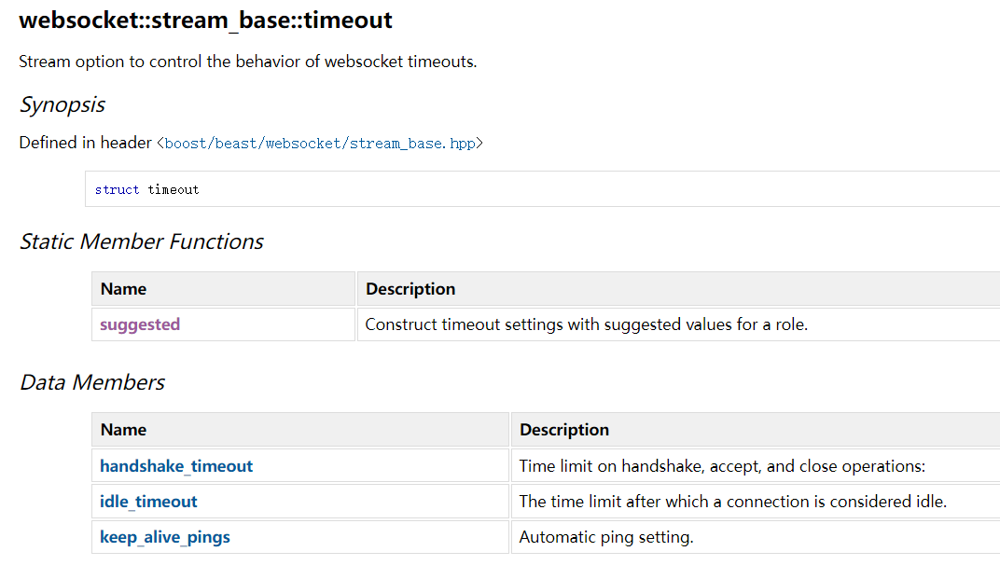

## 接口

### Connecting（连接）

处理 WebSocket 流的连接和接收。

（一）连接到 WebSocket 服务器

要与 WebSocket 服务器建立连接，首先需要连接到服务器，然后执行 WebSocket 握手。Boost.Beast 提供了一个 `stream` 类来管理 WebSocket 连接。你可以使用 `tcp_stream` 作为底层流来实现这一点。

```c++
#include <boost/asio.hpp>
#include <boost/beast.hpp>
#include <iostream>

namespace net = boost::asio;
namespace beast = boost::beast;
using tcp = net::ip::tcp;

// 创建 WebSocket 客户端并连接到服务器
int main() {
    try {
        net::io_context ioc;

        // 创建 WebSocket 流
        beast::websocket::stream<tcp::socket> ws(ioc);
        tcp::resolver resolver(ioc);

        // 解析主机名和端口
        auto const results = resolver.resolve("example.com", "ws");

        // 连接到服务器
        beast::get_lowest_layer(ws).connect(results);

        // 执行 WebSocket 握手
        ws.handshake("example.com", "/");

        std::cout << "Connected and handshake completed" << std::endl;

        // 在这里你可以发送和接收消息

    } catch (std::exception const& e) {
        std::cerr << "Exception: " << e.what() << std::endl;
    }
}
```

（二）接收来自客户端的连接

要接受传入的 WebSocket 连接，你需要创建一个 `acceptor` 对象来监听连接请求。接受到连接后，你可以创建一个 `stream` 对象来处理 WebSocket 连接。

```c++
#include <boost/asio.hpp>
#include <boost/beast.hpp>
#include <iostream>

namespace net = boost::asio;
namespace beast = boost::beast;
using tcp = net::ip::tcp;

// 创建 WebSocket 服务器并接受连接
int main() {
    try {
        net::io_context ioc;

        // 创建接受器
        tcp::acceptor acceptor(ioc, tcp::endpoint(tcp::v4(), 0));
        acceptor.listen();

        std::cout << "Listening for connections on port " << acceptor.local_endpoint().port() << std::endl;

        // 等待并接受连接
        tcp::socket socket(ioc);
        acceptor.accept(socket);

        // 创建 WebSocket 流对象
        beast::websocket::stream<tcp::socket> ws(std::move(socket));

        // 执行 WebSocket 握手
        ws.accept();

        std::cout << "Connection accepted and handshake completed" << std::endl;

        // 在这里你可以发送和接收消息

    } catch (std::exception const& e) {
        std::cerr << "Exception: " << e.what() << std::endl;
    }
}
```

（三）使用 `acceptor` 直接接收连接到 WebSocket 流

如果你希望 WebSocket 流在接受连接时直接使用 `acceptor`，可以这样做：

```c++
#include <boost/asio.hpp>
#include <boost/beast.hpp>
#include <iostream>

namespace net = boost::asio;
namespace beast = boost::beast;
using tcp = net::ip::tcp;

// 创建 WebSocket 服务器并接受连接
int main() {
    try {
        net::io_context ioc;

        // 创建接受器
        tcp::acceptor acceptor(ioc, tcp::endpoint(tcp::v4(), 0));
        acceptor.listen();

        // 创建 WebSocket 流，并使用 strand 保证线程安全
        beast::websocket::stream<tcp::socket> ws(net::make_strand(ioc));

        // 直接将套接字传递给 WebSocket 流
        acceptor.accept(beast::get_lowest_layer(ws).socket());

        // 执行 WebSocket 握手
        ws.accept();

        std::cout << "Connection accepted and handshake completed" << std::endl;

        // 在这里你可以发送和接收消息

    } catch (std::exception const& e) {
        std::cerr << "Exception: " << e.what() << std::endl;
    }
}
```

### Handshaking（握手）

（一）客户端

WebSocket 会话开始于客户端发送一个 HTTP/1.1 升级请求，通过建立的连接请求 WebSocket 协议。服务器收到请求后，发送一个表示接受请求并将连接升级的响应。这个升级请求必须包含 `Host` 字段和请求的目标资源。下面是一个典型的 HTTP 升级请求的示例：

```c++
GET / HTTP/1.1
Host: www.example.com
Upgrade: websocket
Connection: upgrade
Sec-WebSocket-Key: 2pGeTR0DsE4dfZs2pH+8MA==
Sec-WebSocket-Version: 13
User-Agent: Boost.Beast/216
```

使用 `websocket::stream` 类的 `handshake` 和 `async_handshake` 成员函数可以发送带有所需 `Host` 和目标字符串的请求。下面的代码展示了如何在客户端角色中连接到服务器，并执行 WebSocket 握手：

```c++
#include <boost/asio.hpp>
#include <boost/beast.hpp>
#include <iostream>

namespace net = boost::asio;
namespace beast = boost::beast;
using tcp = net::ip::tcp;

int main() {
    try {
        net::io_context ioc;

        // 创建 WebSocket 流
        beast::websocket::stream<tcp::socket> ws(ioc);
        tcp::resolver resolver(ioc);

        // 连接到服务器
        beast::get_lowest_layer(ws).connect(resolver.resolve("www.example.com", "ws"));

        // 在客户端角色中执行 WebSocket 握手
        ws.handshake("www.example.com", "/");

        std::cout << "Connected and handshake completed" << std::endl;

        // 这里可以发送和接收消息

    } catch (std::exception const& e) {
        std::cerr << "Exception: " << e.what() << std::endl;
    }
}
```

在客户端收到 HTTP 升级响应后，可能希望对收到的 HTTP 响应消息执行额外的验证。例如，检查基本认证挑战的响应是否有效。可以通过重载的 `handshake` 成员函数，将收到的 HTTP 消息存储到 `response_type` 类型的输出引用参数中：

```c++
#include <boost/asio.hpp>
#include <boost/beast.hpp>
#include <iostream>

namespace net = boost::asio;
namespace beast = boost::beast;
using tcp = net::ip::tcp;

int main() {
    try {
        net::io_context ioc;

        // 创建 WebSocket 流
        beast::websocket::stream<tcp::socket> ws(ioc);
        tcp::resolver resolver(ioc);

        // 连接到服务器
        beast::get_lowest_layer(ws).connect(resolver.resolve("www.example.com", "ws"));

        // 用于接收 HTTP 响应的变量
        beast::http::response<beast::http::string_body> res;

        // 执行 WebSocket 握手
        ws.handshake(res, "www.example.com", "/");

        std::cout << "Connected and handshake completed with response" << std::endl;

        // 这里可以发送和接收消息

    } catch (std::exception const& e) {
        std::cerr << "Exception: " << e.what() << std::endl;
    }
}
```

（二）服务端

使用 `accept` 和 `async_accept` 成员函数可以读取 WebSocket HTTP 升级请求握手，并发送 WebSocket HTTP 升级响应：

```c++
#include <boost/asio.hpp>
#include <boost/beast.hpp>
#include <iostream>

namespace net = boost::asio;
namespace beast = boost::beast;
using tcp = net::ip::tcp;

int main() {
    try {
        net::io_context ioc;

        // 创建接受器
        tcp::acceptor acceptor(ioc, tcp::endpoint(tcp::v4(), 0));
        acceptor.listen();

        // 等待并接受连接
        tcp::socket socket(ioc);
        acceptor.accept(socket);

        // 创建 WebSocket 流对象
        beast::websocket::stream<tcp::socket> ws(std::move(socket));

        // 执行 WebSocket 握手
        ws.accept();

        std::cout << "Connection accepted and handshake completed" << std::endl;

        // 这里可以发送和接收消息

    } catch (std::exception const& e) {
        std::cerr << "Exception: " << e.what() << std::endl;
    }
}
```

（三）握手缓冲

服务器可以从流中读取数据，并在后续决定这些缓冲的字节是否应该解释为 WebSocket 升级请求。为此，提供了接受额外缓冲序列参数的 `accept` 和 `async_accept` 重载函数。

```c++
#include <boost/asio.hpp>
#include <boost/beast.hpp>
#include <string>

namespace net = boost::asio;
namespace beast = boost::beast;
using tcp = net::ip::tcp;

int main() {
    try {
        net::io_context ioc;

        // 创建接受器
        tcp::acceptor acceptor(ioc, tcp::endpoint(tcp::v4(), 0));
        acceptor.listen();

        // 等待并接受连接
        tcp::socket socket(ioc);
        acceptor.accept(socket);

        // 创建 WebSocket 流对象
        beast::websocket::stream<tcp::socket> ws(std::move(socket));

        // 用于存储 HTTP 请求的缓冲区
        std::string s;

        // 读取缓冲区中的 HTTP 请求，直到遇到请求结束标志
        net::read_until(ws, net::dynamic_buffer(s), "\r\n\r\n");

        // 使用缓冲的数据接受连接
        ws.accept(net::buffer(s));

        std::cout << "Connection accepted and handshake completed with buffered data" << std::endl;

    } catch (std::exception const& e) {
        std::cerr << "Exception: " << e.what() << std::endl;
    }
}
```

（四）检查 HTTP 请求

当实现一个支持 WebSocket 的 HTTP 服务器时，服务器通常会读取来自客户端的 HTTP 请求。可以使用 `websocket::is_upgrade` 函数来检测传入的 HTTP 请求是否为 WebSocket 升级请求。

如果 HTTP 请求是 WebSocket 升级请求，可以使用重载的 `accept` 和 `async_accept` 函数，这些函数接受整个 HTTP 请求头作为对象，以执行握手。通过手动读取请求，可以处理普通的 HTTP 请求以及升级请求。示例如下：

```c++
#include <boost/asio.hpp>
#include <boost/beast.hpp>
#include <iostream>

namespace net = boost::asio;
namespace beast = boost::beast;
using tcp = net::ip::tcp;

int main() {
    try {
        net::io_context ioc;

        // 创建接受器
        tcp::acceptor acceptor(ioc, tcp::endpoint(tcp::v4(), 0));
        acceptor.listen();

        // 等待并接受连接
        tcp::socket socket(ioc);
        acceptor.accept(socket);

        // 用于读取 HTTP 消息的缓冲区
        beast::flat_buffer buffer;

        // 读取 HTTP 请求
        beast::http::request<beast::http::string_body> req;
        beast::http::read(socket, buffer, req);

        // 检查是否为 WebSocket 升级请求
        if (beast::websocket::is_upgrade(req)) {
            // 创建 WebSocket 流对象
            beast::websocket::stream<tcp::socket> ws(std::move(socket));

            // 确保缓冲区为空
            BOOST_ASSERT(buffer.size() == 0);

            // 接受升级请求
            ws.accept(req);

            std::cout << "WebSocket upgrade request accepted" << std::endl;
        } else {
            // 不是 WebSocket 升级请求，处理为普通 HTTP 请求
            std::cout << "Normal HTTP request received" << std::endl;
        }

    } catch (std::exception const& e) {
        std::cerr << "Exception: " << e.what() << std::endl;
    }
}
```

（五）子协议

如果客户端请求一组子协议中的一个，客户端将在初始 WebSocket 升级 HTTP 请求中设置 `Sec-WebSocket-Protocol` 头。服务器需要解析该头并选择一个接受的协议。服务器通过在接受头中设置 `Sec-WebSocket-Protocol` 头来指示选定的协议。

```c++
#include <boost/asio.hpp>
#include <boost/beast.hpp>
#include <array>
#include <algorithm>
#include <string>

namespace net = boost::asio;
namespace beast = boost::beast;
using tcp = net::ip::tcp;

// 选择最优协议的函数
auto select_protocol = [](beast::string_view offered_tokens) -> std::string {
    beast::http::token_list offered(offered_tokens);

    // 支持的协议数组，按优先级顺序排列
    static const std::array<beast::string_view, 3> supported = {{
        "v3.my.chat",
        "v2.my.chat",
        "v1.my.chat"
    }};

    std::string result;

    for (auto proto : supported) {
        auto iter = std::find(offered.begin(), offered.end(), proto);
        if (iter != offered.end()) {
            // 找到客户端提供的支持的协议
            result.assign(proto.begin(), proto.end());
            break;
        }
    }

    return result;
};

int main() {
    try {
        net::io_context ioc;

        // 创建接受器
        tcp::acceptor acceptor(ioc, tcp::endpoint(tcp::v4(), 0));
        acceptor.listen();

        // 等待并接受连接
        tcp::socket socket(ioc);
        acceptor.accept(socket);

        // 用于读取 HTTP 消息的缓冲区
        beast::flat_buffer buffer;

        // 读取 HTTP 请求
        beast::http::request<beast::http::string_body> req;
        beast::http::read(socket, buffer, req);

        // 检查是否为 WebSocket 升级请求
        if (beast::websocket::is_upgrade(req)) {
            std::string protocol = select_protocol(req[beast::http::field::sec_websocket_protocol]);

            if (protocol.empty()) {
                // 没有提供有效的协议
                beast::http::response<beast::http::string_body> res;
                res.result(beast::http::status::bad_request);
                res.body() = "No valid sub-protocol was offered. This server implements v3.my.chat, v2.my.chat, and v1.my.chat";
                beast::http::write(socket, res);
            } else {
                // 创建 WebSocket 流对象
                beast::websocket::stream<tcp::socket> ws(std::move(socket));

                ws.set_option(beast::websocket::stream_base::decorator(
                    [protocol](beast::http::response_header<>& hdr) {
                        hdr.set(beast::http::field::sec_websocket_protocol, protocol);
                    }
                ));

                // 接受升级请求
                ws.accept(req);

                std::cout << "WebSocket upgrade request accepted with selected protocol: " << protocol << std::endl;
            }
        } else {
            // 不是 WebSocket 升级请求，处理为普通 HTTP 请求
            std::cout << "Normal HTTP request received" << std::endl;
        }

    } catch (std::exception const& e) {
        std::cerr << "Exception: " << e.what() << std::endl;
    }
}
```

### Decorator（装饰器）

使用 Boost.Beast 提供的装饰器（decorator）功能来修改 WebSocket 的 HTTP 升级请求和响应。装饰器允许程序在发送 HTTP 消息之前修改这些消息，从而实现自定义的 HTTP 头字段或其他行为。

**装饰器**：可以是函数指针或可调用对象，在 WebSocket 实现发送 HTTP 消息之前被调用。

**装饰对象类型**：

- `request_type`：代表 HTTP 升级请求的类型。
- `response_type`：代表 HTTP 升级响应的类型。
- `stream_base::decorator`：用于持有装饰器对象，通过 `set_option` 方法应用到流上。

可以通过 `set_option` 将装饰器设置到 `stream` 对象上。装饰器必须在握手（handshake）或接受连接（accept）之前设置。以下是几个典型的使用方式：

（一）普通函数

```c++
void set_user_agent(request_type& req)
{
    req.set(http::field::user_agent, "My User Agent");
}

stream<tcp_stream> ws(ioc);
ws.set_option(stream_base::decorator(&set_user_agent));
```

（二）函数对象

```c++
struct set_server
{
    void operator()(response_type& res)
    {
        res.set(http::field::user_agent, "My Server");
    }
};

ws.set_option(stream_base::decorator(set_server{}));
```

（三）Lambda 表达式

```c++
ws.set_option(stream_base::decorator(
    [](response_type& res)
    {
        res.set(http::field::user_agent, "My Server");
    }));
```

（四）同时处理请求和响应

```c++
struct set_message_fields
{
    void operator()(request_type& req)
    {
        req.set(http::field::user_agent, "My User Agent");
    }

    void operator()(response_type& res)
    {
        res.set(http::field::user_agent, "My Server");
    }
};

ws.set_option(stream_base::decorator(set_message_fields{}));
```

装饰器对象通过 **衰退复制（decay-copy）** 转移到 `stream`，因此支持移动类型。可以使用 `std::unique_ptr` 等资源管理对象：

```c++
struct set_auth
{
    std::unique_ptr<std::string> key;

    void operator()(request_type& req)
    {
        req.set(http::field::authorization, *key);
    }
};

ws.set_option(stream_base::decorator(
    set_auth{boost::make_unique<std::string>("Basic QWxhZGRpbjpPcGVuU2VzYW1l")}));
```

注意：装饰器**不应**修改 WebSocket 升级特定的字段（如 `Upgrade` 或 `Connection` 字段），否则会导致未定义行为。

### Message

消息可以是文本（UTF-8 编码）或二进制。文本消息必须是有效的 UTF-8 字符串，这在接收时会进行验证，但在发送时不会检查。

（一）发送消息

**发送完整消息**：可以使用 `write` 或 `async_write` 函数一次性发送完整的消息。

**发送部分消息**：可以通过 `write_some` 或 `async_write_some` 函数分段发送消息，适用于将消息分割为多个帧的情况。

```c++
net::const_buffer b("Hello, world!", 13);
ws.text(true);  // 设置消息为文本模式
ws.write(b);    // 发送消息
```

（二）接收消息

**读取完整消息**：可以使用 `read` 或 `async_read` 函数将完整消息读取到动态缓冲区中。

**读取部分消息**：如果消息较大或者需要逐步处理，可以使用 `read_some` 或 `async_read_some` 函数分段读取。这适用于流媒体或处理无法一次加载到内存中的大型数据。

```c++
flat_buffer buffer;
ws.read(buffer);
ws.text(ws.got_text());
ws.write(buffer.data());
buffer.consume(buffer.size());
```

注：`websocket::stream` 类是 **非线程安全的**，因此其成员函数的调用必须在同一 strand（线程或任务序列）中进行，以避免竞争条件。

### Timeouts

与基础的 `tcp_stream` 或 `basic_stream` 的通用超时机制不同，WebSocket 流提供了一套更复杂的超时配置，专门用于 WebSocket 通信。

**stream_base::timeout**：表示 WebSocket 流的超时设置。



**stream_base::timeout::suggested**：根据角色（客户端或服务端）返回建议的超时设置。

**stream::set_option**：用于将超时和其他设置应用到 WebSocket 流上。

（一）设置建议的超时

```c++
// 为服务端角色应用建议的超时选项
ws.set_option(stream_base::timeout::suggested(role_type::server));
```

（二）手动设置超时

```c++
stream_base::timeout opt{
    std::chrono::seconds(30),   // 握手超时
    stream_base::none(),        // 禁用空闲超时
    false                       // 不启用 keep_alive_pings
};

// 将自定义的超时设置应用到 WebSocket 流
ws.set_option(opt);
```

（三）超时通知

当超时发生时，系统会关闭套接字或流，并通过 `async_read` 的完成处理器传递超时错误（`error::timeout`）。

不需要手动关闭连接，系统会自动关闭。

```c++
ws.async_read(b,
    [](error_code ec, std::size_t)
    {
        if(ec == beast::error::timeout)
            std::cerr << "timeout, connection closed!";
    });
```

### 重要注意事项

- WebSocket 的超时功能仅在**异步 I/O**操作时可用。
- WebSocket 流的超时机制与 `tcp_stream` 的超时机制**不兼容**。如果从一个启用了超时的 `tcp_stream` 构造 WebSocket 流，应首先禁用 `tcp_stream` 的超时

```c++
// 禁用 tcp_stream 上的任何超时
sock.expires_never();

// 构造 WebSocket 流并接管现有的 tcp_stream
stream<tcp_stream> ws(std::move(sock));
```

## 代码实现和测试

在输入框中输入 ws:://127.0.0.1:8080，点击连接，网站会提示连接成功。然后到输入框中输入你要发送的数据，服务器接收到之后会回复相同的信息。


测试网址：http://websocket-test.com/

代码地址：[实现WebSocketServer](https://github.com/xiaoyangst/Code/tree/master/Asio%E7%BD%91%E7%BB%9C%E7%BC%96%E7%A8%8B/13-WebSocketServer)

---

⭐️内容取自 B 站 UP 恋恋风辰和 mmoaay 的《Boost.Asio C++ 网络编程》，仅从中取出个人以为需要纪录的内容。不追求内容的完整性，却也不会丢失所记内容的逻辑性。如果需要了解细致，建议看原视频或者读原书。