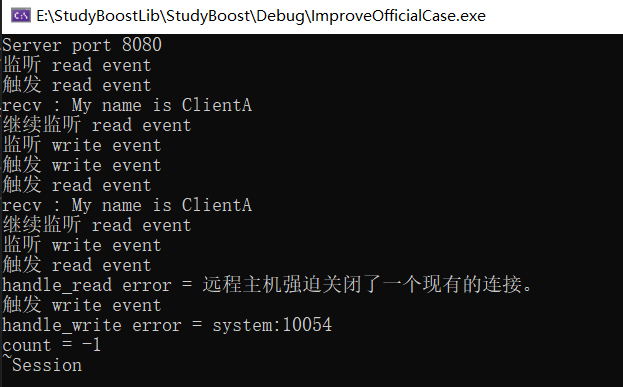
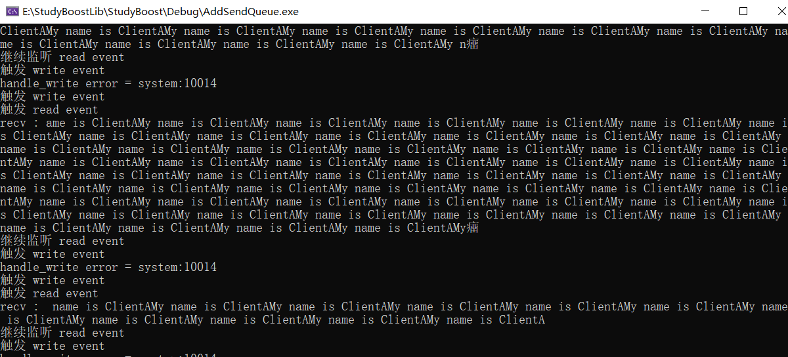
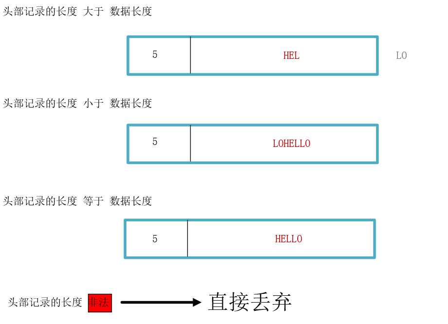
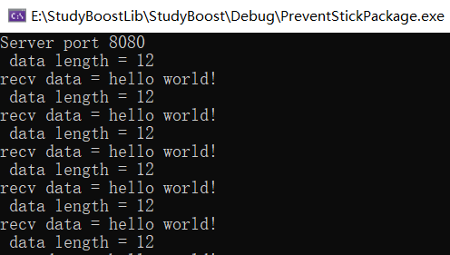
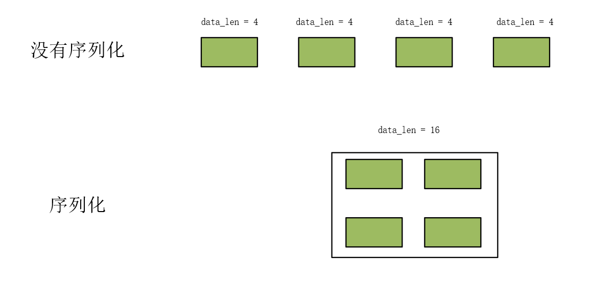

在上一章中，但我们编写基于官方代码的 全双工通信，发现由于 Session 管理不当，导致多次析构。我们要解决 Session 的生命周期问题，以及网络传输必然存在的粘包问题。

## 伪闭包延长连接生命周期

### Server类

我们可以通过 [shared_ptr 智能指针](https://xiaoyangst.github.io/2024/08/16/%E6%99%BA%E8%83%BD%E6%8C%87%E9%92%88/)对这些 Session 进行管理，shared_ptr 智能指针管理的对象会在引用技术为 0 的时候自动析构。

那用什么来存储这些 Session 呢？unordered_map容器，key 为 Session 的 uuid，value 为该 Session 的智能指针。由于存储到 unordered_map 容器中的对象是拷贝一份进来的，那么引用计数会 加 1，至少可以保证说如果我们不在容器中移除 这些存储的 Session，就能保证它必然不会被析构。

```c++
unordered_map<std::string, std::shared_ptr<Session>> sessionMap_;
```

管理 Session 的是 Server 类，因此 sessionMap_ 定义在  Server 类中。所以只涉及让 Session 在适当的地方增加和删除操作。

```c++
void Server::ClearSession(const std::string& uuid)
{
	sessionMap_.erase(uuid);
}

void Server::start_accept()
{
	std::shared_ptr<Session> new_session = std::make_shared<Session>(ioc_,this);
	acceptor_.async_accept(new_session->Socket(),
		std::bind(&Server::handle_accept, this, new_session, std::placeholders::_1));
}

void Server::handle_accept(std::shared_ptr<Session> new_session, const boost::system::error_code& error)
{
	if (!error) {
	new_session->Start();		
	sessionMap_.insert(std::make_pair(new_session->getUUID(), new_session));	// 代表有新连接建立，所以触发此回调了
	start_accept();
	}
}
```

这里我们重点分析 new_session 对象的引用计数情况。start_accept 函数 中第一次创建 共享智能指针对象 new_session，引用计数加 1，即从 0 变为 1。调用 acceptor_ 对象的 async_accept 方法需要 bind 一个回调函数，该回调函数需要用到 new_session 对象，但我们知道 bind 是通过拷贝值来满足函数调用的参数需求的，这个时候 共享智能指针对象 new_session，引用计数加 1，即从 1 变为 2。

触发回调之后，进入 handle_accept 函数，这也意味着 start_accept 函数 执行完毕，那么一开始创建的 new_session 脱离作用域，引用计数减 1，即从 2 变为 1。由于 bind 绑定的 handle_accept 函数还没有执行完毕，所以不会修改引用计数。那么开始 执行 handle_accept 函数，把 共享智能指针对象 new_session 加入到 map 容器中，也是把 对象拷贝到容器中，引用计数加 1，即从 1 变为 2。等到 handle_accept 函数执行完成，那么 bind 绑定所需的 new_session 也就 离开其作用域了，引用计数减 1，即从 2 变为 1。所以 最后的 这个为 1 的引用计数是 map 容器中还保留着 new_session 对象。

### Session类

如果我们从 map 容器中移除 new_session 对象，这就是 new_session 对象的消亡时刻。那我们的 读写回调函数在如果继续前一章的测试条件还是会出错，因为读事件回调如果从 map 容器中移除 new_session 对象，写事件回调在有错误的情况下同样会 再次从 map 容器中移除 new_session 对象，这也是不正确的做法。因为 从 map 中移除对象，会调用对应的回调函数，还是会双重析构。

其实，我们需要保证的是，读写事件在执行的时候能够保证 new_session 对象 是可用的，这样就不出现重复删除同一个对象了。在类中使用 shared_ptr 智能指针要注意一个问题，避免通过 this 指针 创建 shared_ptr 对象，因为并不会返回 shared_ptr 对象，而是返回到裸指针。如果真要能够返回 当前类的 shared_ptr 对象，需要让当前类继承 enable_shared_from_this，然后调用 shared_from_this 函数即可。

我们给 handle_read 和 handle_write 函数就会得到 new_session 对象，并让 引用计数 加 1，就保证 读写事件在执行的时候能够保证 new_session 对象 是可用的。

《恋恋风尘》博主是如下第一种写法，我是采用的第二种写法：

```c++
socket_.async_read_some(boost::asio::buffer(data_, BUFFSIZE),	// 接收客户端发生来的数据
		std::bind(&Session::handle_read, this, std::placeholders::_1, std::placeholders::_2, shared_from_this()));

socket_.async_read_some(boost::asio::buffer(data_, BUFFSIZE),
        std::bind(&Session::handle_read, shared_from_this(), std::placeholders::_1, std::placeholders::_2));
```

询问ChatGpt结果：

- **第一种方式**：`this` 是裸指针，可能会导致生命周期问题，虽然 `shared_from_this()` 提供了一定的保护，但 `this` 依然存在风险。
- **第二种方式**：完全使用 `shared_ptr<Session>` 来管理生命周期，更加安全。

通常，**第二种方式**更推荐使用，因为它可以确保在异步操作完成之前，`Session` 对象的生命周期得到完全管理，避免使用裸指针的潜在风险。

### 代码实现和结果验证

代码地址：[保证读写事件连接的可用性](https://github.com/xiaoyangst/Code/tree/master/Asio%E7%BD%91%E7%BB%9C%E7%BC%96%E7%A8%8B/4-%E4%BF%9D%E8%AF%81%E8%AF%BB%E5%86%99%E4%BA%8B%E4%BB%B6%E8%BF%9E%E6%8E%A5%E7%9A%84%E5%8F%AF%E7%94%A8%E6%80%A7)



采用之前同样的断点进行测试，图中只进行一次析构，说明连接保活成功。

## 增加发送队列实现全双工通信

解决多次析构的问题，就要进入到消息发送的问题上来了。实际的网络服务器那都是全双工，即读写事件同时监听。我们需要实现一个 Buffer 结构（这里实现的MsgNode类），用于读和写事件数据的存储，把未发送完的数据保存到队列中，保证消息的有序性。同时还要重写之前的读写回调函数。

### 实现全双工的读写回调流程

```c++
void Session::handle_write(const boost::system::error_code& error)
{
	std::cout << "触发 write event" << std::endl;

	if (error) {
		std::cout << "handle_write error = " << error << std::endl;
		server_->ClearSession(uuid_);
		return;
	}
	std::lock_guard<std::mutex> send_lock(mtx_);
	if (!sendQue_.empty()) {
		auto& msgNode = sendQue_.front();
		boost::asio::async_write(socket_, boost::asio::buffer(msgNode->data_, msgNode->max_len_),
			std::bind(&Session::handle_write, shared_from_this(), std::placeholders::_1));
		sendQue_.pop();
	}
}

void Session::Send(char* msg, int max_len)
{
	bool pending = false;
	// 加锁
	std::lock_guard<std::mutex> send_lock(mtx_);
	if (!sendQue_.empty()) {	
		pending = true;
	}
	sendQue_.push(std::make_shared<MsgNode>(msg, max_len));
	if (pending) {	
		return;
	}

	socket_.async_write_some(boost::asio::buffer(msg,max_len),	
		std::bind(&Session::handle_write, shared_from_this(), std::placeholders::_1));
}
```

增加的这个队列是发送队列。当客户端第一次发送数据，触发这边的读回调，该回调内部就会调用 Send 函数。在 Send 函数中，对数据进行操作需要加锁，异步编程中，你不知道会被哪个线程再次调用 Send 接口。如果 发送队列 sendQue_ 不为空，代表 handle_write 内部已经再次监听写事件，这边就只需要把数据加入到发生队列中即可。如果发送队列 sendQue_ 为空，代表当前 socket 没有再监听写事件，那么我们需要再次 监听写事件。通过这样的方式，就可以一直保证监听写事件，不管队列中有没有数据。

我们的 handle_read 函数 接受客户端数据之后，就继续监听读事件了。

至此，该服务器虽然实现了全双工通信，但是仍存在缺陷，比如粘包问题未处理。

### 代码实现和粘包现象

代码地址：[添加发生消息队列保证消息处理的有序性](https://github.com/xiaoyangst/Code/tree/master/Asio%E7%BD%91%E7%BB%9C%E7%BC%96%E7%A8%8B/5-%E6%B7%BB%E5%8A%A0%E5%8F%91%E7%94%9F%E6%B6%88%E6%81%AF%E9%98%9F%E5%88%97%E4%BF%9D%E8%AF%81%E6%B6%88%E6%81%AF%E5%A4%84%E7%90%86%E7%9A%84%E6%9C%89%E5%BA%8F%E6%80%A7)

我们只需要把客户端修改为 循环发送 数据就可以见证粘包现象。记得不要写成客户端发一个消息，然后接一个消息，这会让服务器很快就处理数据，看不到粘包现象了。



## 处理网络粘包问题

网络粘包问题可见我的另一篇文章[记住：TCP 是一种流协议](https://xiaoyangst.github.io/2024/08/10/%E8%AE%B0%E4%BD%8F%EF%BC%9ATCP%E6%98%AF%E4%B8%80%E7%A7%8D%E6%B5%81%E5%8D%8F%E8%AE%AE/)。

### Session类

说明：红色数据代表已发送，灰色数据代表未发送



- 如果头部记录的长度大于数据长度，意味着本次接受的消息不完整，还有一部分数据在下一个数据包中
- 如果头部记录的长度小于数据长度，意味着本次接受的消息包含上一个数据包未完整接受到的数据和其他数据
- 如果头部记录的长度等于数据长度，意味着解析完成或者刚好没有粘包，直接接受即可
- 头部记录的长度非法，头部记录的长度远远超出我们规定的可接受数据包的最大长度，这种视为非法的带有攻击性的数据包，直接丢弃即可

由于我们调用的异步函数 async_read_some，对方只要有发送数据就会触发回调函数，那我们就得写复杂的拆包逻辑。消息不完整的，需要等待下次数据包到来切割出剩余的数据，拼凑出完整的数据。消息超出头部记录的长度，需要把多余的部分切割出来给到上一次的数据包，然后继续处理余下的数据包。其余两种情况就不难处理了。不管怎么样，我们要记录很多的信息，消息处理到哪个位置了？上次的消息有没有处理完？诸如此类的考量，以至于《恋恋风辰》写出[如此复杂的代码](https://llfc.club/category?catid=225RaiVNI8pFDD5L4m807g7ZwmF#!aid/2PSqYnkrogKeDPjv3gdBUAcbN5P)，实在看不下去了。其实，就算我们按照这种情况去处理，也可以写出比这个还看起来轻松的代码，但我们还是直接利用 async_receive 异步回调函数 满足指定长度才触发回到的机制来实现吧。

### 代码实现和解决粘包

代码地址：[处理网络粘包问题](https://github.com/xiaoyangst/Code/tree/master/Asio%E7%BD%91%E7%BB%9C%E7%BC%96%E7%A8%8B/6-%E5%A4%84%E7%90%86%E7%BD%91%E7%BB%9C%E7%B2%98%E5%8C%85%E9%97%AE%E9%A2%98)



客户端的代码要修改，即发生消息按照 数据头+数据 的格式发送过来。我这边只是测试服务器的是否解决粘包，所以依旧是客户端大量发送消息。

## 字节序处理和消息队列的控制

字节序问题可以看我此文的介绍：[主机字节序和网络字节序](https://xiaoyangst.github.io/2024/08/10/%E4%B8%BB%E6%9C%BA%E5%AD%97%E8%8A%82%E5%BA%8F%E5%92%8C%E7%BD%91%E7%BB%9C%E5%AD%97%E8%8A%82%E5%BA%8F/)

网络字节序是大端字节序，而主机字节序可能是大端（如某些RISC处理器）或小端（如x86/x86_64处理器）。为了保证不同系统间的数据兼容性，需要在网络数据交换时进行字节序转换。

当你发送或接收的数据中包含整数（如IP地址、端口号等），需要进行字节序转换。例如，TCP/IP协议中有很多字段需要进行字节序转换：

- **端口号**（如`htons`和`ntohs`）：网络中使用的端口号在发送之前需要转换为网络字节序，接收后需要转换为主机字节序。
- **IP地址**（如`htonl`和`ntohl`）：IP地址通常以32位的整数形式传输，发送前转换为网络字节序，接收后转换为主机字节序。

我们知道网络传输数据务必保证字节序相同，即采用网络字节序，因此看看 asio 提供什么接口给我们使用了。

```c++
// 将一个 32 位无符号整数从主机字节序转换为网络字节序，返回转换后的结果
boost::asio::detail::socket_ops::host_to_network_long()

 // 将一个 16 位无符号整数从主机字节序转换为网络字节序，返回转换后的结果
boost::asio::detail::socket_ops::host_to_network_short()
```

需要注意的是，在使用这些函数时，应该确保输入参数和返回结果都是无符号整数类型，否则可能会出现错误。同样的道理，我们只需要在服务器发送数据时，将数据长度转化为网络字节序，在接收数据时，将长度转为本机字节序即可。客户端也要遵循相同的规则。

```c++
boost::asio::detail::socket_ops::network_to_host_short()

boost::asio::detail::socket_ops::network_to_host_long()
```

**发生数据时，把本地字节序转换为网络字节序。接受数据时，把网络字节序转换为本地字节序。**客户端和服务端都要遵守。下面只截取一部分代码作为演示：

```c++
// 服务器端代码
void Session::handle_read(const boost::system::error_code& error, size_t bytes_transfered)
{
	if (error) {
		std::cout << "handle_read error = " << error.message() << std::endl;
		Close();
		server_->ClearSession(uuid_);
		return;
	}

	int data_len = 0;
	memcpy(&data_len, recv_head_node_->data_, HEAD_LENGTH);
	std::cout << " data length = " << data_len << std::endl;

	if (data_len > MAX_LENGTH) {	// 非法
		std::cout << "invalid data length is " << data_len << std::endl;
		server_->ClearSession(uuid_);
		return;
	}
	
       //网络字节序转化为本地字节序
	data_len = boost::asio::detail::socket_ops::network_to_host_short(data_len);

	recv_msg_node_ = std::make_shared<MsgNode>(data_len);
	socket_.async_receive(boost::asio::buffer(recv_msg_node_->data_, data_len),	// 读完 HEAD_LENGTH 字节才触发读回调
		std::bind(&Session::HandleReadMsg, shared_from_this(), std::placeholders::_1, std::placeholders::_2));

}

// 客户端代码
void send_thread(tcp::socket& sock) {
    for (;;) {
        this_thread::sleep_for(std::chrono::milliseconds(2));
        const char* request = "hello world!";
        // 本地字节序转换为网络字节序
        short request_length = boost::asio::detail::socket_ops::host_to_network_short(strlen(request));
        
        char send_data[MAX_LENGTH] = { 0 };
        memcpy(send_data, &request_length, HEAD_LENGTH);
        memcpy(send_data + HEAD_LENGTH, request, request_length);

        std::lock_guard<std::mutex> lock(mtx);
        boost::asio::write(sock, boost::asio::buffer(send_data, request_length + HEAD_LENGTH));
    }
}
```

我在实际测试的时候，发现 asio 这几个库函数出现问题，导致我的客户端发送数据失败。建议还是用 我博客介绍的 htons 和 ntohs 来进行转换吧。

还有就是我们的发送队列要有限制，不然无限添加也不合理。

```c++
void Session::Send(char* msg, int max_len)
{
	bool pending = false;
	std::lock_guard<std::mutex> send_lock(mtx_);
	if (!sendQue_.empty()) {	
		pending = true;
	}
	if (sendQue_.size() > MAX_SENDQUE) {	// 超过队列限制大小，直接丢弃
		std::cout << "uuid = "<< uuid_ << "Exceeding the maximum capacity of the SendQue" << std::endl;
		return;
	}
	sendQue_.push(std::make_shared<MsgNode>(msg, max_len));
	if (pending) {	
		return;
	}

	socket_.async_write_some(boost::asio::buffer(msg,max_len),	
		std::bind(&Session::handle_write, shared_from_this(), std::placeholders::_1));
}
```

代码地址：[字节序处理和消息队列控制](https://github.com/xiaoyangst/Code/tree/master/Asio%E7%BD%91%E7%BB%9C%E7%BC%96%E7%A8%8B/7-%E5%AD%97%E8%8A%82%E5%BA%8F%E5%A4%84%E7%90%86%E5%92%8C%E6%B6%88%E6%81%AF%E9%98%9F%E5%88%97%E6%8E%A7%E5%88%B6)

## 序列化

常见的序列化方式是通过 Json 或 Protobuf 来完成，下面记录几个链接，用以需要时候查询：

[jsoncpp](https://llfc.club/category?catid=225RaiVNI8pFDD5L4m807g7ZwmF#!aid/2Q5XIMAjJ76n2snyNEHstog2W9b)

[恋恋风尘protobuf](https://llfc.club/category?catid=225RaiVNI8pFDD5L4m807g7ZwmF#!aid/2Pp1SSXN9MDHMFG9WtkayoC3BeC)

[大炳protobuf](https://subingwen.cn/cpp/protobuf/#1-Protobuf-%E6%A6%82%E8%BF%B0)

[json.hpp](https://www.yuque.com/xiaoyang-wyxle/his01x/tmy3rfx62gvsi7ad)

json 是以 key-value 传递数据，protobuf 将 value 转化为二进制进行传递，效率更高且数据包更小。

json.hpp 只需要引入一个头文件就可使用，而 jsoncpp 需要编译为库文件才可以使用。

protobuf 是对应两个不同的博主的笔记记录，大炳老师的讲解要细致一些。

---

这里就以 json这种格式简单看看 在网络库中的应用。你可以理解为就是把传递的消息进行打包，那么对方在接收到这份数据之后，能够根据一定的规则得到数据中存储的有效值（毕竟 key 是用来查找 value，实际我们关心的就是 value）。



如果你要发送的数据是有联系的，你不进行反序列化话就要多次发生数据。如果进行反序列化就可以打包在一起发过去，只需要发生一次数据，然后对端序列化之后通过 key 来读取实际要获取的数据就可以了。序列化只是把数据打包，因此依旧要通过 数据头部+数据长度解决粘包问题。序列化和反序列化可以规范数据的传输格式，但并不能解决**粘包**或**拆包**问题。**粘包问题**主要是由于TCP流式传输的特性引起的，而不是数据的编码方式。

序列化可以规范和压缩数据结构，但为了避免粘包，常结合**消息头+消息体**的方式进行序列化。比如，你可以先序列化数据，将其打包成字节流，再在字节流前加上长度信息，接收方根据长度信息判断数据是否完整，然后再反序列化还原数据。

客户端把要发生的数据序列化：

```c++
    Json::Value root;
    root["id"] = 1001;
    root["data"] = "hello world";
    std::string request = root.toStyledString();
    size_t request_length = request.length();
    char send_data[MAX_LENGTH] = { 0 };
    int request_host_length = htons(request_length);
    memcpy(send_data, &request_host_length, 2);
    memcpy(send_data + 2, request.c_str(), request_length);
    boost::asio::write(sock, boost::asio::buffer(send_data, request_length + 2));
```

客户端收到数据之后，进行反序列化：

```c++
    Json::Reader reader;
    Json::Value root;
    reader.parse(std::string(_recv_msg_node->_data, _recv_msg_node->_total_len), root);
    std::cout << "recevie msg id  is " << root["id"].asInt() << " msg data is "
    << root["data"].asString() << endl;
```

---

⭐️内容取自 B 站 UP 恋恋风辰和 mmoaay 的《Boost.Asio C++ 网络编程》，仅从中取出个人以为需要纪录的内容。不追求内容的完整性，却也不会丢失所记内容的逻辑性。如果需要了解细致，建议看原视频或者读原书。
