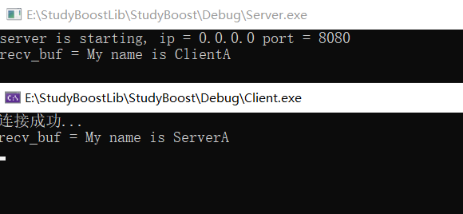
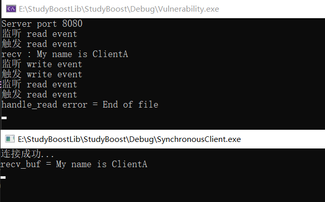
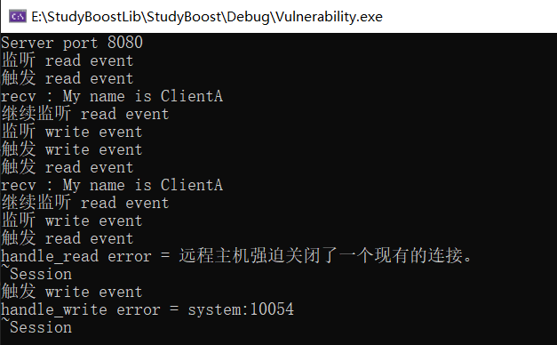
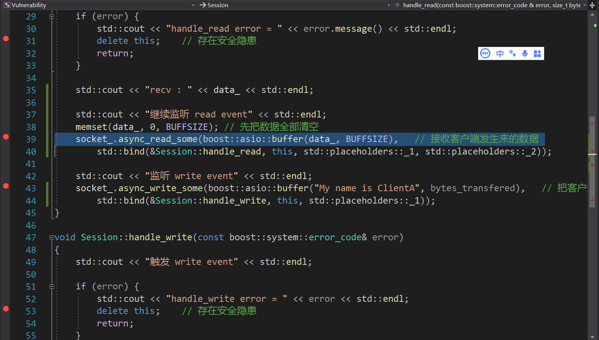
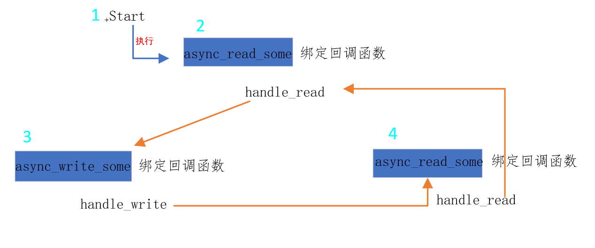

## 同步

### 同步写

write_some 可以每次向指定的空间写入固定的字节数，如果写缓冲区满了，就只写一部分，返回写入的字节数。但是使用起来比较麻烦，需要多次调用，就不多介绍了。重点讲一讲 send 和 write。

（一）send

send函数会一次性将buffer中的内容发送给对端，如果有部分字节因为发送缓冲区满无法发送，则阻塞等待，直到发送缓冲区可用，则继续发送完成。

```c++
 // 连接到服务器，后续就可以通过 socket 进行通信

// 通过 send 发送数据，传递数据和数据的长度即可

try {
    std::string buf = "My name is ClientA";
    int send_length = sock.send(buffer(buf.c_str(), buf.length()));
    if (send_length != buf.length())
    {
        cout << "Warning: Not all data sent, only " << send_length << " bytes sent." << endl;
    }
} catch (const boost::system::system_error& e) {
    cout << "Exception during send: " << e.what() << endl;
}
```

（二）write

asio 还提供了一个 write 函数，可以一次性将所有数据发送给对端，如果发送缓冲区满了则阻塞，直到发送缓冲区可用，将数据发送完成。这个和 send 非常类似，只是调用方式有所不同。

```c++
int send_length = write(sock,buffer(buf.c_str(), buf.length()));
```

### 同步读

read_some 就和 前面不介绍的 write_some 一样，需要循环去读取，同样不做介绍。重点讲一讲receive 和 read。

（一）receive

可以一次性同步接收对方发送的数据。

```c++
// 连接到服务器，后续就可以通信了

// 通过 receive 发送数据，记得把 char 数组 转换成 asio 自己的 buffer 类型

const size_t BUFF_SIZE = 7;
char buffer_receive[BUFF_SIZE + 1]; // +1 用于字符串终止符

try {
    int recv_length = sock.receive(asio::buffer(buffer_receive, BUFF_SIZE));
    if (recv_length > 0) {
        buffer_receive[recv_length] = '\0'; // 确保字符串终止
        cout << "Received: " << buffer_receive << endl;
    } else {
        cout << "recv failed!!!" << endl;
    }
} catch (const boost::system::system_error& e) {
    cout << "Exception during receive: " << e.what() << endl;
}
```

（二）read

```c++
 int recv_length = read(sock,asio::buffer(buffer_receive,BUFF_SIZE));
```

### 读取直到指定字符

我们可以一直读取，直到读取指定字符结束

```c++
std::string  read_data_by_until(asio::ip::tcp::socket& sock) {
    asio::streambuf buf;
    asio::read_until(sock, buf, '\n');
    std::string message;
    std::istream input_stream(&buf);
    std::getline(input_stream, message);
    return message;
 }
```

## 基于同步读写 API 实现 CS 互相通信

代码地址：[Asio同步CS通信](https://github.com/xiaoyangst/Code/tree/master/Asio%E7%BD%91%E7%BB%9C%E7%BC%96%E7%A8%8B/1-Asio%E5%90%8C%E6%AD%A5CS%E9%80%9A%E4%BF%A1)



## 异步

### 异步写

```c++
async_write_some(buffer, handler);

async_send(buffer, handler);
```

async_write_some 函数不能保证每次回调函数触发时发送的长度为总长度，这样我们每次都要在回调函数判断发送数据是否完成。asio 提供了一个更简单的发送函数 async_send，这个函数在发送的长度未达到我们要求的长度时就不会触发回调，所以触发回调函数时要么时发送出错了要么是发送完成了,其内部的实现原理就像不断的调用 async_write_some 直到完成发送，所以 async_send 不能和 async_write_some 混合使用。

### 异步读

```c++
async_read_some(buffer,handler);

async_receive(buffer, handler);
```

接下来介绍异步读操作，异步读操作和异步的写操作类似同样有 async_read_some 和 async_receive函数，前者触发的回调函数获取的读数据的长度可能会小于要求读取的总长度，后者触发的回调函数读取的数据长度等于读取的总长度。同样 async_read_some 和 async_receive 不能混合使用，否则会出现逻辑问题。

## 基于异步读写 API 实现 CS 互相通信

同步的网络通信方式是在不可能用于高性能服务器的开发，因此前面只是简单的实现客户端和服务器端通信，用以对前面网络通信基本API以及同步发生消息和接收消息API的应用。只不过，接下来要讲的异步通信就相当重要了，后续所有的讨论都是建立在异步通信的基础上，也将伴随着整个教程的终结，可见意义非凡。

下面要实现的是官方的案例，即Echo服务器。尽管它存在隐患，这个问题也会提及的。

代码地址：[Asio异步CS通信](https://github.com/xiaoyangst/Code/tree/master/Asio%E7%BD%91%E7%BB%9C%E7%BC%96%E7%A8%8B/2-Asio%E5%BC%82%E6%AD%A5CS%E9%80%9A%E4%BF%A1)



客户端发送消息和接受消息之后就会断开连接，因此服务器那边会触发读事件并且提示客户端已经关闭连接。

代码地址：[证实官方代码存在安全隐患](https://github.com/xiaoyangst/Code/tree/master/Asio%E7%BD%91%E7%BB%9C%E7%BC%96%E7%A8%8B/3-%E8%AF%81%E5%AE%9E%E5%AE%98%E6%96%B9%E4%BB%A3%E7%A0%81%E5%AD%98%E5%9C%A8%E5%AE%89%E5%85%A8%E9%9A%90%E6%82%A3)



特意修改客户端代码，即发生一个消息给服务器，接收服务器的一个消息，再次发生一个消息给服务器。再次发生消息是复现问题的关键，它会触发服务器的读事件，从而保证触发服务器的写事件。这个时候我们需要下断点保证先触发服务器的读事件异常去 delete  Seesion 对象，即断开连接。既然 Seesion 对象已经被 delete 一次了，那么由于客户端发来的消息服务器准备要去回复，但是发现出现异常，导致再次 delete  Seesion 对象。



### 存在隐患的代码解读

（一）Session类

 一个会话 Session 对应一个 Socket，而一个 Socket 无外乎处理两个关键的事件，即读写事件。在代码中分别对应两个回调函数 handle_read 和 handle_write。

我们的目的暂时还很简单，只是实现客户端和服务端的文本通信。如果客户端发来消息，触发异步读函数 async_read_some 绑定的 handle_read ，读取数据之后，就给异步发生消息函数 async_write_some 绑定回调函数 handle_write，即回复客户端发送的消息回复给客户端。回复消息之后，就会给 async_read_some 绑定回调函数 handle_read，从而返回接收和读取客户端消息了。



当你调用 Start 接口之后，当前 Session 就开始异步等待 读事件的到来，然后层层 函数的调用形成一个 环，即图中的 2-3-4 步骤。这个环的功能就是先监听客户端的读事件，即先读取客户端发来的消息。然后调用异步发送函数，把同样的消息回复给客户端。回复消息给客户端之后，继续监听客户端的读事件。

至此，我们就完成 Echo 服务器，但是我们这个服务器不是全双工的，即读和写没有分离（这就是为什么说官方案例是隐患，如果你设计成全双工就有问题，但如果不是就没有影响）。按理实际开发中应该是全双工通信，即可以同时收发消息，但是我们的这个官方案例，如果采用全双工通信就会出现多次析构问题（两次），具体原因分析可看[官方案例的隐患](https://llfc.club/category?catid=225RaiVNI8pFDD5L4m807g7ZwmF#!aid/2ODYV1A2xbhTjWr0FJ1ZS22ijZO)。

（二）Server类

Server 类就是用来监听客户端连接，并为其创建一个 Session 的。

所以当你创建 Server 对象之后，构造函数中会调用 start_accept 函数，该函数内部就会创建一个 Session ，并调用 异步函数 async_accept，该函数绑定的回调函数是 handle_accept。如果有客户端连接，那么就会 调用 Session 的 Start 函数（前面已经介绍过），同时继续调用 start_accept 函数。处理完一个连接，继续监听新的连接到来。

### 证实隐患的代码解读

将原先的 Session 代码进行简单的修改，让 一个 socket 同时监听读写事件，不像之前监听读事件和监听写事件不是同时存在的。让一个 socket 同时监听读写事件存在的隐患就是，对方关闭连接触发读事件回调，进而删除 Session 对象，那么写事件早之前被客户端触发（但还没有实际把数据发过去），就会出现异常，进而再次删除 Session 对象，出现多次析构，这个问题是很严重的。

表明上看这已经不是官方的代码，已经做了修改，但是官方提供的代码如果结合实际开发就会出现问题，即读写分离的通信方式。这也是为什么说为隐患的原因，即便是现在证实隐患存在的那份代码，直接运行也不一定会出现问题，但如果大量客户端连接和大量收发消息，必然会在某一刻出现问题，因为这是异步编程，读事件和写事件的触发不是有顺序的。

至此，我们引出如何对 Session 对象的正确管理了。

---

⭐️内容取自 B 站 UP 恋恋风辰和 mmoaay 的《Boost.Asio C++ 网络编程》，仅从中取出个人以为需要纪录的内容。不追求内容的完整性，却也不会丢失所记内容的逻辑性。如果需要了解细致，建议看原视频或者读原书。
