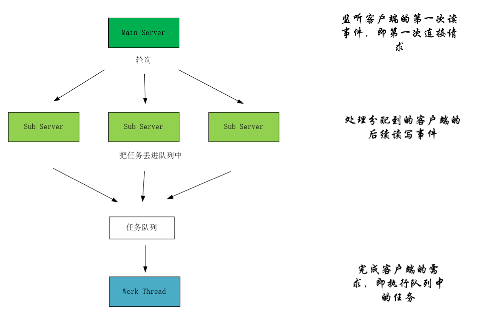
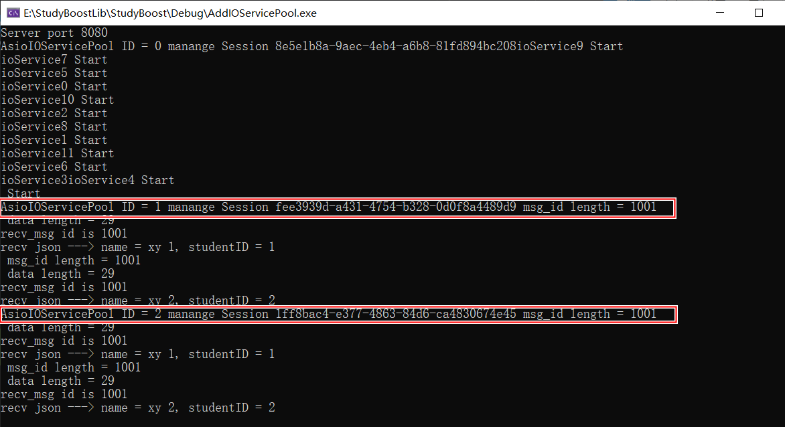
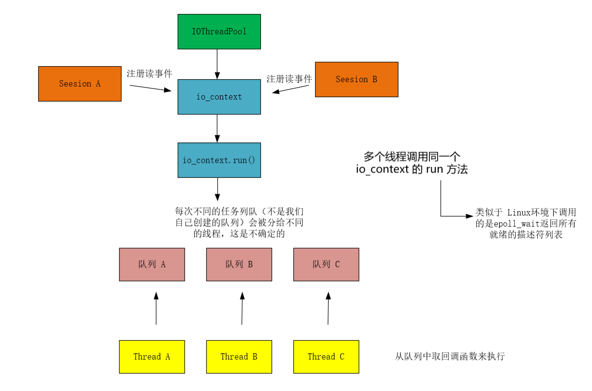
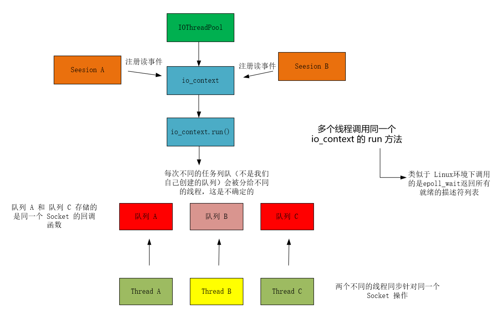
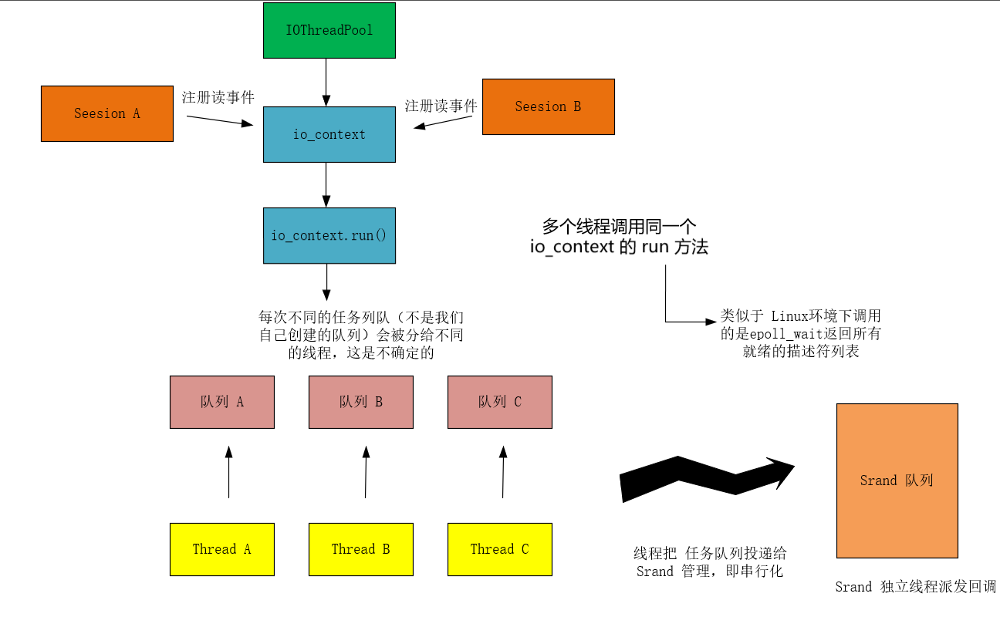

## 多线程

我们将介绍两种模式：

- IOServicePool --> 启动多个线程，每个线程管理一个 io_context
- IOThreadPool --> 只启动一个 io_context，被多个线程共享

### IOServicePool

早前的单线程模式中，我们的主线程不仅要监听客户端的连接，同时还要继续监听该客户端后续的读写事件。尽管我们已经把客户端需要的服务交互给工作线程，达到网络和计算工作的解耦，但是在接下来的多线程中，还可以继续解耦。即让主线程继续监听客户端的连接，但是后续这些连接的读写事件讲交给其他的线程处理。



1. 每一个 io_context 跑在不同的线程里，所以同一个 socket 会被注册在同一个 io_context 里，它的回调函数也会被单独的一个线程回调，那么对于同一个 socket，他的回调函数每次触发都是在同一个线程里，就不会有线程安全问题，网络 IO 层面上的并发是线程安全的
2. 对于不同的 socket，回调函数的触发可能是同一个线程（两个 socket 被分配到同一个 io_context），也可能不是同一个线程（两个socket被分配到不同的io_context里）。所以如果两个 socket 对应的上层逻辑处理，如果有交互或者访问共享区，会存在线程安全问题。比如 socket1 代表玩家 1，socket2 代表玩家 2，玩家 1 和玩家 2 在逻辑层存在交互，比如两个玩家都在做工会任务，他们属于同一个工会，工会积分的增加就是共享区的数据，需要保证线程安全。可以通过加锁或者逻辑队列的方式解决安全问题，我们目前采取了后者

这里面有个内容值得一提，即 `boost::asio::io_context::work` 。我们调用 `boost::asio::io_context` 的 run 方法之后进入 事件循环。根据官方文档, 在已经启动 `io_context::run()` 的情况下, 如果此时没有了 IO 操作, 那么 `io_context` 会自动取消事件循环, 那么此时如果再有异步 IO 回调, 也不会发生作用了。

```c++
boost::asio::io_context::work(boost::asio::io_context & io_context);
```

但是有些情况下, 我们希望 `run()` 函数的事件循环在没有 IO 事件的情况下, 也不会退出事件循环, 而是一直等待, 当有了新的异步 IO 调用的时候, 还可以继续使用该循环。`io_context::work` 就可以办到，就是防止 `io_context` 在没有 IO 的情况下依旧能够运行。直到你调用 它的 reset 方法销毁 work 对象才会停止发挥作用。

用法也相当简单，只需要把对应 io_context 传递给 work 作为参数，就代表让 该 work 管理了。

比方说我们的核心代码如下：

```c++
	for (std::size_t i = 0; i < size; i++) {
		workVec_[i] = std::unique_ptr<Work>(new Work(ioServiceVec_[i]));
	}
```

有新连接到来就会轮询分配 IOService。



代码地址：[增加IOServicePool](https://github.com/xiaoyangst/Code/tree/master/Asio%E7%BD%91%E7%BB%9C%E7%BC%96%E7%A8%8B/10-%E5%A2%9E%E5%8A%A0IOServicePool)

### IOThreadPool

```c++
AsioIOServicePool::AsioIOServicePool(std::size_t size)
	:threadVec_(size),nextIOService_(0),size_(size)
	,work_(new Work(ioService_))
{
	// 一个 线程上 启动同一个 ioService
	for (std::size_t i = 0; i < size; i++) {
		threadVec_.emplace_back([this]() {
			ioService_.run();
			});
	}
}
```

我们的代码不是基于前一个多线程代码来修改的，而是基于上一章的 LogicalDesign。

我首先疑惑的是为什么多个线程可以多次启动 io_context，这当然是不了解 Asio 底层原理所致，也打算在第七章或者终章记录任何有关 Asio 库的相关问题。

`boost::asio::io_context` 是设计为线程安全的，并支持多个线程并发调用其 `run()` 方法。这是通过内部同步机制实现的，确保同一时刻只有一个线程处理某个具体任务，但多个线程可以同时调度任务。

如下图所示，每个线程内部已经调用 run 方法，它是一个阻塞调用，直到所有挂起的异步操作都完成或被显式地停止。在处理完所有操作后，它会返回。但是我没已经用 work 帮我们让它始终不会停止，除非我们手动 reset。run 之后会开始处理所有已注册的异步操作，那么多线程都等待者异步事件到来，即等待被分配任务队列，然后去执行回调函数。



即便如此，还是存在一个隐患，即同一个 Socket 的多个事件被分配到多个线程中（每个线程只得到一个事件，即回调函数），那么同一个 Socket 是共享数据区域的，那么多个线程同时对这块区域进行操作就会有问题了。比如第一次是在线程 A，第二次是在线程 C，如果这两次触发间隔时间不大，那么很可能出现不同线程并发访问数据的情况，比如在处理读事件时，第一次回调触发后我们从 Socket 的接收缓冲区读数据出来，第二次回调触发,还是从 Socket 的接收缓冲区读数据，就会造成两个线程同时从 Socket 中读数据的情况，会造成数据混乱。



如果需要多个线程访问共享资源，你可以使用 `boost::asio::strand` 来串行化这些任务，确保某些任务只能由一个线程排他性地处理。`strand` 的目的是保证一系列操作是按照顺序执行的，即使它们分布在不同的线程中。



**创建 strand 对象**

```c++
boost::asio::io_context io_context;
boost::asio::strand<boost::asio::io_context::executor_type> strand(io_context.get_executor());

//这里 strand 是一个串行化的执行器，它绑定到 io_context 的执行器上
```

**boost::asio::bind_executor：将执行器与回调函数完全绑定在一起**

```c++
// 没有绑定 strand 之前
	auto& msgnode = sendQue_.front();
	socket_.async_write_some(boost::asio::buffer(msgnode->data_, msgnode->total_len_),
		std::bind(&Session::handle_write, shared_from_this(), std::placeholders::_1));

// 绑定 strand 之后
	auto& msgnode = sendQue_.front();
	socket_.async_write_some(boost::asio::buffer(msgnode->data_, msgnode->total_len_),
		boost::asio::bind_executor(strand_,std::bind(&Session::handle_write, shared_from_this(), std::placeholders::_1)));
```

绑定 strand 之后，绑定的函数就会有 strand 来调用，就不会有前面讲的并发安全问题。我们需要在所有收发的地方，都将调度器绑定为`strand_`，这边是集中在 Session类 中。Server类 中尽管也有，但是它是工作在单线程的，不存在并发问题。

代码地址：[增加IOThreadPool](https://github.com/xiaoyangst/Code/tree/master/Asio%E7%BD%91%E7%BB%9C%E7%BC%96%E7%A8%8B/11-%E5%A2%9E%E5%8A%A0IOThreadPool)

### 性能比较

把两端的输入全部移除，压力测试不要有任何输出。我这边 10万并发量 需要 15s （IOThreadPool 和 IOSerivcePool都是一样），这当然取决于你的机器。

---

⭐️内容取自 B 站 UP 恋恋风辰和 mmoaay 的《Boost.Asio C++ 网络编程》，仅从中取出个人以为需要纪录的内容。不追求内容的完整性，却也不会丢失所记内容的逻辑性。如果需要了解细致，建议看原视频或者读原书。