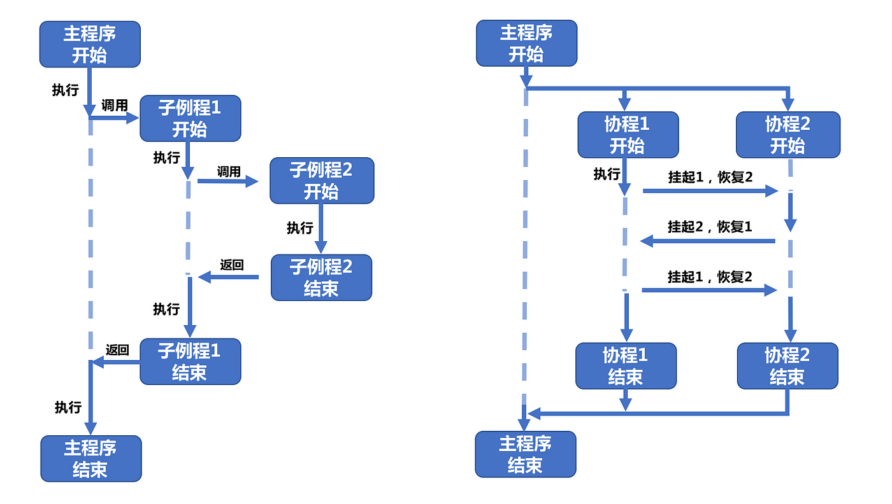

## 协程是什么？

普通函数返回点：返回

协程返回点：**暂停** + 返回

```C++
int func(){
    printf("A");
    return 0;
    printf("B");
    return 0;
    printf("C");
}
```

如果是普通函数，待输入字符 A，执行 return 返回，该函数执行完成。往后的代码永远不会有执行的机会。

如果是协程，待输出字符 A，执行 return 返回，该函数执行完成。但下一次该函数可以继续被执行，并且从上次结束的地方继续往下执行，你可以说它有暂停功能，但也许记忆功能会更容易理解。往下执行，输出字符 A，执行 return 返回。

至于 C++20 中如何支持协程，可见此文：[C++20协程入门教程](https://zplutor.github.io/2022/03/25/cpp-coroutine-beginner/)。



## Asio 提供的协程接口

Boost.Asio 从 C++20 开始支持协程。通过协程，可以编写异步代码，避免了嵌套的回调函数或复杂的状态机。这使得代码结构更加直观和易于维护。Boost.Asio 利用 C++ 的协程语法，使得异步操作看起来像同步操作。

常用库组件：

- **`boost::asio::awaitable`**: 表示一个可以使用协程等待的类型
- **`boost::asio::use_awaitable`**: 用作异步操作的最后一个参数，告诉 Asio 操作返回一个 `awaitable` 对象，可以与协程配合使用
- **`co_spawn`**: 启动一个协程，参数分别为调度器，执行的函数，以及启动方式。比方说启动方式是 deatched，表示将协程对象分离出来，这种启动方式可以启动多个协程，他们都是独立的，如何调度取决于调度器，在用户的感知上更像是线程调度的模式，类似于并发运行，其实底层都是串行的
- **`co_await`**: 等待异步操作完成

### boost::asio::awaitable

```c++
template<
    typename T,
    typename Executor = any_io_executor>
class awaitable
```

作为协程或异步操作的**返回类型**。从定义来看，必填模板参数是返回类型 T，也就是说协程或异步操作的返回类型是什么， T 就填什么。

```c++
boost::asio::awaitable<void> my_async_function();
boost::asio::awaitable<int> my_async_function_with_result();
```

第一个代表 my_async_function 返回值类型是 void ，第二个代表 my_async_function_with_result 返回值类型是 int。

### boost::asio::use_awaitable

```c++
constexpr use_awaitable_t use_awaitable;

template<
    typename Executor = any_io_executor>
struct use_awaitable_t
```

`use_awaitable` 是一个标记（无参数，仅作为标记使用），告诉 Boost.Asio 返回一个 `awaitable` 对象，支持协程等待。

常用操作：在进行异步操作时，它作为参数传递给函数，表示希望异步结果能够与协程配合使用。

```c++
co_await async_read(socket, boost::asio::buffer(data), boost::asio::use_awaitable);
```

### boost::asio::co_spawn

用于启动协程的函数，它允许协程在 `io_context` 中运行，管理异步任务的生命周期。

```c++
template<
    typename Executor, 
    typename Awaitable, 
    typename Token>
void co_spawn(Executor&& ex, Awaitable&& awaitable, Token&& token);
```

`Executor`：执行异步任务的执行器（通常是 `io_context`）。

`Awaitable`：一个协程，通常是返回 `awaitable<T>` 类型的函数。

`Token`：协程结束后如何处理返回值，通常使用 `detached` 选项表示不关心返回值；或者使用 `use_future` 来获取返回值。

举例说明：

```c++
boost::asio::co_spawn(io_context, my_async_function(), boost::asio::detached);
```

`detached`：表示协程完成后不需要返回值或等待结果。它用于简单的异步操作，不关心任务的结果。

`use_future`：协程完成后，返回一个 `std::future` 对象，可以等待协程的结果。

### co_await

等待一个异步操作完成，通常配合 `awaitable` 一起使用。

比方说：

```c++
co_await async_read(socket, boost::asio::buffer(buffer), boost::asio::use_awaitable);
```

### use_future

`use_future` 是 `co_spawn` 的另一个选项，表示协程运行完成后，将返回一个 `std::future` 对象，可以等待并获取协程的结果。

```c++
auto future = boost::asio::co_spawn(io_context, my_async_function(), boost::asio::use_future);
auto result = future.get(); // 等待协程结果
```

### boost::asio::steady_timer

`steady_timer` 是 Boost.Asio 的定时器类，常与协程一起使用，用于执行定时任务或延迟任务。

```c++
boost::asio::steady_timer timer(io_context);
timer.expires_after(std::chrono::seconds(5));
co_await timer.async_wait(boost::asio::use_awaitable);
```

`io_context`：执行器，用于管理异步操作。

`expires_after`：设置定时器的超时时间。

`async_wait`：等待定时器超时，与协程配合使用。

### 异步操作函数

Boost.Asio 提供了各种异步操作函数（如 `async_read`, `async_write`, `async_connect`, `async_resolve`），这些函数都可以使用协程来等待结果。

```c++
co_await boost::asio::async_connect(socket, endpoints, boost::asio::use_awaitable);
co_await boost::asio::async_read(socket, boost::asio::buffer(buffer), boost::asio::use_awaitable);
co_await boost::asio::async_write(socket, boost::asio::buffer(data), boost::asio::use_awaitable);
```

常见参数：

- `socket`：用于通信的 `tcp::socket` 对象。
- `buffer`：用于传输数据的缓冲区，通常是 `boost::asio::buffer`。
- `endpoints`：用于连接的地址列表。
- `use_awaitable`：表示使用协程等待异步操作的结果。

## 解读官方代码

我觉得结合前面接口的介绍，读懂下面的代码就不难了：

```c++
#include <boost/asio/co_spawn.hpp>
#include <boost/asio/detached.hpp>
#include <boost/asio/io_context.hpp>
#include <boost/asio/ip/tcp.hpp>
#include <boost/asio/signal_set.hpp>
#include <boost/asio/write.hpp>
#include <cstdio>
using boost::asio::ip::tcp;
using boost::asio::awaitable;
using boost::asio::co_spawn;
using boost::asio::detached;
using boost::asio::use_awaitable;
namespace this_coro = boost::asio::this_coro;
#if defined(BOOST_ASIO_ENABLE_HANDLER_TRACKING)
# define use_awaitable \
  boost::asio::use_awaitable_t(__FILE__, __LINE__, __PRETTY_FUNCTION__)
#endif
awaitable<void> echo(tcp::socket socket)
{
    try
    {
        char data[1024];
        for (;;)
        {
            std::size_t n = co_await socket.async_read_some(boost::asio::buffer(data), use_awaitable);
            co_await async_write(socket, boost::asio::buffer(data, n), use_awaitable);
        }
    }
    catch (std::exception& e)
    {
        std::printf("echo Exception: %s\n", e.what());
    }
}
awaitable<void> listener()
{
    auto executor = co_await this_coro::executor;
    tcp::acceptor acceptor(executor, { tcp::v4(), 10086 });
    for (;;)
    {
        tcp::socket socket = co_await acceptor.async_accept(use_awaitable);
        co_spawn(executor, echo(std::move(socket)), detached);
    }
}
int main()
{
    try
    {
        boost::asio::io_context io_context(1);
        boost::asio::signal_set signals(io_context, SIGINT, SIGTERM);
        signals.async_wait([&](auto, auto) { io_context.stop(); });
        co_spawn(io_context, listener(), detached);
        io_context.run();
    }
    catch (std::exception& e)
    {
        std::printf("Exception: %s\n", e.what());
    }
}
```

`co_spawn(io_context, listener(), detached)` 。co_spawn 意味着 启动一个协程，那么需要传递三个参数，第一个参数是异步任务的执行器，网络编程中通常就是 io_context 无疑了。第二个参数就是协程，即一个函数，只不过这个函数如何才可以被视为协程，后续再聊。第三个参数有两种选择，一种选择是不关心返回值，一种是关心返回值。你可以看到我们传递的协程是没有返回值的，那就可以用 detached，表示协程完成后不需要返回值或等待结果。否则你传递 use_future ，代表协程完成后，返回一个 `std::future` 对象，可以等待协程的结果。

`listener()` 。它究竟如何是被视为一个 协程的？请看下面：

1. 返回类型为 `boost::asio::awaitable<T>`。（必须）
2. 使用 `co_await` 操作符等待异步操作。（必须）
3. 使用 `co_return` 返回结果（如果有的话，我们这里是没有的）。（非必须）
4. 是被 `boost::asio::co_spawn` 启动的。（必须）

`listener` 内部做了什么 ？

先通过`this_coro::executor` 获取当前协程的执行器（即 io_context 中的执行上下文），然后监听 TCP 连接。每当有客户端连接到服务器，`async_accept` 接收连接，并启动 `echo` 协程来处理该连接。这个过程是异步等待的，因为我们使用 co_await ，即`co_await acceptor.async_accept(use_awaitable)`。`co_spawn` 用于启动 `echo` 协程，并且使用 `detached` 方式运行，表示不需要等待其结束。

echo 函数就不提了，和 listener 并无二致。我主要还是提一提`this_coro::executor` ：

**获取执行器 (executor)**: `this_coro::executor` 是一个特殊的对象，它代表当前协程正在使用的执行器（即协程是在哪个 `io_context` 或 `executor` 上运行的）。

**确保异步操作正确调度**: 当你通过 `co_await this_coro::executor` 获取执行器时，实际上是在告诉编译器，当前协程的所有异步操作都需要通过这个执行器调度。这使得协程中的 `co_await` 异步操作能够正确使用 `executor` 来调度执行。

那为什么我们主函数中没有使用呢？

在主函数中，执行器并没有直接在协程中运行，因此不需要使用 `this_coro::executor`。`io_context` 是在主函数中直接创建的，并且作为参数传递给 `co_spawn`。当 `co_spawn` 启动协程时，它会自动将 `io_context` 作为执行器传递给协程内部使用的 `this_coro::executor`。

---

⭐️内容取自 B 站 UP 恋恋风辰和 mmoaay 的《Boost.Asio C++ 网络编程》，仅从中取出个人以为需要纪录的内容。不追求内容的完整性，却也不会丢失所记内容的逻辑性。如果需要了解细致，建议看原视频或者读原书。
