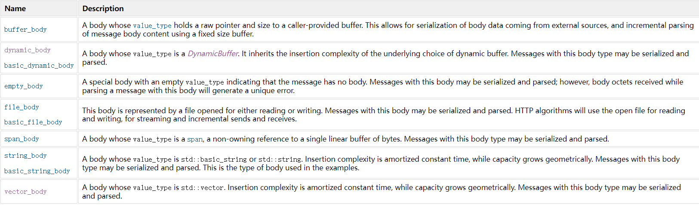
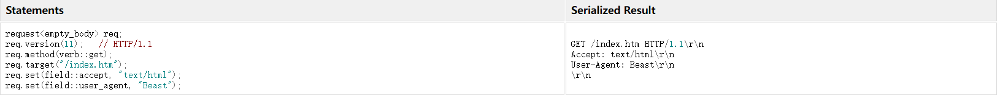
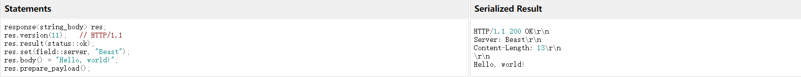
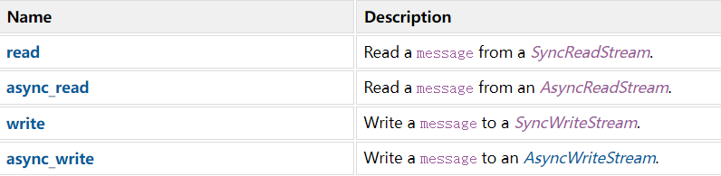
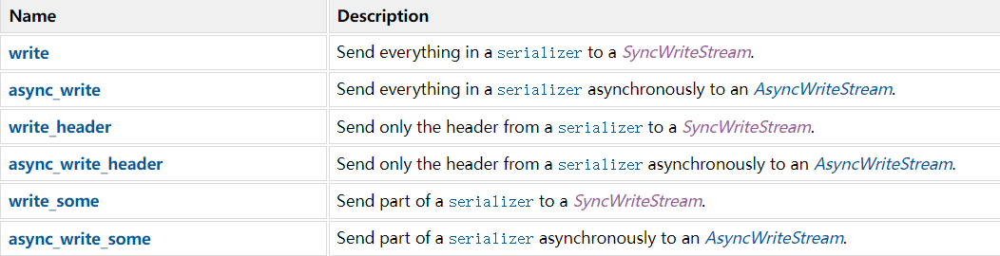
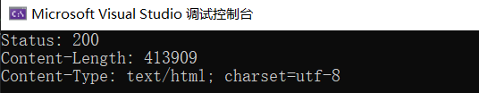
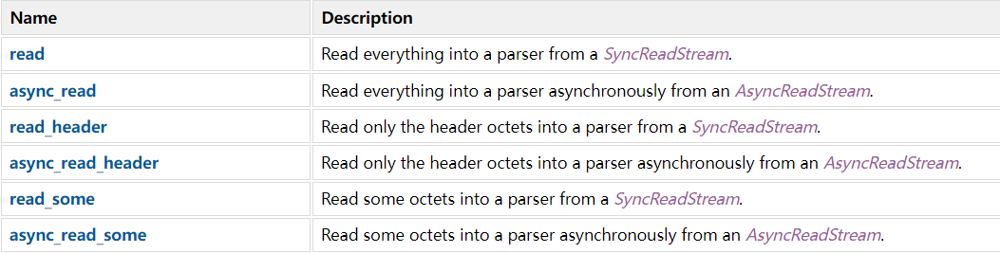
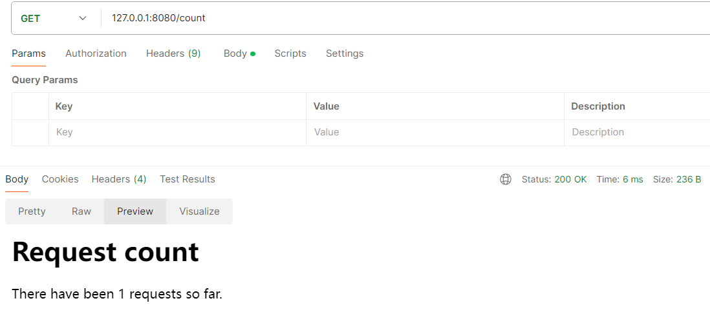
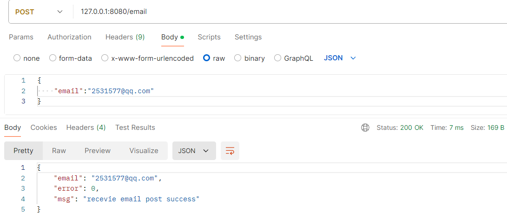

经过前面几章节的训练，[基于 Asio 实现HTTP服务器](https://llfc.club/category?catid=225RaiVNI8pFDD5L4m807g7ZwmF#!aid/2RbaWyENb1b1trG4KoWHtScUHri)也不难，但是这种造轮子行为还是不推荐的，下面就介绍如何基于 Beast 库实现 HTTP 和 WebSocket 服务器。

Boost.Beast 是基于 Boost.Asio 的 C++ 网络库，用于处理 HTTP 和 WebSocket 协议。它简化了处理 HTTP 和 WebSocket 请求与响应的过程，同时提供高效的异步操作，广泛用于开发高性能网络应用。

文档地址：[Beast官方文档](https://www.boost.org/doc/libs/master/libs/beast/doc/html/index.html)

## 接口

### [Message Containers](https://www.boost.org/doc/libs/master/libs/beast/doc/html/beast/using_http/message_containers.html)

完整的 HTTP 消息使用 message class 建模，用户可进行自定义。

```c++
// An HTTP message
template<
    bool isRequest,             // `true` 代表 requests, `false` 代表 responses
    class Body,                 // Controls the container and algorithms used for the body
    class Fields = fields>      // The type of container to store the fields
class message;

// A typical HTTP request
template<class Body, class Fields = fields>
using request = message<true, Body, Fields>;

// A typical HTTP response
template<class Body, class Fields = fields>
using response = message<false, Body, Fields>;
```

从上面的模板可以看出，message 通过 第一个参数来区分 request 和 response，然后第三个参数 有默认参数。所以，对于 创建  request 和 response 的时候必须填写的参数是 Body，Fields 是可选的。



这里面值得一提的是 [DynamicBuffer](https://www.boost.org/doc/libs/master/libs/beast/doc/html/beast/concepts/DynamicBuffer.html) 动态缓冲区。

动态缓冲区封装了内存存储，该存储可以根据需要自动调整大小，其中内存分为输入序列和输出序列。这些内存区域是动态缓冲区的内部，但提供了对元素的直接访问，以允许它们有效地用于 I/O 操作，例如套接字的发送或接收操作。 写入动态缓冲区对象输出序列的数据将追加到同一对象的输入序列中。

如果你要存储 request 和 response ，可以如下定义：

```c++
namespace beast = boost::beast;         // from <boost/beast.hpp>
namespace http = beast::http;           // from <boost/beast/http.hpp>

http::request<http::dynamic_body> request_;
http::response<http::dynamic_body> response_;
```

等后面我们学习消息的发送和接受，就能用到了。

这里记录一下官方的使用案例：

**我们构建了一个带有空消息正文的 HTTP GET 请求。**



**我们创建了一个 HTTP 响应，状态代码表示成功。**



---

我们前面处理的消息是包含 body + header，如果你只需要处理 header，beast 也支持。

```c++
// An HTTP header
template<
    bool isRequest,             // `true` for requests, `false` for responses
    class Fields = fields>      // The type of container to store the fields
class header;

// A typical HTTP request header
template<class Fields>
using request_header = header<true, Fields>;

	
// A typical HTTP response header
template<class Fields>
using response_header = header<false, Fields>;
```

### [Message Stream Operations](https://www.boost.org/doc/libs/master/libs/beast/doc/html/beast/using_http/message_stream_operations.html)

提供 `read`、`async_read` 等函数用于从流中读取 HTTP 消息数据。

提供 `write`、`async_write` 等函数用于将 HTTP 消息写入流中。



我们直接看官方案例就好，这些函数的含义在前面的章节已经学习过，尽管参数的类型可能会有所不同。

这个参数类型就是 [flat_buffer](https://www.boost.org/doc/libs/master/libs/beast/doc/html/beast/ref/boost__beast__flat_buffer.html)，通常用于处理网络 I/O 操作中的可变大小的字节序列。而且，它非常适合和前面讲的 动态缓冲区 结合使用。

（一）Reading

同步读：

```c++
flat_buffer buffer;
request<string_body> req;
read(sock, buffer, req);
```

异步读：

```c++
flat_buffer buffer;
response<string_body> res;
async_read(sock, buffer, res,
    [&](error_code ec, std::size_t bytes_transferred)
    {
        boost::ignore_unused(bytes_transferred);
        std::cerr << ec.message() << std::endl;
    });
```

用于限制 HTTP 消息标头的最大大小的技术，以防止缓冲区溢出攻击：

```c++
flat_buffer buffer{10};
// Try to read a request
error_code ec;
request<string_body> req;
read(sock, buffer, req, ec);
if(ec == http::error::buffer_overflow)
    std::cerr << "Buffer limit exceeded!" << std::endl;
```

（二）Writing

同步写：

```c++
response<string_body> res;
res.version(11);
res.result(status::ok);
res.set(field::server, "Beast");
res.body() = "Hello, world!";
res.prepare_payload();

error_code ec;
write(sock, res, ec);
```

异步写：

```c++
async_write(sock, res,
    [&](error_code ec, std::size_t bytes_transferred)
    {
        boost::ignore_unused(bytes_transferred);
        if(ec)
            std::cerr << ec.message() << std::endl;
    });
```

### Serialization

 将 HTTP 消息转化为字节缓冲区。

```c++
// 将 HTTP message 序列化为字节流
template<
    bool isRequest,
    class Body,
    class Fields = fields
>
class serializer;

	
// 将 HTTP request 序列化为字节流
template<
    class Body,
    class Fields = fields
>
using request_serializer = serializer<true, Body, Fields>;

//将 HTTP response 序列化为字节流
template<
    class Body,
    class Fields = fields
>
using response_serializer = serializer<false, Body, Fields>;
```

其实这不难理解，就是我们构建 HTTP 数据包，将其序列化后就可以发送出去了。

```c++
// 构建HTTP响应
        http::response<http::string_body> res{http::status::ok, 11};
        res.set(http::field::server, "Beast");
        res.set(http::field::content_type, "text/plain");
        res.body() = "Hello, World!";
        res.prepare_payload(); // 准备消息体的负载

// 创建序列化器
        http::response_serializer<http::string_body> sr{res};

// 循环写入流，直到所有数据都被发送
        while(! sr.is_done()) {
            beast::error_code ec;
            http::write_some(socket, sr, ec);  // 逐步发送
            if(ec) {
                std::cerr << "Error: " << ec.message() << std::endl;
                break;
            }
        }
```

按照常见的通信模式来看，服务器需要进行序列化（Serialization），而客户端需要进行反序列化（Parsing）。下面看看可用的传输序列化数据的操作：



### Parsing

将字节缓冲区解析为 HTTP 消息。

```c++
// 生成 message 的解析器
template<
    bool isRequest,                       
    class Body,                             
    class Allocator = std::allocator<char>> 
class parser
    : public basic_parser<...>;

// 生成 request message 的解析器
template<class Body, class Allocator = std::allocator<char>>
using request_parser = parser<true, Body, Allocator>;

//生成 response message 的解析器
template<class Body, class Allocator = std::allocator<char>>
using response_parser = parser<false, Body, Allocator>;
```

比方说我们构造 HTTP 请求发给 百度，然后将百度的 response 进行解析，通过 get 方法获取解析结果。下面仅记录核心代码：

```c++
// 构建HTTP请求
        http::request<http::string_body> req{ http::verb::get, "/", 11 };
        req.set(http::field::host, "www.baidu.com");
        req.set(http::field::user_agent, BOOST_BEAST_VERSION_STRING);

// 将请求发送到服务器
        http::write(socket, req);

// 定义一个缓冲区来存储从服务器接收到的数据
        beast::flat_buffer buffer;

// 定义一个HTTP响应解析器
        http::response_parser<http::string_body> parser;

// 读取响应头和消息体，存入缓冲区并由解析器处理
        http::read(socket, buffer, parser);

// 获取解析后的响应对象
        auto const& response = parser.get();

// 提取HTTP状态码
        std::cout << "Status: " << response.result_int() << std::endl;

// 提取Content-Length头部字段
        if (response.find(http::field::content_length) != response.end()) {
            std::cout << "Content-Length: " << response[http::field::content_length] << std::endl;
        }

// 提取Content-Type头部字段
        if (response.find(http::field::content_type) != response.end()) {
            std::cout << "Content-Type: " << response[http::field::content_type] << std::endl;
        }
```

解析结果：



通过 get 获取整个 HTTP 消息的 header + body，我们常常需要获取 header 中的字段信息，部分字段可直接调用接口，其余字段需要通过 find 方法查找。我们讲完 response_parse ，也就 自然领会 request_parse，它们的操作也都是一致的。



## 代码实现和测试

**get 请求测试**



**post 请求测试**



测试工具：Postman

代码地址：[实现HttpServer](https://github.com/xiaoyangst/Code/tree/master/Asio%E7%BD%91%E7%BB%9C%E7%BC%96%E7%A8%8B/12-HttpServer/)

---

⭐️内容取自 B 站 UP 恋恋风辰和 mmoaay 的《Boost.Asio C++ 网络编程》，仅从中取出个人以为需要纪录的内容。不追求内容的完整性，却也不会丢失所记内容的逻辑性。如果需要了解细致，建议看原视频或者读原书。