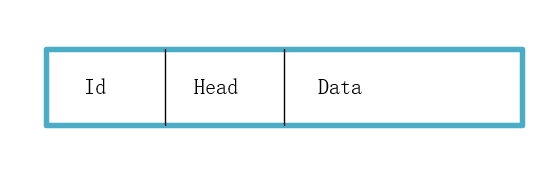
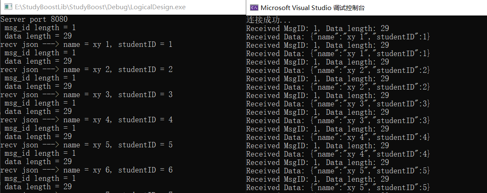
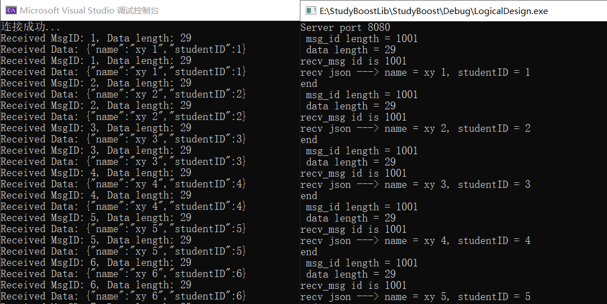

## 消息头完善

早前我们的数据包设计为 头部+数据，但是要进行逻辑处理，就需要传递一个 id 字段表示要处理的消息 id，当然可以不在包头传 id 字段，将 id 序列化到消息体也是可以的，但是我们为了便于处理也便于回调逻辑层对应的函数，最好是将 id 写入包头。



基于之前的 MsgNode 再设计两个节点类，即 RecvNode 和 SendNode，前者表示接收消息的节点，后者表示发送消息的节点。就不新建类来定义，直接再 MsgNode 类文件中一起实现了。随之，我们的 Session 类也要有所改动。

上一章的末尾讲到把传递的实体数据序列化，那就在这节把传递数据序列化的代码完成。同时，本次代码还进行一收一发的过程，如果你要测试是否存在粘包，只需要把客户端代码中的收数据过程注释掉进行测试即可，如果你想测试客户端和服务端通信的收发过程没有问题，再将注释关闭即可。



代码地址：[加入序列化和完善MsgNode](https://github.com/xiaoyangst/Code/tree/master/Asio%E7%BD%91%E7%BB%9C%E7%BC%96%E7%A8%8B/8-%E5%8A%A0%E5%85%A5%E5%BA%8F%E5%88%97%E5%8C%96%E5%92%8C%E5%AE%8C%E5%96%84MsgNode)

## 优雅退出

让服务器优化退出可以采用信号的方式，如果你是在 Linux 系统中，你可以在主线程设置监听某个信号，如果有对应的信号产生，就执行事先设置好的回调函数。

asio 也提供有这样的方式，在主函数中添加如下代码即可：

```c++
int main()
{
    try {
        boost::asio::io_context  io_context;
        boost::asio::signal_set signals(io_context, SIGINT, SIGTERM);
        signals.async_wait([&io_context](auto, auto) {
            io_context.stop();
            });
        CServer s(io_context, 10086);
        io_context.run();
    }
    catch (std::exception& e) {
        std::cerr << "Exception: " << e.what() << endl;
    }
}
```

从代码中可以看出， boost::asio::signal_set 定义一个变量，第一个参数是 io_context，表示由它监听接下来要设置的信号。后面的参数就是要监听的信号，然后 async_wait 异步等待信号的发送，如果有等待的信号产生，就执行 回调函数。这里的回调函数是匿名函数，这样方便传递外部的变量，至于这里为什么是(auto, auto)，是因为这里的 async_wait 里面的回调函数本身是要两个参数的。这两个参数见下：

```c++
signals.async_wait([&io_context](auto error, auto signal_number) {
    io_context.stop();
});
```

但由于我们暂时不用这两个变量，也就没有写明（反正《恋恋风尘》是这么写的，我只是说清楚）。

下面是一些其他的 API，可以了解看看。

```c++
signal_set(io_context): 构造函数，接受一个 io_context 对象来处理异步操作
    
add(int signal_number): 向信号集添加要监听的信号
    
remove(int signal_number): 从信号集中移除指定信号
    
clear(): 清除所有已注册的信号
    
async_wait(handler): 异步等待信号的触发，当信号被捕获时调用指定的处理程序
```

## LogicSystem单例类

单例类的实现可见此文：[单例模式](https://xiaoyangst.github.io/2024/09/11/%E5%8D%95%E4%BE%8B%E6%A8%A1%E5%BC%8F/)

我们的消息格式已经重新设计，这个新增的 ID 字段究竟代表着什么？客户端通过 ID 来表明自己需要的服务。简单举例，服务器现在是一个聊天服务器，客户端就谈过 ID 来表达自己的功能需求。传递 ID = 1 表明需要注册用户，其账号和密码就包含在消息体中，服务器通过解析 JSON 数据就可以拿出并把数据存储注册信息的数据库中，同时返回 ID = 10，表示注册成功。客户端接收到这个信息之后，也就知道自己已经注册成功了。

LgicSystem 类就是和网络库进行分离的，即网络和计算工作进行分离。在网络阶段解析到 用户数据包中的 ID字段之后，就加入到 LgicSystem 提供的队列中，LgicSystem 这边会自动唤醒工作线程来执行任务函数（ID 和 回调函数以 key-value 存在 map 容器中，查找方便）。也就是说，之前我们是让网络库来执行和用户交互的工作，但是现在网络库就是来处理客户端的连接和客户端发来的消息，至于后续执行客户端需求和回复客户端状态的事情将交给工作线程来做（LgicSystem 中的 dealMsg成员函数），实现网络和计算工作的解耦合。



代码地址：[逻辑层设计完成](https://github.com/xiaoyangst/Code/tree/master/Asio%E7%BD%91%E7%BB%9C%E7%BC%96%E7%A8%8B/9-%E9%80%BB%E8%BE%91%E5%B1%82%E8%AE%BE%E8%AE%A1%E5%AE%8C%E6%88%90)

---

⭐️内容取自 B 站 UP 恋恋风辰和 mmoaay 的《Boost.Asio C++ 网络编程》，仅从中取出个人以为需要纪录的内容。不追求内容的完整性，却也不会丢失所记内容的逻辑性。如果需要了解细致，建议看原视频或者读原书。
