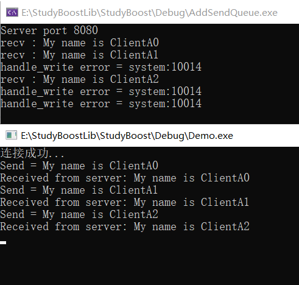
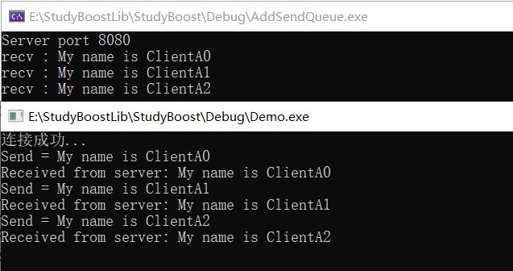

## 前言

我不能保证之前提供的代码是没有 bug 的，也不能保证这系列文章的全面性，更不能让该教程以一种深不见底的形式存在，所以要以此章节作为终章，但只能疑似终章。此后，若非特殊情况，只可能让初章（第一章）和终章（第九章）有改动。建立这个信条之后，我们就开启本篇的行文了。

## 知识站加油包

### 为什么后面的代码中监听不再繁琐？

在最开始的服务器代码中，从创建到监听客户端连接的代码相当繁琐，创建 io_context、endpoint、acceptor，然后调用 acceptor 的 bind、listen、accept 方法，才算开始监听。如果我们学过 Linux 网络编程，对此不难理解，但是未免每次这样都过于繁琐。

Asio 重载 acceptor 的构造函数，其内部帮我们会调用这些相关函数，即只需要创建 acceptor，随后调用 accept 或 async_accept 就可以监听了。

```c++
 basic_socket_acceptor(const executor_type& ex,
      const endpoint_type& endpoint, bool reuse_addr = true)
    : impl_(0, ex)
  {
    boost::system::error_code ec;
    const protocol_type protocol = endpoint.protocol();
    impl_.get_service().open(impl_.get_implementation(), protocol, ec);
    boost::asio::detail::throw_error(ec, "open");
    if (reuse_addr)
    {
      impl_.get_service().set_option(impl_.get_implementation(),
          socket_base::reuse_address(true), ec);
      boost::asio::detail::throw_error(ec, "set_option");
    }
    impl_.get_service().bind(impl_.get_implementation(), endpoint, ec);
    boost::asio::detail::throw_error(ec, "bind");
    impl_.get_service().listen(impl_.get_implementation(),
        socket_base::max_listen_connections, ec);
    boost::asio::detail::throw_error(ec, "listen");
  }
```

## 代码逻辑修复

### 轮询的错误

```c++
boost::asio::io_context& AsioIOServicePool::getIOService()
{
	nextIOService_ = nextIOService_ % size_;
	nextIOService_++;

	return ioServiceVec_[nextIOService_];
}
```

nextIOService_ 代表 要选择的 IOService，我这里通过取余得到 nextIOService_ 之后 进行自加操作是不合法的，这会出现越界行为。

修正代码如下：

```c++
boost::asio::io_context& AsioIOServicePool::getIOService()
{
	std::size_t current = nextIOService_;
	nextIOService_ = (nextIOService_ + 1) % size_;  // 确保不会越界
	return ioServiceVec_[current];  // 直接返回当前的 ioService
}
```

### Session::handle_write 代码修复

从 添加有序队列开始后续的代码都有这个错误，下面分析逻辑错误的原因：

```c++
void Session::handle_write(const boost::system::error_code& error)
{
	std::cout << "触发 write event" << std::endl;

	if (error) {
		std::cout << "handle_write error = " << error << std::endl;
		server_->ClearSession(uuid_);
		return;
	}
	std::lock_guard<std::mutex> send_lock(mtx_);
	if (!sendQue_.empty()) {
		auto& msgNode = sendQue_.front();
		boost::asio::async_write(socket_, boost::asio::buffer(msgNode->data_, msgNode->max_len_),
			std::bind(&Session::handle_write, shared_from_this(), std::placeholders::_1));
		sendQue_.pop();
	}
}

void Session::Send(char* msg, int max_len)
{
	bool pending = false;
	std::lock_guard<std::mutex> send_lock(mtx_);
	if (!sendQue_.empty()) {
		pending = true;
	}
	sendQue_.push(std::make_shared<MsgNode>(msg, max_len));
	if (pending) {	
		return;
	}

	socket_.async_write_some(boost::asio::buffer(msg,max_len),	
		std::bind(&Session::handle_write, shared_from_this(), std::placeholders::_1));
}
```

优先触发 Send 函数，把得到的数据封装为 MsgNode 放入到 队列中，然后调用 async_write_some 函数发送数据（就是刚刚封装的 MsgNode），如果执行成功，就会调用 handle_write 方法。

由于刚刚的数据已经发送，所以应该在 handle_write 方法中 pop 一下，即把之前加入到队列中的 MsgNode 移除。但是我的代码中没有这么做，而是判断是否为空后继续调用后面的方法，按理会导致必然有一份数据遗留在队列中。之所以之前没有测试出来，是因为客户端没有写接受服务端的代码导致。下面测试图中看不出来，但是你可以 Debug 看队列的大小，你会发现即便消息发送完，大小还是为 1，按理应该为 0。



正确的代码如下：

```c++
void Session::handle_write(const boost::system::error_code& error)
{
	std::cout << "触发 write event" << std::endl;

	if (error) {
		std::cout << "handle_write error = " << error << std::endl;
		server_->ClearSession(uuid_);
		return;
	}
	std::lock_guard<std::mutex> send_lock(mtx_);
       sendQue_.pop();
	if (!sendQue_.empty()) {
		auto& msgNode = sendQue_.front();
		boost::asio::async_write(socket_, boost::asio::buffer(msgNode->data_, msgNode->max_len_),
			std::bind(&Session::handle_write, shared_from_this(), std::placeholders::_1));
	}
}
```

修复检验：



## 代码完善

### 单例模式可接受不定参数

## 核心代码解读

