atomic 有两个功能：原子 和 内存序，这点可以通过官方接口文档看出，只是通常内存序默认是`memory_order_seq_cst`，从而被忽视。

原子的作用：保证对一个变量操作期间，其他线程不会对此变量操作，那就称为原子操作。

内存序的作用：构造一个事件发生先后的顺序关系，同步访问其线程中的其他非原子对象。不仅保护自己的安全，还要考虑保护别人的安全。

```tex
acquire：获得

release：释放、发布
```


# 原子变量

```c++
template <class T> 
struct atomic;
```

## 公共操作

| 接口                    | 描述                                                   | 补充说明                                                  |
| ----------------------- | ------------------------------------------------------ | --------------------------------------------------------- |
| is_lock_free            | 检测对特定类型的原子操作是否为无锁操作                 | 如果原子操作是无锁的（即不使用锁或自旋锁），则返回 `true` |
| store                   | 设置原子变量的值                                       |                                                           |
| load                    | 获取原子变量的当前值                                   |                                                           |
| exchange                | 原子地将存储的值替换为新值，并返回旧值                 | 常用于实现原子交换操作                                    |
| compare_exchange_weak   | 原子地比较当前值与预期值，如果相等，则将其替换为期望值 | 可能即使比较成功也会失败                                  |
| compare_exchange_strong | 功能同上                                               | 保证不会虚假失败（仅在比较结果确实不相等时才会失败）      |

对于大部分情况下，要对原子变量操作，一般方法是先通过 `load` 加载原子变量目前存储的值，然后操作后执行 `compare_exchange`。

 在一些平台，弱形式的 CAS 函数，也就是 `compare_exchange_weak` 函数性能可能更高。两个 CAS 函数均建议使用 do-while 循环进行操作。但是弱形式的函数可能会有 “出乎意料（Unexpected）” 的返回，那就直接用 `compare_exchange_strong` 更稳妥。

## 特有操作

| 接口      | 描述                                              | 补充说明                                                |
| --------- | ------------------------------------------------- | ------------------------------------------------------- |
| fetch_add | 将参数值加到原子变量中，并返回修改前的值          | 用于实现原子加法操作，常用于计数器或累加操作            |
| fetch_sub | 从原子变量中减去参数值，并返回修改前的值          | 用于实现原子减法操作                                    |
| fetch_and | 对原子变量执行位与操作（AND），并返回修改前的值   | 通常用于屏蔽或清除特定位                                |
| fetch_or  | 对原子变量执行位或操作（OR），并返回修改前的值    | 用于设置某些位（即将特定位设置为1），常见于标志位的操作 |
| fetch_xor | 对原子变量执行位异或操作（XOR），并返回修改前的值 | 用于切换位值（即0变1，1变0），这也是一种原子操作        |

# 内存序

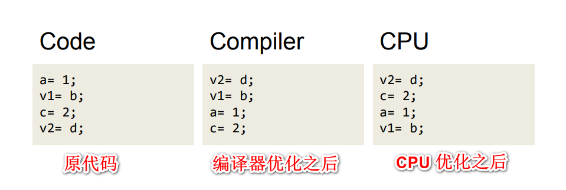

内存的顺序描述了计算机CPU获取内存的顺序，内存的排序可能静态也可能动态的发生：

- 静态内存排序：编译器期间，编译器对内存重排
- 动态内存排序：运行期间，CPU乱序执行

静态内存排序是为了提高代码的利用率和性能，编译器对代码进行了重新排序；同样为了优化性能CPU也会进行对指令进行重新排序、延缓执行、各种缓存等等，以便达到更好的执行效果。虽然经过排序确实会导致很多执行顺序和源码中不一致，但是你没有必要为这些事情感到棘手足无措。任何的内存排序都不会违背代码本身所要表达的意义，并且在单线程的情况下通常不会有任何的问题。

但是在多线程场景中，无锁的数据结构设计中，指令的乱序执行会造成无法预测的行为。所以我们通常引入内存屏障这一概念来解决可能存在的并发问题。

## 内存屏障的作用

内存屏障使得CPU 或编译器在对内存进行操作的时候,，严格按照一定的顺序来执行，也就是说在内存屏障之前的指令和之后的指令不会由于系统优化等原因而导致乱序。

大多数现代计算机为了提高性能而采取乱序执行，这使得内存屏障成为必须。语义上，内存屏障之前的所有写操作都要写入内存；内存屏障之后的读操作都可以获得同步屏障之前的写操作的结果。因此，对于敏感的程序块，写操作之后、读操作之前可以插入内存屏障。

我们讲内存屏障只有一种功能，禁止指令越过屏障。

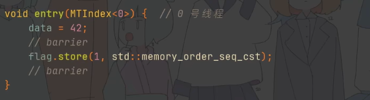

注：内存屏障（barrier），又名内存卡，栅栏。

## memory_order_release

以图中原子操作 atomic_store_explicit 为界限。

界限之前的写和读不允许重排到界限之后，界限之后的写和读允许被重排到界限之前。

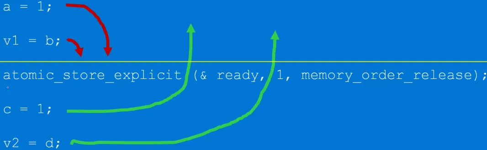

在当前线程中 memory_order_release 保护前面，不保护后面，即在原子操作前面加入内存屏障。

## memory_order_acquire

以图中原子操作 atomic_load_explicit 为界限。

界限之前的写和读允许重排到界限之后，界限之后的写和读不允许被重排到界限之前。

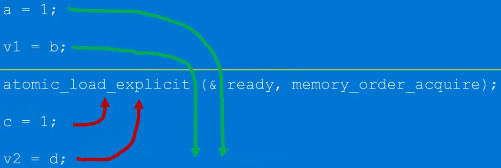

在当前线程中 memory_order_acquire 保护后面，不保护前面，即在原子操作后面加入内存屏障。

## memory_order_relaxed

松散的内存序，即相当于只有原子特性，不顾及事件发生先后的顺序关系。就是说编译器和CPU你想怎么优化就怎么优化，我不关心。

之前 atomic 有两个功能：原子性和内存序。但如果使用该内存序，就等价于只发挥 atomic 的原子性。

如果以下面这个原子操作为界限，界限之前的写和读允许重排到界限之后，界限之后的写和读也允许被重排到界限之前。

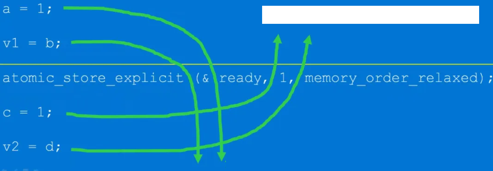

在当前线程中 memory_order_acquire 不保护后面，也不保护前面，即在原子操作前面和后面都不会加入内存屏障。

## memory_order_consume

`memory_order_consume`不应该出现在实际的代码中，即使在 C++17 中也不推荐使用。

截至 2015 年，大多数生产编译器并未实际跟踪这些依赖链，而是简单地将 `memory_order_consume` 提升为更强的 `memory_order_acquire`。

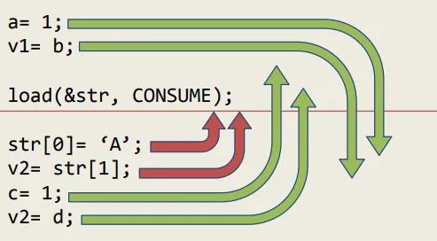

## memory_order_seq_cst

这是最强的内存序，不允许任何编译器等对代码进行优化，性能不是最好，但绝对是最安全。也就是编译器和CPU不要给我优化，代码原来是怎么样就怎么样去执行。

以图中原子操作 atomic_store_explicit 为界限。

界限之前的写和读不允许重排到界限之后，界限之后的写和读也不允许被重排到界限之前。

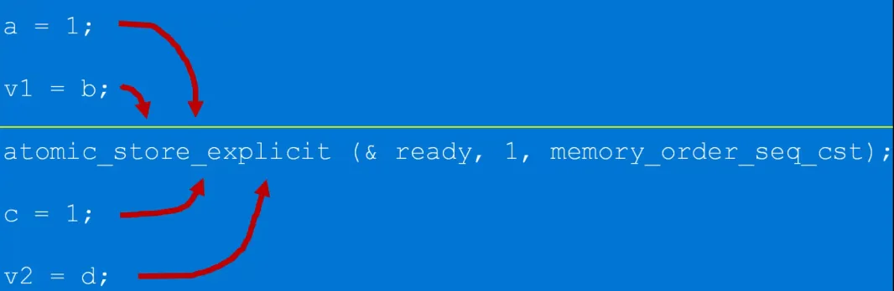

<font color="red">所有线程中</font> memory_order_seq_cst 保护前面，也保护后面，可谓最强内存序，线程的执行顺序与代码顺序严格一致。

## memory_order_acq_rel

同时包含 memory_order_acquire 和 memory_order_release 标记。

本线程中 memory_order_acq_rel 保护前面，也保护后面，是 memory_order_release 和 memory_order_acquire 同时作用之意。、

界限之前的写和读不允许重排到界限之后，界限之后的写和读也不允许被重排到界限之前。

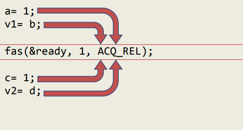

## 操作对应可选的内存序

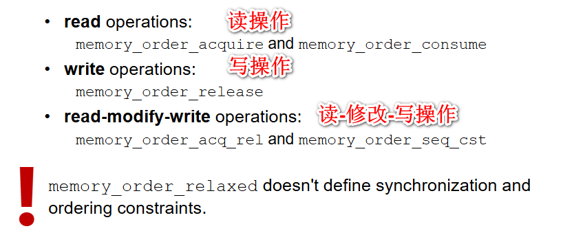

特殊的内存序要单独拿出来说一说：

- memory_order_release 只能 写操作，如 store
- memory_order_acquire 只能 读操作，如 load
- memory_order_acq_rel 只能 读-修改-写操作，如 fetch_add

> [!IMPORTANT]
>
> 由于 memory_order_consume 特殊性，不加入到单独说明中

## Acquire 和 Release成对

Acquire 和 Release 语义通常成对使用以确保不同线程之间的正确同步。

这样的成对使用保证了：

- 在执行 `release` 操作之前的所有写操作（包括普通非原子写和之前的原子写操作），对于执行 `acquire` 操作的线程都是可见的。
- 这些写操作不会被重排序到 `release` 操作之后，同时也不会被重排序到 `acquire` 操作之前。

# 内存模型

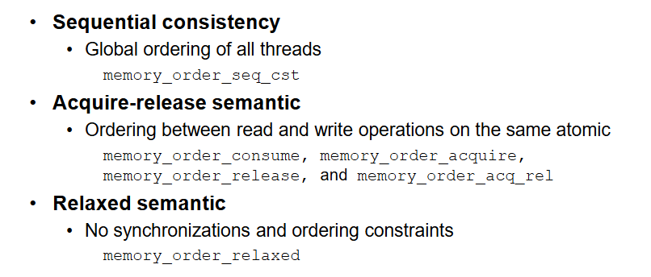

## 顺序一致性：所有线程的全局排序

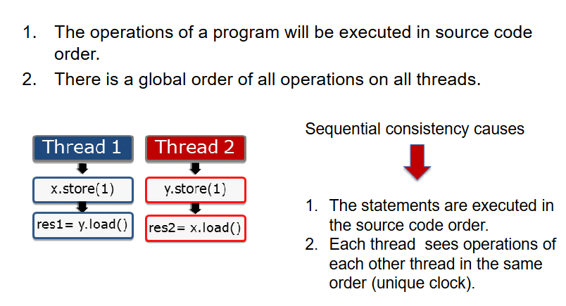

顺序一致性中，不允许 CPU 或 编译器对源代码进行重排，即禁止任何优化操作。因此，我们程序的操作将按照源代码顺序执行。

所有线程上的所有操作都有一个全局顺序，这意味着即使这些操作实际上可能几乎同时发生，系统也会保证所有线程看到的是相同的、确定的操作顺序。

那究竟会有哪些可能的操作顺序呢？

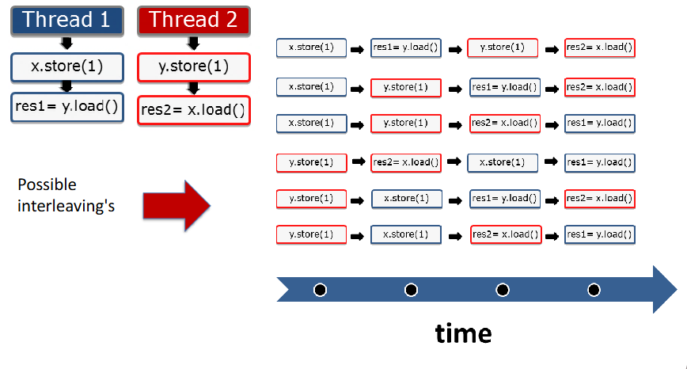

从图中我们可以看到的是，不管如何交错，都保证这样一个前提：x.store 操作 在 y.load 操作之前，y.store 在 x.load 操作之前。

这是因为我们线程中的代码顺序就是这样的，这是不可改变的。

## 获取-释放语义：同一原子操作上的读和写操作之间的顺序

原子上的释放操作与同一原子上的获取操作同步，并另外建立排序约束。

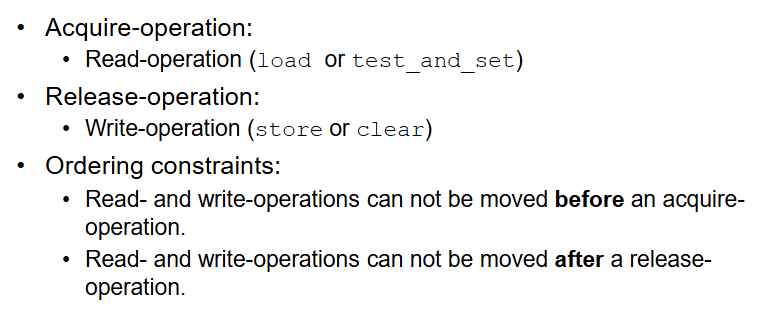

读写操作不能移动到 acquire（获取） 操作 之前，读写操作不能移动到 release（修改） 操作 之后。

下面请看示例：

这里明显是有两个原子变量，分别是 dataProduced 和 dataConSumed。

三个函数分别可以被多个不同的线程去执行，但是最终执行的顺序却保持一致，这是 acquire 和 release 语义配对形成。

dataConsumer 只有 dataConSumed 为 true 才可以继续往下执行。

deliveryBoy 的 两个原子操作不会被重排，dataProduced 为 true 往下执行，再往下 dataConSumed 为 true。

dataProducer 随时可以被执行，不依赖于任何东西，执行会让 dataProduced 为 true。

因此，如果三个线程分别去执行 图中三个函数。dataConsumer 和 deliveryBoy  会有依赖，导致无法往下执行。但是 dataProducer 没有依赖，正常执行让 dataProduced 为 true。deliveryBoy 等待的条件被满足，正常往下执行让 dataConSumed 为 true。dataConsumer 等待的条件被满足，得以往下执行。可见，尽管是多线程，操作的顺序是确定的。

是不是觉得特别像条件变量的感觉，获取-释放语义模型又名同步模型。

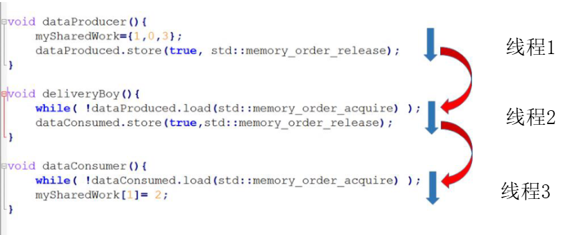

## 宽松语义：无同步和排序限制

没有同步和排序限制，这些操作只是原子的。

典型的用例就是 shared_ptr 的引用计数，线程可以以不同的顺序查看另一个线程中的操作。

# 文章推荐

[Memory-barriers](https://mariadb.org/wp-content/uploads/2017/11/2017-11-Memory-barriers.pdf)

[C++内存模型和原子类型操作](https://www.mdnice.com/writing/2c2a8fea034146b4aa87e157c4b2c6b8)

[The Cpp Memory Model](https://www.modernescpp.org/wp-content/uploads/2022/09/TheCppMemoryModel.pdf)