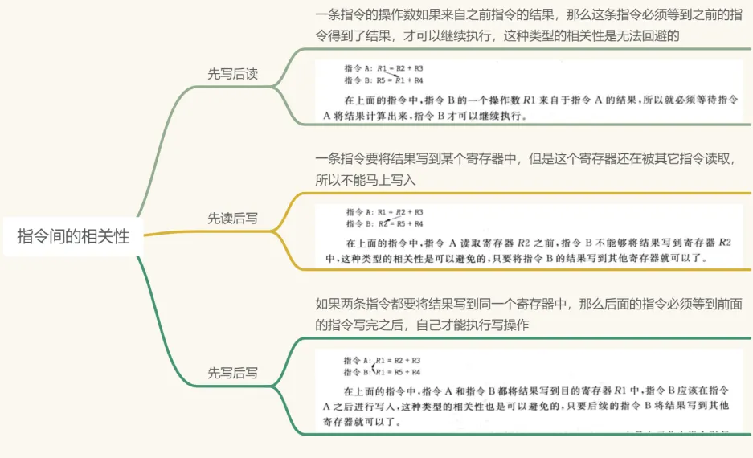
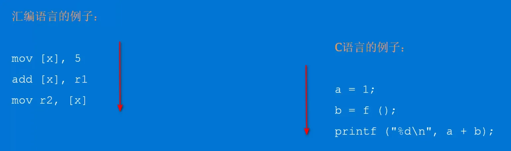
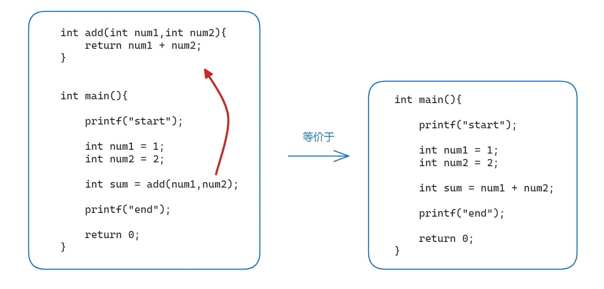
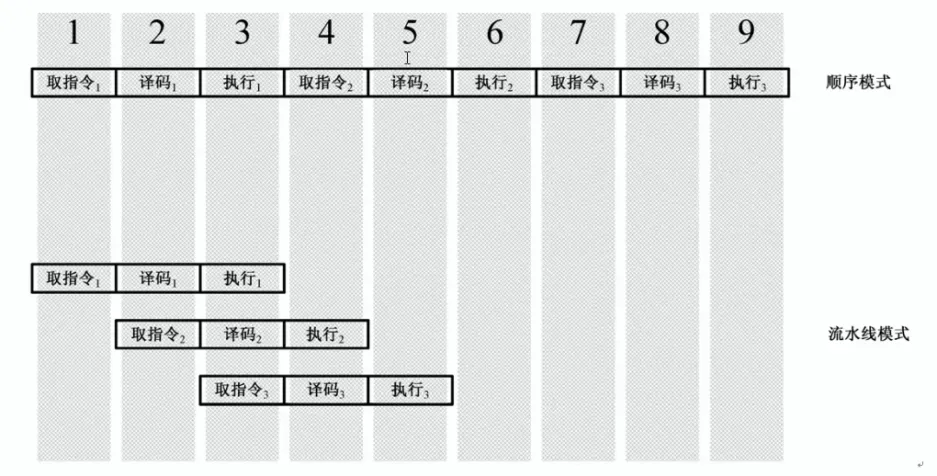
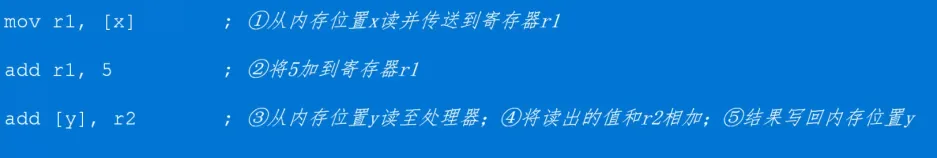
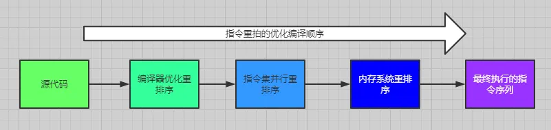
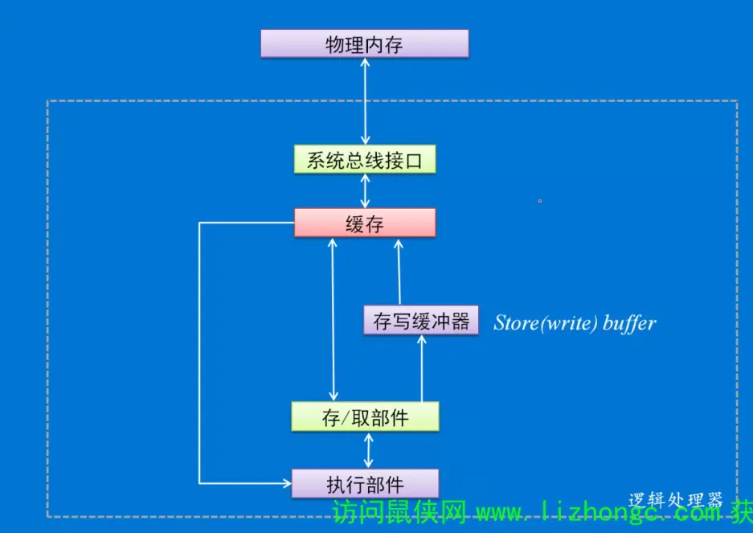
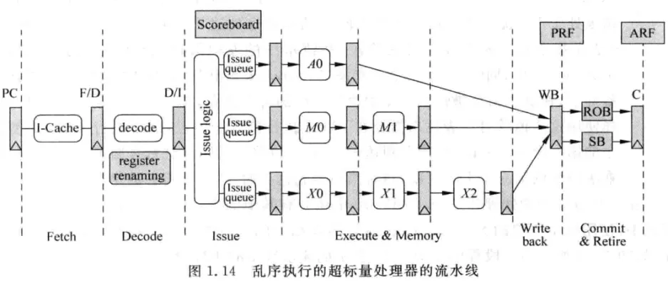

# 指令间的相关性

了解指令之间存在的相关性，它是阻碍程序并行执行的关键因素。

概括来讲，指令之间存在如下三种类型的相关性：

还有一种类型的相关性叫控制相关性，它是由于分支指令引起的，只有当分支指令的结果被计算出来的时候，才可以知道从哪里取得后续的指令来执行，由于分支指令需要一段时间才可以得到结果，在这段时间内只能按照预测的方式取指令。这个后面再讨论。

# 编排顺序（顺序执行）

指组成一段代码或组成一个程序的那些指令或者语句的先后次序。从直觉上来说，程序和代码都是按他们的编排顺序执行。

即便遇到汇编语言中的跳转或高级语言中的函数，本质上还是按照编排顺序执行指令或代码。

只不过为了代码维护的方便，才把程序功能抽离出为一个个函数。

# 流水线

处理器可以做很多事情，换言之，能够执行各种不同的指令，完成不同的功能，但这些事情大都不会在一个时钟周期内完成。执行一条指令需要从内存中取指令、译码、访问操作数和结果，并进行移位、加法、减法、乘法以及其他任何需要的操作。

为了提高处理器的执行效率和速度，可以把一条指令的执行过程分解成若干个细小的步骤，并分配给相应的单元来完成。各个单元的执行是独立的、并行的。如此一来，各个步骤的执行在时间上就会重叠起来，这种执行指令的方法就是**流水线**技术。

# 乱序执行

乱序执行就是将指令拆分成微操作，且如果指令之间没有依赖关系，则它们的微操作可以塞进不同的流水线同时执行。

即实际代码运行的顺序可能和我们代码编写的顺序并不一致。

执行顺序分析：

+ 1️⃣ 和 2️⃣ 不能同时执行，需要按照编排顺序执行，因为 2️⃣ 需要等待 1️⃣ 完成到 r1 的传送。
+ 2️⃣ 和 3️⃣ 可以同时进行，因为两条指令没有数据依赖。实际上，在 1️⃣ 完成后就可以立即执行 3️⃣ ，与此同时 2️⃣ 也正在执行。

# 指令的执行和引退

前面的乱序执行提高效率清晰可见，这如果是在**单线程中**，乱序执行并不影响执行的结果

为了保证乱序执行的结果和按照编排顺序执行的结果一致，**乱序执行后的结果不会立即生效**。指令需要按照 程序中规定的顺序，即 按照编排顺序更新处理器的状态。比如 inetl x86 系列的处理器都会引入一个称为**重排序缓冲器的部件 ROB**（用于扩展 Tomasulo 算法以支持乱序和推测指令执行的硬件单元）。

接下来，处理器按照指令的原始编排顺序，使它们离开重排序缓冲器。即按照它们原本的编排顺序引退（retirement）并提交（commit）执行的结果给软件可见的资源，诸如系统内存、缓存、寄存器，等等。

1. 指令的执行（execute）会产生预期的结果并影响处理器的状态。如果在执行期间处理器检测到错误的条件（比如被 0 除），也将引发异常。
2. 在一条指令没有引退之前，它的状态都是推测的，只有这条指令真正引退而离开流水线的时候，才可以将它的结果提交为处理器的一系列状态。
3. 在重排序缓冲器里，如果一条指令之前的指令还没有执行完，那么即使这条指令已经执行完成，它也不能离开重排序缓冲器，必须等待它之前的所有指令都执行完成。
4. 流水线的分发阶段是处理器从顺序执行到乱序执行的分界点，而流水线的引退阶段又将处理器从乱序状态拉回到顺序执行的状态。不管超标量处理器内部发生了怎样的事情，从处理器外部看来，它总是按照程序中指定的顺序(编排顺序) 执行的。

# 存写缓冲器

## 指令执行发生异常怎么处理

指令的执行会产生结果和状态，如果在这个过程中发生异常，根据异常的类型，有可能需要将处理器的状态回退到执行这条指令之前的状态。由于这时的指令还在重排序缓冲器，还没有被引退和提交，所以只需要将这条指令以及之前的指令从重排缓冲器中清除即可。

## 何为推测性执行

利用乱序执行技术，处理器还可以实施**推测性执行**。即如果程序中具有条件分支，处理器可以在知道是否需要转向这个分支之前就开始执行它。如果随着程序的执行，最终证明预测失败，则必须清空流水线，将已经执行过的指令从重排缓冲器中清除。

## 何为引退

流水线中的所有指令都按照程序中规定的顺序，即按照编排顺序存储在重排序缓冲器内部，使用重排序缓存来实现程序对处理器状态的顺序更新，同时重排序缓存也会配合完成对异常的处理。如果不存在异常和错误的分支预测，那么指令就能顺利离开流水线，并对处理器的状态进行更改，这就是指令的**引退**。

指令一旦引退，它就再也不可能回到之前的状态了。

## 存写缓冲器出现的缘由

指令一旦引退，就不存在从流水线中清除这一说了。麻烦在于，很多指令在执行时需要写内存。

读内存不会有任何影响，不改变内存的状态，写内存就意味着修改了软件可见的资源，改变了机器的状态。但是，写操作是在指令执行时进行的，而此时指令位于重排序缓冲器，还没有引退和提交。一旦由于分支预测失败或者异常等原因，需要将这条指令从流水线中抹掉时，就没有办法将内存的状态恢复到指令执行前的状态，因为内存中原来的值已经被覆盖了。

为此，需要在处理器内部设置一个缓冲器，即存写缓冲器，用来临时保存尚未提交的执行结果，以免破坏实际的执行环境。

## 存写缓冲器

存写缓冲器用来保存指令还没有引退之前的结果，需要写内存的指令将它的结果写到存写缓冲器，只有当这条指令真正从流水线引退的时候，才可以将它的值从存写缓冲器写回到内存。

使用了这个部件之后，如果一条指令所需要的数据位于存写缓冲器，它也可以直接从存写缓冲器取得，而不需要访问内存。

## 乱序和推测性地执行指令带来的读写情况

由于处理器可以乱序和推测性地执行指令，由处理器硬件实施的内存访问顺序将不会以程序的编排顺序出现。

首先，有可能出现乱序读。乱序读是乱序执行和推测性执行的自然结果，由于读操作不影响软件可见的资源(除了寄存器)，乱序读不妨碍我们认为程序是按编排顺序执行的。

其次，推测性读是允许的。在实施推测性执行时，有些推测性执行的指令需要读内存，这个读操作本身即是预测性的。

最后，很多处理器不允许乱序写和推测性写。由于这个原因，处理器将不得不使用存写缓冲器临时保存写操作，直到它们被提交。

# 缓存

**缓存由长度固定的**缓存线组成。内存访问时，如果处理器认为正在读取的内存位置是可以缓存的，它将把数据加载到一个缓存线，这叫做缓存线填充 。缓存线填充时，即使是处理器只访问1个字节，也将从内存里加载该字节前后的部分以组成一个完整的缓存线。

+ 缓存的内容也是动态变化的。缓存线填充需要淘汰其它有效的缓存线以腾出空间，这个过程叫做缓存线替换 。如果缓存线在被替换之前被修改过，则处理器执行一个到系统内存的回写操作。回写操作有助于维持缓存和系统内存之间的一致性。
+ 如果处理器要访问的操作数位于缓存中，则可直接从缓存中读取，而不必访问内存，这叫做缓存命中或者叫读命中。
+ 在处理器写内存时，它首先检查缓存，看这个内存位置是否有对应的缓存线。如果存在，处理器可以直接写入缓存而不是写入内存，这个操作叫做写命中。如果写操作未命中（要写入的内存位置不存在有效的缓存线），处理器执行一个缓存线填充，然后写入缓存线。如果当前的写入策略允许的话也将写入内存。

在多处理器系统中，所有处理器都有能力嗅探其它处理器是否访问了内存和缓存。它们用这种嗅探能力来保持其内部缓存与系统内存及其它处理器内部缓存的一致性。即如果某个处理器更改了内存或者其缓存中的数据，则所有缓存了这个数据的处理器都会得到通知并更新它们缓存的内容。

# 总结

为了提高指令执行的效率，指令之间没有数据依赖的话，可以**乱序执行**。

乱序执行的结果必须和编排顺序执行的结果保持一致，否则就改变了程序执行本来的意图，是不合理的

所以流水线中的所有指令都按照程序中规定的顺序存储在**重排序缓存（ROB）**中，使用重排序缓存来实现程序对处理器状态的顺序更新，这个阶段称为**提交（commit）**。

如果这个过程中**分支预测失败**或**出现异常**，只需要清空重排序缓存即可。

如果不存在异常和错误的分支预测，那么指令就能顺利离开流水线（引退的动作完成，且引退的指令再也不可能回到之前的状态了），并对处理器的状态进行更改（提交的动作完成）。

如果这些指令只是读内存倒也没什么，可是写内存的指令出现分支预测失败或异常等原因，就得从重排序缓存中清空这些指令，但是存储器的状态在之前执行写指令的时候被更改又该如何恢复呢？还需要引入另一个缓存，即存写缓冲器（SB）保存指令还没有引退之前的结果，需要写内存的指令将它的结果写到存写缓冲器（不再直接写入内存，这样就不会出现在异常或分支预测失败时就已经更改内存了），只有当这条指令真正从流水线引退的时候，才可以将它的值从存写缓冲器写回到内存。

