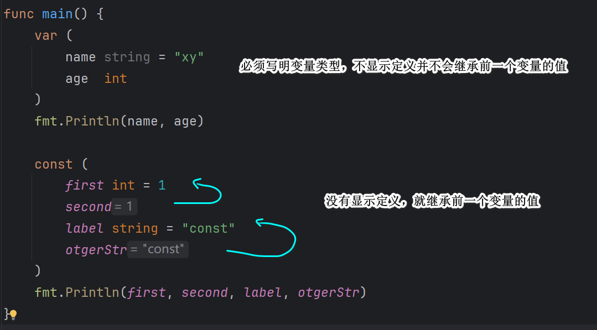
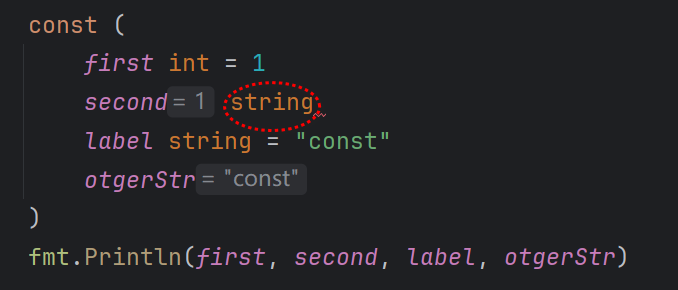

## 如何定义变量

（1）使用 var 关键字定义变量（标准写法）

```go
var a int           // 声明一个 int 类型的变量 a，初始值为 0（默认值）
var b string = "hi" // 声明并初始化
```

如果你不写类型，Go 会根据赋值自动推断类型：

```go
var c = 3.14  // 自动推断为 float64
```

（2）简短声明（只能在函数内部使用）

```go
d := 42         // 自动推断类型为 int
e := "hello"    // string
```

⚠️ 注意：`:=` 只能在函数内部使用（局部变量），不能在包级作用域外使用（全局变量）。

&nbsp;

⚠️ 注意：Go 语言中局部变量定义之后必须使用，否则不能通过，全局变量不受影响。

## 常量（不可修改）

```go
const PI float32 = 3.1415926;
```

⚠️ 注意：定义常量，名称尽量全部大写。

## 常量和非常量定义多个变量的区别



你可能疑惑，const 隐式定义常量指定类型和前一个显示定义的常量类型不一致会怎么样？报错：



## iota 的使用细节

`iota` 是 Go 语言中一个**非常有用的常量生成器**，常用于定义一组递增的常量，比如枚举类型。

```go
const (
    A = iota // 0
    B        // 1
    C        // 2
)

等价于 

const (
    A = 0
    B = 1
    C = 2
)
```

&nbsp;

技巧1：中间插空

```go
const (
    _  = iota        // 丢弃第一个值（0）
    KB = 1 << (10 * iota)  // 1 << 10 = 1024
    MB               // 1 << 20
    GB               // 1 << 30
)
```

技巧2：多个常量使用 itoa

```go
const (
    a, b = iota, iota * 10
    c, d
)

输出结果：

a = 0, b = 0
c = 1, d = 10
```

&nbsp;

注意点：

- `iota` 是在 **同一个 const 块内才会自增**，每遇到 `const` 会重置为 0。
- 如果某一行没有写 `iota`，但写了一个值，那 `iota` 仍会自增，只是你没用它。

```go
const (
	num1 = iota
	num2
	num3 = "ha"
	num4
)

输出结果：

0 1 ha ha
```

可以看到，如果我们在中间不再使用 itoa ，重新赋值其他值给新的变量，那么后面隐式定义的变量就继续前一个显示定义变量的结果，这个在前面介绍 const 已经讲过。

那么，itoa 就消失了吗？依旧在递增，只是没有被使用：

```go
num1 = 0        // iota = 0
num2 = 1        // iota = 1
num3 = "ha"     // iota = 2（被丢弃）
num4 = "ha"     // iota = 3（被丢弃）
```

直到你下一次定义新的 const 常量，itoa 才会重置为 0：


为了证明只是被丢弃，我们在后面添加应该隐式定义，看看效果：


## 匿名变量

匿名变量本身**不能定义，也不能被读取**，只用于占位。

它是一个下划线 `_`，专门用来**丢弃不需要的值**。

```go
_ = 123  // 这个值被丢弃
```

注意点：

- `_` 不能作为变量参与运算或读取。
- 多次使用 `_` 并不会冲突，因为它不会占用内存或命名空间。
- 编译器会强制你**不要声明未使用的变量**，使用 `_` 是合规的方式避免警告。

&nbsp;

常见用途：

（1）**忽略函数返回值**

很多函数会返回多个值，有时你不需要所有的：

```go
val, _ := someFunc()  // 又两个返回值，这里忽略第二个错误返回值
```

（2）遍历时忽略 index 或 value

```go
for i, _ := range []string{"a", "b"} {
    fmt.Println(i)
}

for _, val := range []string{"a", "b"} {
    fmt.Println(val)
}
```

（3）接口实现时忽略未使用参数

当实现接口时，有些方法参数可能用不到，用匿名变量可避免“变量未使用”编译错误：

```go
func (m MyType) ServeHTTP(_ http.ResponseWriter, _ *http.Request) {
    // 不使用参数，只实现接口
}
```

（4）占位符测试

```go
_ = someFunc() // 只是为了触发调用，不关心结果
```


