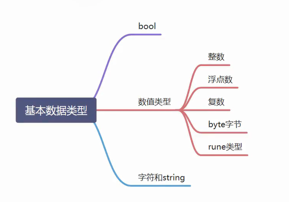

- **rune 类型**：在 Go 语言中，`rune`是`int32`的别名 ，用于表示 Unicode 码点，主要用于处理字符。

- **复数**：由实部和虚部组成，在 Go 语言中复数类型有`complex64` （实部和虚部都是`float32` 类型 ）和`complex128` （实部和虚部都是`float64` 类型 ） 。

## 数据类型的转换--Strconv

strconv包实现了基本数据类型与其字符串表示的转换。

主要有以下常用函数： Atoi()、Itoa()、parse系列、format系列、append系列。

### int 和 string 的转换

Atoi() 函数用于将字符串类型的整数转换为 int 类型。

Itoa() 函数用于将 int 类型数据转换为对应的字符串表示。

### parse 系列

Parse类函数用于转换字符串为给定类型的值：ParseBool()、ParseFloat()、ParseInt()、ParseUint()。

```go
b, err := strconv.ParseBool("true")
f, err := strconv.ParseFloat("3.1415", 64)
i, err := strconv.ParseInt("-2", 10, 64)
u, err := strconv.ParseUint("2", 10, 64)
```

### Format系列函数

Format 系列函数将给定类型数据格式化为 string 类型数据：FormatBool()、FormatFloat()、FormatInt()、FormatUint()。

```go
s1 := strconv.FormatBool(true)
s2 := strconv.FormatFloat(3.1415, 'E', -1, 64)
s3 := strconv.FormatInt(-2, 16)
s4 := strconv.FormatUint(2, 16)
```

