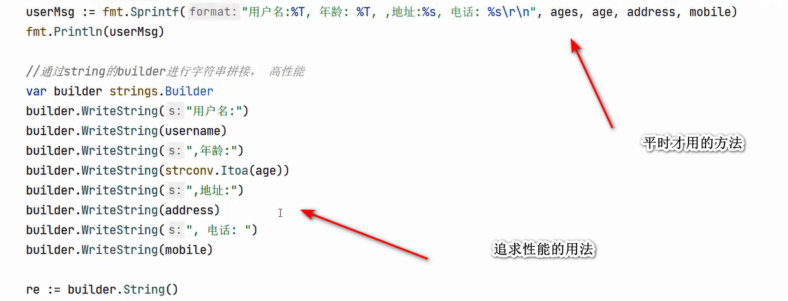

## 格式化输出和字符串拼接高性能

格式化输出平时常用，追求性能可以选择 Builder 来完成。



## 字符串常用操作

| 函数                              | 功能说明                          |
| --------------------------------- | --------------------------------- |
| `strings.HasPrefix(s, pre)`       | 是否以 pre 开头                   |
| `strings.HasSuffix(s, suf)`       | 是否以 suf 结尾                   |
| `strings.Contains(s, sub)`        | 是否包含子串                      |
| `strings.Index(s, sub)`           | 第一次出现子串的位置，找不到为 -1 |
| `strings.ToLower(s)`              | 转为小写                          |
| `strings.ToUpper(s)`              | 转为大写                          |
| `strings.TrimSpace(s)`            | 去除首尾空格                      |
| `strings.Split(s, sep)`           | 按分隔符分割字符串，返回切片      |
| `strings.Join([]string, sep)`     | 用分隔符连接字符串切片            |
| `strings.ReplaceAll(s, old, new)` | 替换所有子串                      |

## 定义多行字符串

Go语言中要定义一个多行字符串时，就必须使用`反引号`字符：

```go
s1 := `第一行
第二行
第三行
`
```

反引号间换行将被作为字符串中的换行，但是所有的转义字符均无效，文本将会原样输出。

## Go 中字符串是不可变的

修改字符串只能通过转换为 `[]byte` 或 `[]rune`：

```go
s := "hello"
b := []byte(s)
b[0] = 'H'
s = string(b) 	// "Hello"
```

