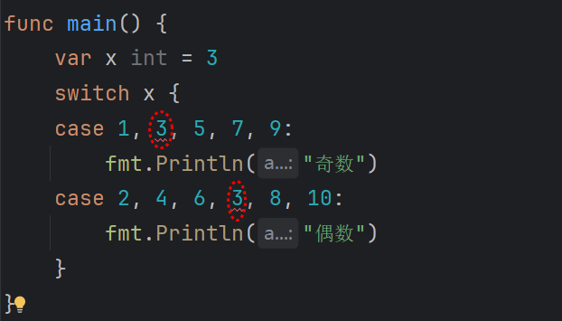

## if 语句

```go
x := 10

if x > 0 {
    fmt.Println("x 是正数")
} else if x < 0 {
    fmt.Println("x 是负数")
} else {
    fmt.Println("x 是零")
}
```

Go 中特有的写法，尽管 C++后面的新特性也已经支持，即在条件中声明变量：

```go
if v := compute(); v > 10 {
    fmt.Println("大于 10")
} else {
    fmt.Println("小于等于 10")
}
// 注意：v 只在 if/else 代码块中可见
```

## switch 语句

```go
switch n := len("hello"); n {
case 5:
    fmt.Println("长度为 5")
default:
    fmt.Println("其他长度")
}

// 注意：变量 n 只在 switch 块中可见。
```

case 是支持多个值的，只要值在其中就可以执行对应的逻辑代码：

```go
switch x {
case 1, 3, 5, 7, 9:
    fmt.Println("奇数")
case 2, 4, 6, 8, 10:
    fmt.Println("偶数")
}
```

你可能疑惑，如果两个条件中有相同的判断会如何？会报错：



如果 switch 没有表达式，就和 if 语句差不多：

```go
score := 85

switch {
case score >= 90:
    fmt.Println("优秀")
case score >= 60:
    fmt.Println("及格")
default:
    fmt.Println("不及格")
}
```

## for 语句

### 传统方式

```go
for i := 0; i < 5; i++ {
    fmt.Println(i)
}
```

在 Go 中没有 while 循环，for 可以完成这个工作：

```gO
i := 0
for i < 5 {
    fmt.Println(i)
    i++
}
```

接着还有死循环：

```go
for {
    fmt.Println("死循环")
}
```

&nbsp;

`break`：跳出当前循环

`continue`：跳过本次循环，继续下一次

`goto`：不推荐，一般不用

### rang 方式

遍历数组和切片：

```go
arr := []int{10, 20, 30}

for index, value := range arr {
    fmt.Printf("下标 %d 的值是 %d\n", index, value)
}
```

遍历 map：

```go
m := map[string]int{"A": 1, "B": 2}

for key, value := range m {
    fmt.Printf("键: %s, 值: %d\n", key, value)
}
```


