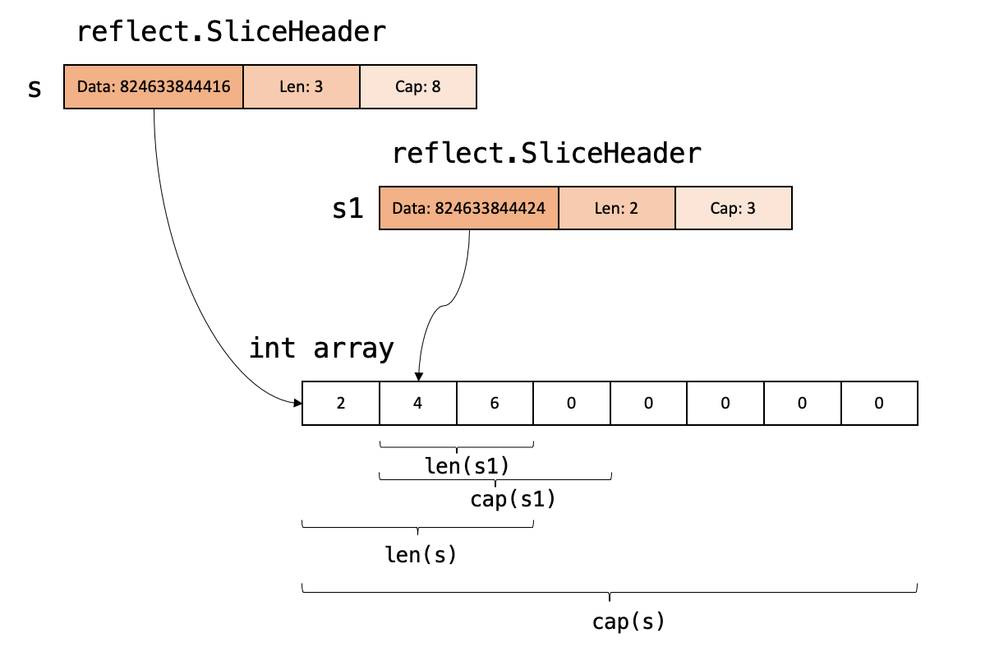
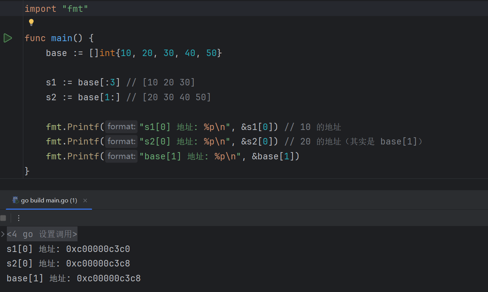
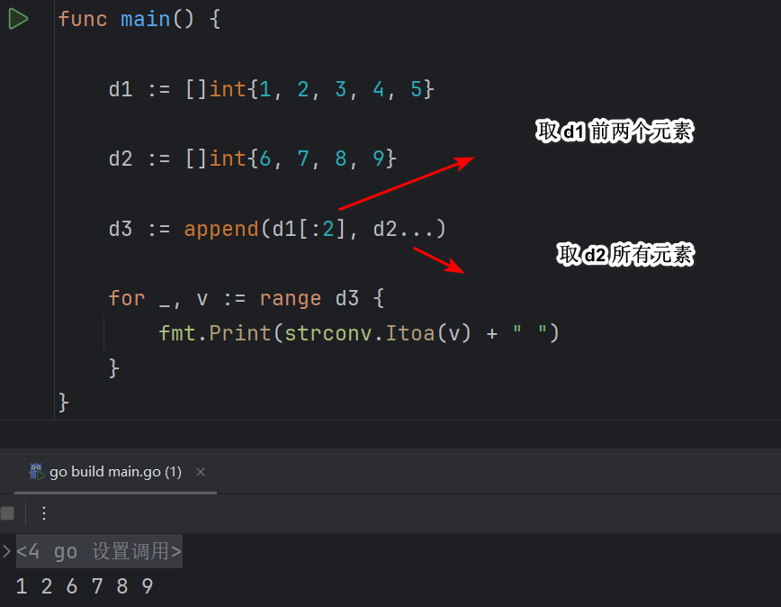
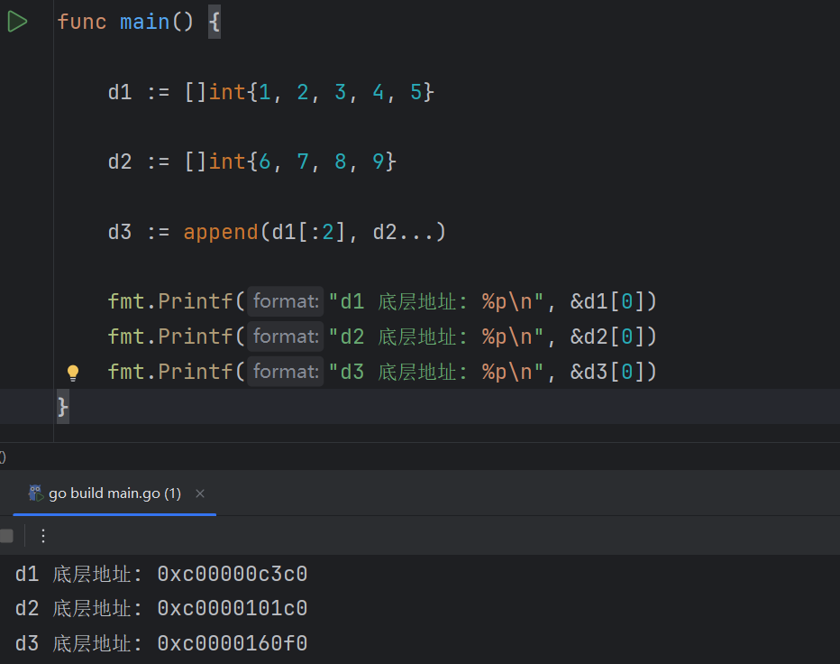
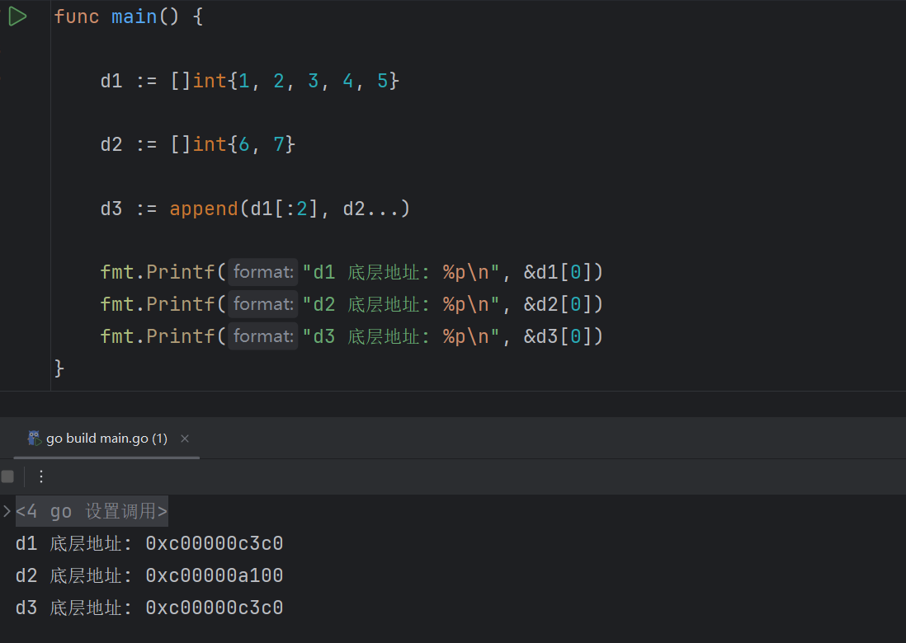
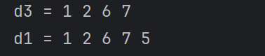

切片（slice）是对数组的一层抽象，底层基于数组，但具有**动态长度**，可以自动增长、截取等。

## 切片的多种初始化方式

```go
// 使用字面量直接定义
d1 := []int{1, 2, 3, 4, 5, 6, 7, 8, 9}

// 从数组切片
arr := [...]int{1, 2, 3, 4, 5, 6, 7, 8, 9}
d2 := arr[2:5]

// 使用 make 创建，提前创建指定长度，避免频繁扩容的性能问题
d3 = make([]int, 3, 5) // 长度为 3 ，容量为 5
d4 = make([]int, 3)    // 长度为 3 ，容量为 3

// 声明后赋值（空切片）
var d5 []int
d5 = append(d5,3)	// 超出容量会两倍扩容
```


## 切片的数据访问和底层存储原理

切片的访问方式和前面的数组一样，但是有些访问方式是切片独有的，就记录这部分内容。

```go
s := []int{10, 20, 30, 40, 50}

s1 := s[1:4]   // [20 30 40]，左闭右开
s2 := s[:3]    // [10 20 30]
s3 := s[2:]    // [30 40 50]
```

子切片并不复制数据，它只是原切片的一部分视图。所以，你对切片过来的数据修改会影响到原切片。

但你不能说新的切片是旧的切片的引用，因为只是数组部分是共享（切片底层存储元素是数组），但是其他信息并不是，而是每个切片独有的。



每个切片本质上是一个结构体，见下：

```go
type slice struct {
    ptr unsafe.Pointer  // 指向底层数组的起始地址
    len int             // 当前切片长度（访问元素数量）
    cap int             // 当前切片容量（最大可扩展数量）
}
```

所以，每个切片共享的是数组部分，但是结构体中的所有元素都是个人的，绝对没有引用。

可见，每个切片都是独立存在的。之所以修改元素会影响原切片，是因为指针指向的同一个数组空间。

要注意，每个切片的指针并不一定指向相同的数组起始下标，这取决于切割的时候从哪里开始切割。比方说，上图中 s 指向数组的第一个元素，s1 指向数组的第二个元素，是不同的起始地址。下面举例：



## 通过省略号添加多个元素到切片

`append` 函数的原型是这样：

```go
func append(slice []T, elems ...T) []T
```

- `slice`: 要追加的目标切片
- `elems ...T`: 变长参数（可以是多个值，也可以是展开的切片）

示例：追加多个元素

```go
s := []int{1, 2, 3}
s2 := []int{4, 5, 6}
s = append(s, s2...) // 把 s2 的每个元素“拆开”并添加进 s

fmt.Println(s) // 输出 [1 2 3 4 5 6]
```

因为 `append` 期望的是**一系列元素**（`...int`），不要直接给 切片，下面这种写法是错误的：

```go
s = append(s, s2) // 报错！类型不匹配
```

&nbsp;

第一个参数可以指定切片的范围，如果直接传递切片，那就是相当于在这个切片后面添加元素进来：



## 切片元素的拷贝和删除

Go 中切片的元素 **拷贝（复制）** 和 **删除** 是两个非常常见的操作。虽然 Go 没有内建的删除函数，但你可以通过 `append` 和 `copy` 轻松实现。

### 拷贝

```go
copy(dstSlice, srcSlice)
```

会将 `srcSlice` 中的元素 **逐个拷贝**到 `dstSlice`

拷贝的元素个数为两者中较小的长度：`min(len(dst), len(src))`

```go
src := []int{1, 2, 3}
dst := make([]int, len(src)) // 必须先分配空间
copy(dst, src)

fmt.Println(dst) // [1 2 3]
```

注意点：

`copy` 是 **值拷贝**，不是引用。修改 `dst` 不影响 `src`。

`dst` 必须已分配好空间，否则拷贝不了。

### 删除

（1）删除索引为 `i` 的一个元素

```go
s := []int{10, 20, 30, 40, 50}
i := 2

s = append(s[:i], s[i+1:]...)
fmt.Println(s) // [10 20 40 50]
```

（2） 删除第一个元素

```go
s = s[1:]
```

（3）删除最后一个元素

```go
s = s[:len(s)-1]
```

（4）删除多个元素（从 i 到 j-1）

```go
i, j := 1, 3 // 删除 s[1], s[2]
s = append(s[:i], s[j:]...)
```


## 切片的扩容机制

切片在 `append` 时，若容量不足，Go 会：

- **创建一个更大的数组**（通常是原容量的 2 倍）；
- **将原有数据复制到新数组中**；
- 返回一个指向新数组的切片。

这就是为什么 append 明明已经传递切片对象，但是却要把返回值给到原切片，就像下面这样：

```go
s1 := []int{1, 2, 3}
s2 := append(s1, 4)
```

那是因为，如果容量不足，`s2` 就不再指向 `s1` 原来的数组了，**它变成一个新数组的切片**。

所以，**`append` 可能返回一个新的底层数组的切片**，如果你不接住这个返回值，你的更改就丢了！

&nbsp;

我想把前面讲 append 的例子拿过来：



d3 之所以地址不同，是因为切片 d3 是 d1 已经不是共享同一个切片。

因为 d2 中的元素加到 d1 中，触发扩容机制。

下面演示，插入 2 个元素就是还共享同一个数组：



注：这里的 d1 和 d3 的地址相同，还有一个原因是起始地址都指向第一个元素，这不影响证明，恰恰是为了不影响当前的证明。

但是已改变原切片部分数据，你拷贝进来的会覆盖掉对应的数据。



## 切片是如何被 GC 识别的？

Go 的 GC 会自动识别哪些切片仍在使用，但由于切片本身只是指针 + 长度信息，**它是否阻止底层数组回收**，完全取决于：

- 切片是否还存在；
- 切片是否还引用底层数组。

因此切片很容易造成“看似小，但实际持有大内存”的**内存悬挂**问题。


