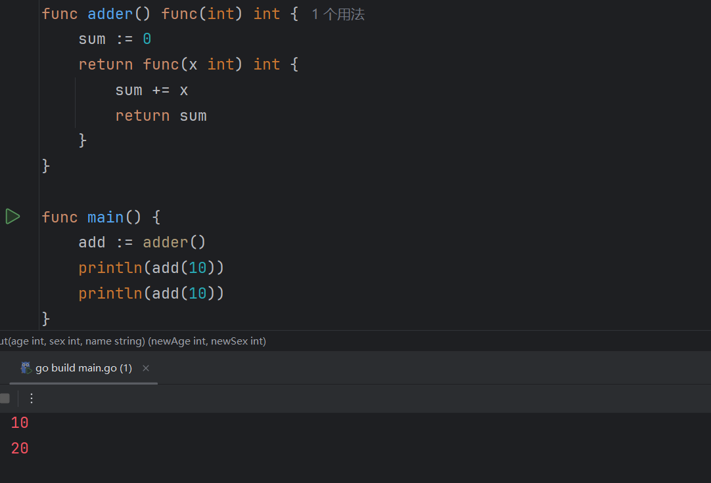
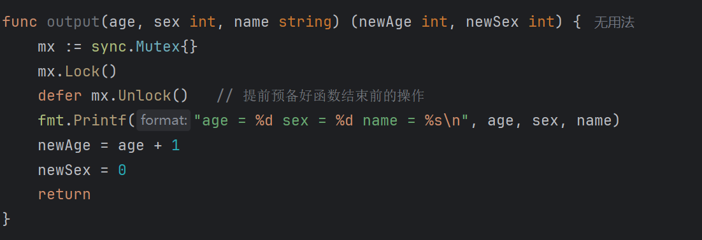

```go
func 函数名(参数列表) 返回值类型 {
    // 函数体
}
```

## 支持多返回值

```go
func output(age, sex int, name string) (int, int) {
	fmt.Printf("age = %d sex = %d name = %s\n", age, sex, name)
	newAge := age + 1
	newSex := 0
	return newAge, newSex	// 多返回值
}
```

我们在定义函数接受的参数的时候，如果连续的多个变量的类型一样。只需要后面标明一个类型就可以，就像 `age, sex int` 就等价于 `age int, sex int`。

再一个就是返回值，前面我们在函数里面新定义一个变量接受结果并返回，实际上也可以把这个变量直接提前在返回值中定义，然后直接 return  就可以。

```go
func output(age, sex int, name string) (newAge int, newSex int) {
	fmt.Printf("age = %d sex = %d name = %s\n", age, sex, name)
	newAge = age + 1
	newSex = 0
	return
}
```

## 可变参数

```go
func sum(nums ...int) int {
    total := 0
    for _, num := range nums {
        total += num
    }
    return total
}
```

## 匿名函数

函数就相当于是一个变量，可以赋值。通过在变量后面加上 () 可以调用这个函数。

```go
add := func(a, b int) int {
	return a + b
}
re :=add(1, 2)
fmt.Println(re)
```

## 闭包

```go
func adder() func(int) int {
    sum := 0
    return func(x int) int {	// 把 sum 拷贝进来
        sum += x
        return sum
    }	// 返回这个匿名函数，形成闭包
}
```

当你调用 adder 会得到一个函数 A ，函数中的变量初始化为 0，每次调用 A 得到的 sum + x 的结果，注意内部 sum 是不断变化的，但是不影响外部的 sum，这是两个独立的变量。



每次调用 adder() 就会得到初始化状态的一个函数 H，这时候的 sum 就是 0，这个 sum 就属于 这个 H，可以直接使用。

## defer

defer 注册的函数会在**当前函数返回之前**执行，**但在函数的所有代码执行完毕之后**。

比方说在并发编程中，我们会在函数的开头上锁，但是可能会忘记在函数结束的时候释放锁。

那我们可以提前写好，见下：



如果有多个 defer，**按照“后进先出（LIFO）”** 执行顺序，就像入栈和弹栈的顺序一样。

## panic、recover

Go 语言中的 panic 和 recover 是用于**异常处理**的机制，它们不是日常控制流程的一部分，但在处理严重错误、资源清理等场景中非常有用。

panic 会让程序直接崩溃，除非你 recover 来处理。panic 可以在任何地方调用，建议只在真正“无法继续”的情况下使用。

recover 只能在 **defer 中使用**，用来**阻止程序崩溃**，捕获 panic 的信息。

```go
package main

import "fmt"

func protect() {
    if r := recover(); r != nil {
        fmt.Println("捕获到 panic：", r)
    }
}

func risky() {
    defer protect()
    fmt.Println("即将 panic")
    panic("Something went wrong!")
    fmt.Println("这行不会执行")
}

func main() {
    risky()
    fmt.Println("程序继续运行")
}

```

多个 defer，最后注册的先执行（LIFO），只有那个 defer 中的 recover 会生效。