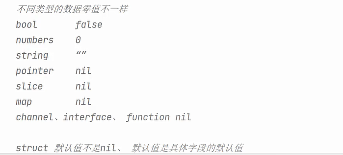

虽然 Go 没有像 C/C++ 那样复杂的指针操作，但它支持基本的指针功能，用于高效传参、修改数据、避免复制等。

✅ 可以取地址（`&`）和解引用（`*`）

❌ 不能进行指针运算（如 `p++`、`p + 1`）

❌ 没有指针数组、指针函数等高级特性

✅ 无需手动释放内存（由 GC 管理）

&nbsp;

| 操作       | 说明                                      |
| ---------- | ----------------------------------------- |
| `&x`       | 取变量 x 的地址                           |
| `*p`       | 解引用指针，获取地址指向的值              |
| `new(T)`   | 返回类型 T 的指针，指向零值               |
| 结构体指针 | 可通过 `.` 调用字段和方法，无需显式解引用 |

最后一点和 C/C++ 不同，特别说明：

```go
type Person struct {
    Name string
    Age  int
}

func (p *Person) Birthday() {
    p.Age++
}

p := &Person{Name: "Alice", Age: 30}
p.Birthday()  // 不需要 (*p).Birthday()
```

## 初始化方式

| 方法     | 示例             | 是否分配新内存 | 可设初始值 | 备注           |
| -------- | ---------------- | -------------- | ---------- | -------------- |
| `&x`     | `p := &x`        | 否             | 是         | 指向已有变量   |
| `new(T)` | `p := new(int)`  | 是             | 否（零值） | 返回指针       |
| `&T{}`   | `p := &Person{}` | 是             | 是         | 创建结构体指针 |
| 零值声明 | `var p *int`     | 否             | 否         | 默认是 `nil`   |

## nil 在 go 中的细节



我们应该尽可能选择初始化，否则会遇到麻烦：

| 情况                  | 后果                |
| --------------------- | ------------------- |
| 访问 nil map          | panic（写时）       |
| 发送/接收 nil channel | 永久阻塞            |
| 解引用 nil 指针       | panic               |
| 调用 nil func         | panic               |
| 接口包含 nil 值       | 不等于 nil 接口本身 |

因此，我们的建议如下：

✅ 总是初始化 map、chan、slice：使用 `make()`。

✅ 使用指针时要判断是否为 nil。

✅ 小心接口类型的 nil 陷阱。

❌ 不要在未初始化的引用类型上执行写入操作。