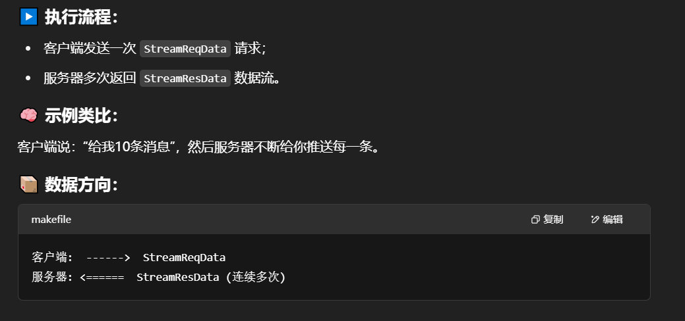
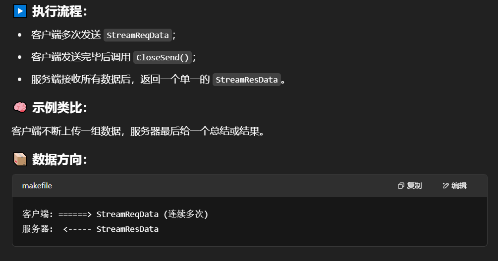
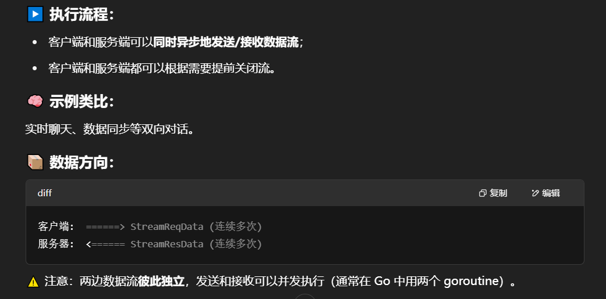

完整的代码地址：[grpc的四种模式](https://github.com/xiaoyangst/Code/tree/master/Go%E7%BC%96%E7%A8%8B/grpc%E7%9A%84%E5%9B%9B%E7%A7%8D%E6%B5%81%E6%A8%A1%E5%BC%8F/StudyGo)

## 四种模式

（1）简单模式

客户端发起一次请求，服务器响应一个数据。

（2）服务端数据流

客户端发起一次请求，服务器响应一段连续的数据流。

典型的例子是客户端向服务器发生一个股票代码，服务器就把股票的实时数据源源不断的返回给客户端。

（3）客户端数据流

与服务端数据流模式相反，这次是客户端源源不断的向服务端发送数据流，在发送结束后，有服务端返回一个响应。典型的例子就是物联网终端向服务器发送数据。

（4）双向数据流

客户端和服务端都可以向对方发送数据流，这个时候双方的数据可以同时互相发送，也就是可以实现实时交互。典型的例子就是聊天机器人。

## grpc发布服务器方法和客户端远程调用服务器方法的基本过程

Go 使用 gRPC 的基本步骤：

1. 定义 `.proto` 文件并指定 `go_package`
2. 使用 `protoc` 生成 Go 代码
3. 创建 grpc 服务端实例并注册服务，监听客户端连接，就启动 grpc 服务器
4. 先通过 grpc 接口去连接 grpc 服务端，创建 grpc 客户端实例并调用远程方法

## grpc的流模式的定义

gRPC 流模式在 `.proto` 中通过 `stream` 关键字定义，Go 中会生成特定接口：

- `stream.ResponseType` 表示 **服务端流**。
- `stream RequestType` 表示 **客户端流**。
- 同时使用表示 **双向流**。

## grpc的单向流，双向流代码实现

```protobuf
syntax = "proto3";

option go_package = ".;proto";

service Greeter{
    rpc GetStream(StreamReqData) returns (stream StreamResData);        // 服务端流模式
    rpc PutStream(stream StreamReqData) returns (StreamResData);        // 客户端流模式
    rpc AllStream(stream StreamReqData) returns (stream StreamResData); // 双向流模式
}

message StreamReqData{	// 请求参数
    string data = 1;
}

message StreamResData{	// 返回参数
    string data = 1;
}
```

服务器流模式：



客户端流模式：



双向流模式：




