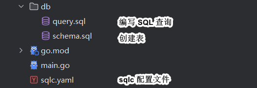
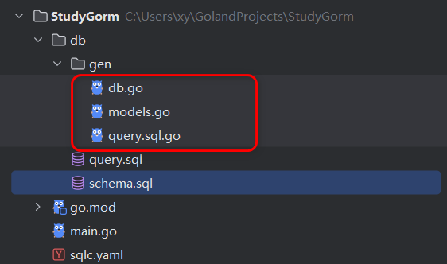
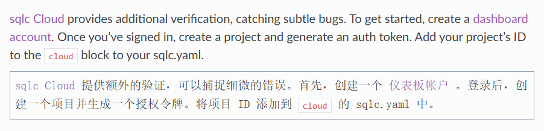
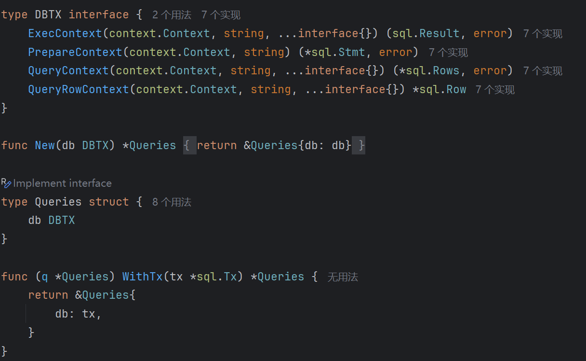
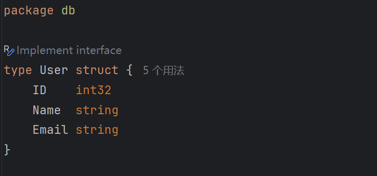
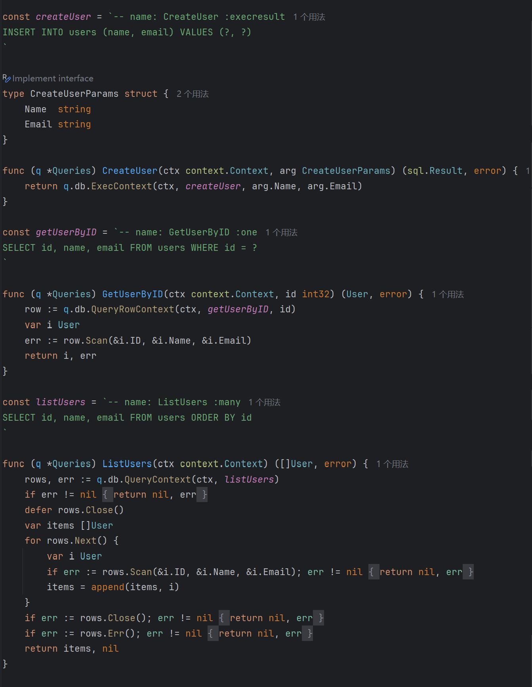
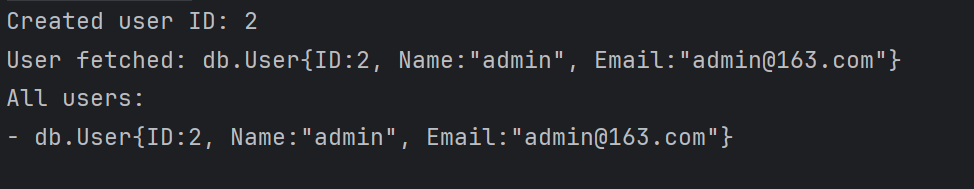
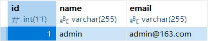

sqlc 官方主页地址是 https://sqlc.dev/。

使用 [play.sqlc.dev](https://play.sqlc.dev/) 在线编写 SQL 查询，并即时查看生成的类型安全的 Go 代码。

代码地址：[Sqlc的基本使用](https://github.com/xiaoyangst/Code/tree/master/Go%E7%BC%96%E7%A8%8B/Sqlc%E7%9A%84%E5%9F%BA%E6%9C%AC%E4%BD%BF%E7%94%A8/StudySqlc)

# 基础知识

## 基本流程



编写配置文件：

```sql
version: "2"
sql:
  - engine: "mysql" # 数据库引擎
    queries: "db/query.sql" # SQL 查询文件
    schema: "db/schema.sql" # 数据库模式文件
    gen:
      go:
        package: "db" # 生成的代码包名
        out: "db/gen" # 生成的代码输出目录
```

写建表语句：

```sql
-- db/schema.sql
CREATE TABLE users
(
    id    INT AUTO_INCREMENT PRIMARY KEY,
    name  VARCHAR(255) NOT NULL,
    email VARCHAR(255) NOT NULL UNIQUE
);
```

注：这个语句并不会由 sqlc 帮你执行，这只是给他用来参考的，实践创建表需要你自己去做，也就是把 sql 语句自己拿到MySQL 中去执行。

写表中数据相关操作的语句：

```sql
-- db/query.sql

-- name: CreateUser :execresult
INSERT INTO users (name, email) VALUES (?, ?);

-- name: GetUserByID :one
SELECT id, name, email FROM users WHERE id = ?;

-- name: ListUsers :many
SELECT id, name, email FROM users ORDER BY id;
```

注：SQL语句上面的注释不可以移除，恰恰是我们在写的时候必须写，这是 sqlc 分析所需要的内容，且注释不可以乱写。

生成代码：在项目的根目录下运行 sqlc generate。



## 查询验证 



登录 sqlc Cloud 之后，你就会得到一个 project id，加入到配置文件中：

```yaml
version: "2"
cloud:
  project: '01JWK7ZTM5KNT96QC5YK5AY7F9'
sql:
  - engine: "mysql" # 数据库引擎
    queries: "db/query.sql" # SQL 查询文件
    schema: "db/schema.sql" # 数据库模式文件
    gen:
      go:
        package: "db" # 生成的代码包名
        out: "db/gen" # 生成的代码输出目录
```

接下你需要在 sqlc Cloud 创建一个 token，然后进行验证：

```shell
Linux 

export SQLC_AUTH_TOKEN="<your sqlc auth token>"

Windows

$Env:SQLC_AUTH_TOKEN = "<your sqlc auth token>"
```

上传你的配置和 SQL 代码到 Cloud 进行验证：

```shell
sqlc push --tag tutorial
```

注：tutorial 可以自定义，是你给项目配置的标签。

上传后 Cloud 会自动验证，发现错误会给你反馈。

## 补充

sqlc.yaml 文件中还可以有些可选选项：SQL测试语句和迁移。

### seed.sql（可选）

- 初始化一些测试数据，通常用于本地开发或测试数据库。
- 例如插入默认的用户、角色等数据。

```sql
-- seed.sql

-- 插入测试用户
INSERT INTO users (name, email) VALUES
('Alice', 'alice@example.com'),
('Bob', 'bob@example.com'),
('Charlie', 'charlie@example.com');

-- 插入测试文章
INSERT INTO posts (user_id, title, content) VALUES
(1, 'Hello World', 'This is my first post!'),
(2, 'Another Post', 'This is Bob\'s post content'),
(1, 'Second Post', 'Alice writes again.');
```

### migrations/（可选）

- 如果你使用数据库迁移工具（如 [golang-migrate](https://github.com/golang-migrate/migrate)、[goose](https://github.com/pressly/goose) 等），可以放置 `.up.sql` 和 `.down.sql` 脚本用于迁移和回滚。
- 更灵活地管理数据库演进，而不是只依赖 `schema.sql`。

### 推荐结构

```sql
db/
├── migrations/
│   ├── 001_init.up.sql
│   └── 001_init.down.sql
├── schema.sql
├── query.sql
├── seed.sql
├── gen/
│   └── （自动生成代码）
```

# 生成的代码

## db.go



### 函数：New

```go
func New(db DBTX) *Queries {
	return &Queries{db: db}
}
```

这个是**构造器函数**，创建 `Queries` 实例的标准方式。

你会这样调用：

```go
dbConn := sql.Open("mysql", dsn)
queries := db.New(dbConn) // 现在你可以调用利用它 sqlc 生成的接口
```

### 结构体：Queries

```go
type Queries struct {
	db DBTX
}
```

这个结构体会包含所有自动生成的 SQL 方法。

### 方法：WithTx

```go
go复制编辑func (q *Queries) WithTx(tx *sql.Tx) *Queries {
	return &Queries{
		db: tx,
	}
}
```

这个方法是为了支持**事务操作**的。

```go
tx, err := db.Begin()
defer tx.Rollback()

q := queries.WithTx(tx)

_, err = q.CreateUser(ctx, ...)
if err != nil {
	return err
}

return tx.Commit()

```

## models.go



还记得我前面讲过，你在 schema.sql 建表文件，需要由你自己去MySQL中执行，sqlc 不会帮你执行。

但你为什么要写？这是给 sqlc 看的，它需要这个东西。

## query.sql.go

这就是我们可用的 sql 接口，你也可以看到对应的 sql命令，但我们只需要调用对应的接口就可以。

这些具体会有多少接口，取决于你在 query.sql 文件中写了多少。



# 多个sql文件如何组织？

我们会有多个表，不可能都放在一个 sql 文件中，应该每个表对应相应的 sql 文件。

```go
schema/
├── users.sql         -- 创建 users 表
├── orders.sql        -- 创建 orders 表
└── products.sql      -- 创建 products 表
queries/
├── users.sql         -- 所有 users 相关查询
├── orders.sql        -- 所有 orders 相关查询
└── products.sql      -- 所有 products 相关查询

```

再看 配置文件：

```go
version: "2"
sql:
  - engine: "mysql"
    schema: "schema/"        # 支持整个文件夹
    queries: "queries/"      # 支持整个文件夹
    gen:
      go:
        package: "db"
        out: "internal/db"
```

&nbsp;

如果你有更多的文件夹，可以在 yaml 文件中编写多个配置：

```go
version: "2"
sql:
  - engine: postgresql
    schema: "schema/users"
    queries: "queries/users"
    gen:
      go:
        package: "usersdb"
        out: "internal/db/users"

  - engine: postgresql
    schema: "schema/orders"
    queries: "queries/orders"
    gen:
      go:
        package: "ordersdb"
        out: "internal/db/orders"
```

更多配置方式：https://docs.sqlc.dev/en/latest/reference/config.html#

# 基本使用

我们不去处理 err，关注核心代码：

```go
package main

import (
	"context"
	"database/sql"
	"fmt"
	"time"

	"StudyGorm/db/gen"
	_ "github.com/go-sql-driver/mysql"
)

func main() {
	// 连接 MySQL 数据库
	dsn := "root:root@tcp(192.168.1.103:3306)/gormdb?parseTime=true"
	dbConn, _ := sql.Open("mysql", dsn)
	defer dbConn.Close()

	// 创建 Queries 实例
	queries := db.New(dbConn)

	ctx, cancel := context.WithTimeout(context.Background(), 5*time.Second)
	defer cancel()

	// 创建用户
	res, _ := queries.CreateUser(ctx, db.CreateUserParams{
		Name:  "admin",
		Email: "admin@163.com",
	})

	lastInsertID, _ := res.LastInsertId()
	fmt.Printf("Created user ID: %d\n", lastInsertID)

	// 查询单个用户
	user, _ := queries.GetUserByID(ctx, int32(lastInsertID))
	fmt.Printf("User fetched: %#v\n", user)

	// 查询所有用户
	users, _ := queries.ListUsers(ctx)
	fmt.Println("All users:")
	for _, u := range users {
		fmt.Printf("- %#v\n", u)
	}
}

```

执行结果：



MySQL 这边的情况：



# 操作指南的前期准备

## 基本语法结构

每个 SQL 查询必须有这样的注释头，告诉 `sqlc` 它叫什么、返回什么：

```sql
-- name: 方法名 :返回类型
SQL语句;
```

示例：

```sql
-- name: GetUserByID :one
```

## 返回类型说明

| 命令名        | 说明                                                     |
| ------------- | -------------------------------------------------------- |
| `:exec`       | 执行 `INSERT`, `UPDATE`, `DELETE`，只返回 `error`        |
| `:execresult` | 同上，但返回 `sql.Result`（可以获取插入 ID、受影响行数） |
| `:execrows`   | 返回受影响的行数（`int64`）                              |
| `:execlastid` | 返回 `LastInsertId()`，通常用于插入返回主键              |
| `:one`        | 返回单条记录（`QueryRow`）                               |
| `:many`       | 返回多条记录（`Query`）                                  |

更多内容：https://docs.sqlc.dev/en/latest/reference/query-annotations.html

## 参数绑定方式

你可以使用：

- `?`（占位符，适用于 **MySQL**）
- `$1`, `$2`（数字不断递增，适用于**PostgreSQL**）

sqlc 会自动生成对应参数结构体：

```go
-- name: UpdateUserEmail :exec
UPDATE users SET email = ? WHERE id = ?;
```

Go 端会生成类似：

```go
type UpdateUserEmailParams struct {
    Email string
    ID    int64
}
```


# 官方操作指南的学习

通过学习 官方的实例，来学习 query.sql 的编写，因为我们调用的接口来源于此。

1. 检索行
2. 计数行
3. 插入行
4. 更新行
5. 删除行
6. 准备查询
7. 使用事务
8. 命名参数
9. 修改数据库架构
10. 配置生成的结构体
11. 嵌入结构体
12. 覆盖类型
13. 重命名字段


