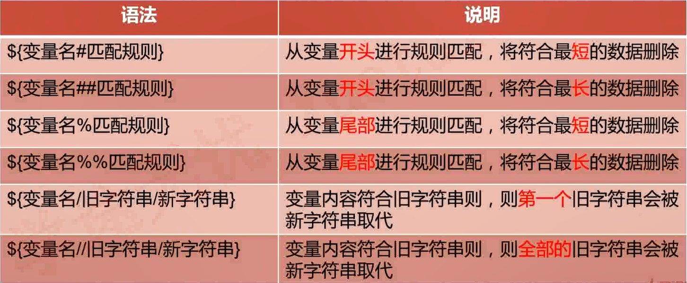
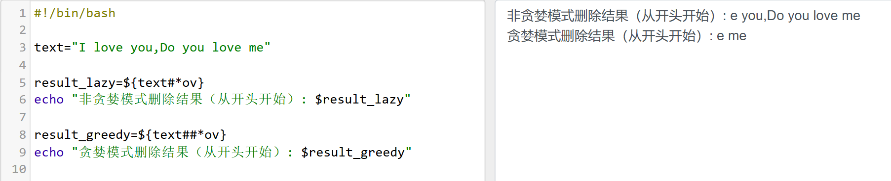
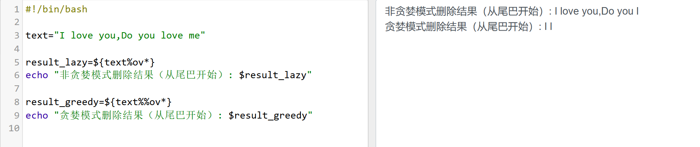
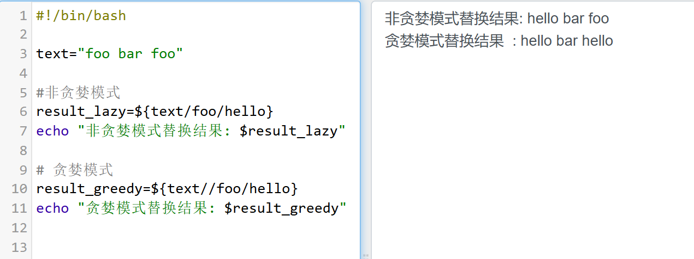

# 变量替换




示例：字符串删除（从前面开始）

非贪婪模式下，从头开始匹配第一个遇到的 ov，然后截止到之前的字符都被删除，因为 * 代表匹配任意字符。

贪婪模式下，从头开始匹配最后一个遇到的 ov，然后截止到之前的字符都被删除，因为 * 代表匹配任意字符。



代码：

```shell
#!/bin/bash

text="I love you,Do you love me"

result_lazy=${text#*ov}
echo "非贪婪模式删除结果（从开头开始）: $result_lazy"

result_greedy=${text##*ov}
echo "贪婪模式删除结果（从开头开始）: $result_greedy"
```

&nbsp;

示例：字符串删除（从后面开始）



&nbsp;

示例：字符串替换

非贪婪模式匹配并替换一个字符。

贪婪模式匹配并替换多个字符。



代码：

```shell
#!/bin/bash

text="foo bar foo"

#非贪婪模式
result_lazy=${text/foo/hello}
echo "非贪婪模式替换结果: $result_lazy"

# 贪婪模式
result_greedy=${text//foo/hello}
echo "贪婪模式替换结果: $result_greedy"
```

# 字符串处理


