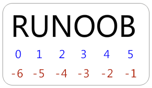

# 基础

## 多行语句

Python语句中一般以新行作为语句的结束符。

但是我们可以使用斜杠（ \）将一行的语句分为多行显示，如下所示：

```python
total = item_one + \
        item_two + \
        item_three
```

语句中包含 [], {} 或 () 括号就不需要使用多行连接符。如下实例：

```python
days = ['Monday', 'Tuesday', 'Wednesday',
        'Thursday', 'Friday']
```

## 脚本语言的第一行

目的就是指出，你想要你的这个文件中的代码用什么可执行程序去运行它。

**#!/usr/bin/python** : 是告诉操作系统执行这个脚本的时候，调用 /usr/bin 下的 python 解释器；

**#!/usr/bin/env python**（推荐）: 这种用法是为了防止操作系统用户没有将 python 装在默认的 /usr/bin 路径里。当系统看到这一行的时候，首先会到 env 设置里查找 python 的安装路径，再调用对应路径下的解释器程序完成操作。

# 变量的定义和使用

Python 中的变量赋值不需要类型声明。

```python
counter = 100 # 赋值整型变量
miles = 1000.0 # 浮点型
name = "John" # 字符串
```

## 五个标准的数据类型

注：类型之间可以轻松转换，Python 提供相应的函数

### Numbers（数字）

数字数据类型用于存储数值。

他们是不可改变的数据类型，这意味着改变数字数据类型会分配一个新的对象。

```python
var1 = 1	# 当你指定一个值时，Number 对象就会被创建

del var1;	# 您也可以使用del语句删除一些对象的引用
```

Python支持四种不同的数字类型：

- int（有符号整型）
- long（长整型，也可以代表八进制和十六进制）
- float（浮点型）
- complex（复数）

### String（字符串）

python 的字串列表有两种种取值顺序:

- 从左到右索引默认 0 开始的，最大范围是字符串长度少 1
- 从右到左索引默认 -1 开始的，最大范围是字符串开头



**[头下标:尾下标]** 获取的子字符串包含头下标的字符，但不包含尾下标的字符。即左闭右开。

```python
str = 'Hello World!'
 
print str           # 输出完整字符串
print str[0]        # 输出字符串中的第一个字符
print str[2:5]      # 输出字符串中第三个至第六个之间的字符串
print str[2:]       # 输出从第三个字符开始的字符串
print str * 2       # 输出字符串两次
print str + "TEST"  # 输出连接的字符串
```

### List（列表）-- 可存储复合类型的数组

列表中值的切割也可以用到变量 **[头下标:尾下标]** ，就可以截取相应的列表，从左到右索引默认 0 开始，从右到左索引默认 -1 开始，下标可以为空表示取到头或尾。

```python
#!/usr/bin/python
# -*- coding: UTF-8 -*-
 
list = [ 'runoob', 786 , 2.23, 'john', 70.2 ]
tinylist = [123, 'john']
 
print list               # 输出完整列表
print list[0]            # 输出列表的第一个元素
print list[1:3]          # 输出第二个至第三个元素 
print list[2:]           # 输出从第三个开始至列表末尾的所有元素
print tinylist * 2       # 输出列表两次
print list + tinylist    # 打印组合的列表
```

### Tuple（元组）-- 不可二次赋值的列表

元组用 **()** 标识。内部元素用逗号隔开。但是元组不能二次赋值，相当于**只读**列表。

```python
#!/usr/bin/python
# -*- coding: UTF-8 -*-
 
tuple = ( 'runoob', 786 , 2.23, 'john', 70.2 )
tinytuple = (123, 'john')
 
print tuple               # 输出完整元组
print tuple[0]            # 输出元组的第一个元素
print tuple[1:3]          # 输出第二个至第四个（不包含）的元素 
print tuple[2:]           # 输出从第三个开始至列表末尾的所有元素
print tinytuple * 2       # 输出元组两次
print tuple + tinytuple   # 打印组合的元组
```

### Dictionary（字典）-- kv存储

字典用"{ }"标识。字典由索引（key）和它对应的值 value 组成。

```python
dict = {}
dict['one'] = "This is one"
dict[2] = "This is two"
 
tinydict = {'name': 'runoob','code':6734, 'dept': 'sales'}
 
 
print dict['one']          # 输出键为'one' 的值
print dict[2]              # 输出键为 2 的值
print tinydict             # 输出完整的字典
print tinydict.keys()      # 输出所有键
print tinydict.values()    # 输出所有值
```

## 总结

数字数据类是不可改变的数据类型，改变数字数据类型会分配一个新的对象。

字符串的操作有基本的功能不需要再自己进行拼接遍历的操作。

列表用 "[ ]" 标识类似 C 语言中的数组，但可以存储复合类型的数据。

元组用 "( )" 标识。内部元素用逗号隔开。但是元组不能二次赋值，相当于只读列表。

字典用 "{ }" 标识。字典由索引 key 和它对应的值 value 组成。

# 逻辑判断和优先级

```python
if 判断条件1:
    执行语句1……
elif 判断条件2:
    执行语句2……
elif 判断条件3:
    执行语句3……
else:
    执行语句4……
```

# 循环

## for

```python
for 变量 in 可迭代对象:
    代码块
```

示例：

```python
# 遍历列表
fruits = ["苹果", "香蕉", "橘子"]
for fruit in fruits:
    print(fruit)

# 遍历字符串
for char in "Python":
    print(char)

# 使用 range()
for i in range(1, 6):  # 生成 1 到 5 的数
    print(i)
```

## while

```python
while 条件:
    代码块
```

# 函数的定义和使用

```python
def 函数名(参数1, 参数2, ...):
    """函数的文档字符串（可选）"""
    代码块
    return 返回值  # 可选
```

## 支持默认参数

```Python
def greet(name="朋友"):
    print(f"你好, {name}!")

greet()         # 输出：你好, 朋友!
greet("小红")  # 输出：你好, 小红!
```

## 关键字参数（指定参数名）

可以指定参数进行赋值，不必关系函数定义时候的参数顺序：

```python
def info(name, age):
    print(f"姓名: {name}, 年龄: {age}")

info(age=25, name="小李")  # 输出：姓名: 小李, 年龄: 25
```

## 多个返回值

```python
def get_user():
    name = "Alice"
    age = 25
    return name, age  # 返回元组

user = get_user()
print(user)  # 输出：('Alice', 25)

# 也可以解包
name, age = get_user()
print(name, age)  # 输出：Alice 25

```

## 可变参数

`*args`：接收任意数量的位置参数，返回一个元组。

`**kwargs`：接收任意数量的关键字参数，返回一个字典。

```python
def demo_args(*args):
    print(args)

demo_args(1, 2, 3)  # 输出：(1, 2, 3)

def demo_kwargs(**kwargs):
    print(kwargs)

demo_kwargs(name="张三", age=30)  # 输出：{'name': '张三', 'age': 30}
```

# 类与对象

## 定义类

```python
class Person:
    def __init__(self, firstname, lastname):    # 构造函数，初始化成员 firstname 和 lastname
        self.firstname = firstname
        self.lastname = lastname
    
    def __str__(self):                          # 成员方法
        print("firstname", self.firstname, "lastname", self.lastname)
```

## \__init__ 方法（构造方法）

```python
class Dog:
    def __init__(self, name):
        self.name = name
```

`__init__` 是构造方法，在创建对象时自动调用。

`self` 代表实例对象，用于访问实例属性和方法。

## 实例属性和方法

**实例属性** 是**每个对象独立拥有**的变量。

**实例方法** 需要 `self` 作为第一个参数。

```python
class Car:
    def __init__(self, brand, speed):
        self.brand = brand
        self.speed = speed

    def show_info(self):
        print(f"品牌: {self.brand}, 速度: {self.speed} km/h")
```

## 类属性和类方法

- **类属性** 由**所有实例共享**，定义在 `__init__` 之外。
- **类方法** 使用 `@classmethod` 修饰，参数 `cls` 代表类本身。

```python
class Animal:
    species = "动物"  # 类属性（所有实例共享）

    def __init__(self, name):
        self.name = name  # 实例属性

    @classmethod
    def get_species(cls):
        return cls.species

print(Animal.get_species())  # 输出：动物
```

## 静态方法

静态方法不依赖实例或类，使用 `@staticmethod` 修饰。

不能访问 `self` 或 `cls`，适用于工具函数。

```python
class MathUtils:
    @staticmethod
    def add(a, b):
        return a + b

print(MathUtils.add(3, 5))  # 输出：8
```

## 继承（子类与父类）

```python
class Animal:
    def __init__(self, name):
        self.name = name

    def speak(self):
        print("动物发出声音")

# 继承 Animal 类
class Dog(Animal):
    def speak(self):
        print(f"{self.name} 汪汪叫！")  # 重写方法
```

## super 关键字--调用父类方法

```python
class Cat(Animal):
    def __init__(self, name, color):
        super().__init__(name)  # 调用父类的构造方法
        self.color = color

    def speak(self):
        super().speak()  # 先调用父类方法
        print(f"{self.name} 喵喵叫！")
```

## 私有属性与方法

私有属性和方法以 **双下划线 `__` 开头**，外部不能直接访问。

但可以通过 **类内方法** 访问。

```python
class BankAccount:
    def __init__(self, owner, balance):
        self.owner = owner
        self.__balance = balance  # 私有属性

    def __show_balance(self):  # 私有方法
        print(f"余额: {self.__balance} 元")

    def get_balance(self):
        self.__show_balance()  # 内部可以访问私有方法
```

## property 属性（getter 和 setter）

使用 `@property` 让方法像属性一样调用，同时可以用 `@setter` 设定属性值。

```python
class Person:
    def __init__(self, name, age):
        self._age = age  # 保护属性

    @property
    def age(self):  # 读取 age
        return self._age

    @age.setter
    def age(self, value):  # 设置 age
        if value < 0:
            print("年龄不能是负数！")
        else:
            self._age = value
```

## 多重继承

```python
class A:
    def show(self):
        print("A 类")

class B:
    def display(self):
        print("B 类")

class C(A, B):  # 继承 A 和 B
    pass
```

# 四种复合类型


# 可变变量与不可变变量

不可变变量在创建后 **无法直接修改其值**，任何修改都会创建一个新的对象，而不是在原对象上修改。

**数值类型**：`int`（整数）、`float`（浮点数）、`complex`（复数）

**布尔类型**：`bool`（`True` / `False`）

**字符串**：`str`

**元组**：`tuple`

**不可变集合**：`frozenset`

&nbsp;

可变变量在原对象上修改时，不会创建新的对象，而是直接在原对象上修改数据。

**列表**：`list`

**字典**：`dict`

**集合**：`set`

**字节数组**：`bytearray`

# 特有技术-切片


# 其他特有技术


