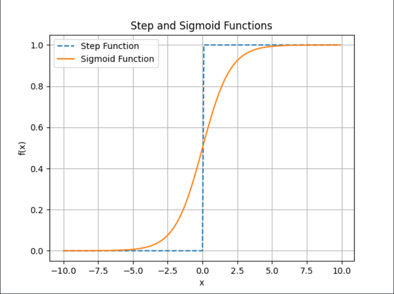

# 感知机

## 感知机是什么

感知机**接收多个**输入信号，**输出一个**信号。

感知机的信号只有**流与不流**两种取值，流取值为 1，不流取值为 0。

在本文中，0 对应“不传递信号”，1 对应“传递信号”。


感知机的多个输入信号都有各自固有的权重，这些权重发挥着控制各个信号的重要性的作用。也就是说，权重越大，对应该权重的信号的重要性就越高。

上述内容的公式：


使用感知机可以表示与门、与非门、或门的逻辑电路。简单看个与门的实现：


## 感知机的实现

### 与门的简单实现

```c++
auto AND = [](auto a, auto b) {
  auto w1 = 0.5, w2 = 0.5, theta = 0.7;
  auto tmp = a * w1 + b * w2;
  return tmp > theta ? 1 : 0;
};

void testAND() {
	cout << AND(0, 0) << endl;
	cout << AND(0, 1) << endl;
	cout << AND(1, 0) << endl;
	cout << AND(1, 1) << endl;
}
```

### 导入权重和偏置

把之前的那个公式的 θ 换成 −b，新公式如下：


此处，b 称为**偏置**，w1 和 w2 称为**权重**。

感知机会计算输入信号和权重的乘积，然后加上偏置，如果这个值大于 0 则输出 1，否则输出 0。

```c++
auto newAND(const vector<int> &inputs, const vector<double> &weights, double b) {
	if (inputs.size() != weights.size()) {
		throw invalid_argument("inputs and weights must have the same size");
	}

	auto tmp = 0.0;
	for (size_t i = 0; i < inputs.size(); ++i) {
		tmp += inputs[i] * weights[i];
	}

	tmp += b;

	return tmp;
}
```

### 使用权重和偏置实现

```c++
auto newAND(const vector<int> &inputs, const vector<double> &weights, double b) {
	if (inputs.size() != weights.size()) {
		throw invalid_argument("inputs and weights must have the same size");
	}

	auto tmp = 0.0;
	for (size_t i = 0; i < inputs.size(); ++i) {
		tmp += inputs[i] * weights[i];
	}

	tmp += b;

	return tmp > 0 ? 1 : 0;
}
```

这没有什么难度，只需要改动最后一行代码即可，该函数的实现就等价于前面的新公式的实现。

## 感知机的局限性

到这里我们已经知道，使用感知机可以实现与门、与非门、或门三种逻辑电路。


但是异或门能实现吗？不能！

如果你有两个特征（x1,x2），感知机其实就是学一条直线来把两个类别分开。

比如：学一条直线 `w1x1 + w2x2 + b = 0`

这就像在二维坐标系中画出一条线，把正类和负类分到两边。

因为感知机只能处理**线性可分问题**。也就是说，如果两个类别不能用一条直线分开，它就搞不定。


你无法用一条直线把图中圆圈和三角形划分为两个区域，之前的与门、与非门、或门三种都可以做到，感知机也可以实现。

那要是能改成曲线就可以，就像下面这样：


## 多层感知机

感知机不能表示异或门让人深感遗憾，但也无需悲观。实际上，感知机的绝妙之处在于它可以“叠加层”。


与门、与非门、或门是具有相同构造的感知机，**区别只在于权重参数的值**。

因此，在与非门和或门的实现中，仅设置权重和偏置的值这一点和与门的实现不同。

```c++
auto Base(const vector<int> &inputs, const vector<double> &weights, double b) {
	if (inputs.size() != weights.size()) {
		throw invalid_argument("inputs and weights must have the same size");
	}

	auto tmp = 0.0;
	for (size_t i = 0; i < inputs.size(); ++i) {
		tmp += inputs[i] * weights[i];
	}

	tmp += b;

	return tmp > 0 ? 1 : 0;
}

// 与门
auto AND(const vector<int> &inputs) {
	auto weights = vector<double>{0.5, 0.5};
	auto b = -0.7;

	return Base(inputs, weights, b);
}

// 或门
auto OR(const vector<int> &inputs) {
	auto weights = vector<double>{0.5, 0.5};
	auto b = -0.2;

	return Base(inputs, weights, b);
}

// （与）非门
auto NAND(const vector<int> &inputs) {
	auto weights = vector<double>{-0.5, -0.5};
	auto b = 0.7;

	return Base(inputs, weights, b);
}
```

既然手里已经有或门、与门和非门的实现，通过它们三个就可以实现异或门：

```c++
// 异或门
auto XOR(const vector<int> &inputs) {
	auto w1 = NAND({inputs[0], inputs[1]});
	auto w2 = OR(inputs);
	auto w3 = AND({w1, w2});

	return w3;
}
```

实际上，与门、或门是单层感知机，而异或门是2层感知机。

叠加了多层的感知机也称为多层感知机。


至此，我们明白多层感知机（MLP）才真正具备了非线性学习能力，进入了我们现在所说的“深度学习”。

## 感知机的训练

前面讲 与门、或门和非门的时候只是权重参数和偏置不同，仅此而已。

因此，它的学习方式就是更新权重参数和偏置，如果当前分类错误，就按照下面方式更新权重：

$$w=w+\eta(y_\mathrm{true}-y_\mathrm{pred})x$$

$\eta$是学习率

$y_{\mathrm{true}}$是真实标签

$y_{\mathrm{pred}}$是预测标签


# 神经网络

## 从感知机到神经网络

下面这个公式在感知机那里已经学过：


为了简化它，我们用一个函数来表示这种分情况的动作（超过 0 则输出1，否则输出 0）。

引入新函数 h(x)：$$y=h(b+w_1x_1+w_2x_2)$$


刚才登场的 h(x) 函数会**将输入信号的<u>总和</u>转换为输出信号**，这种函数一般称为**激活函数**。

将简化的公式分两个阶段进行处理，先计算输入信号的加权总和，然后用激活函数转换这一总和：
$$
a = b + w_1 x_1 + w_2 x_2
$$

$$
y = h(a)
$$

示意图：


## 激活函数

激活函数（Activation Function）是神经网络中**每个神经元在计算加权和后**，用来决定“是否激活”的函数。

常见的激活函数：


### sigmoid 函数 和 阶跃函数

阶跃函数就是前面从感知机那里简化之后的 h(x)，属于最早的“激活函数”之一，但常见的激活函数 sigmoid 的公式如下：

$$h(x)=\frac{1}{1+\exp(-x)}$$

我们先用代码实现这两个函数，在图形化展示：

```python
import numpy as np
import matplotlib.pyplot as plt

# 阶跃函数
def step_function(x):
    return np.array(x > 0, dtype=int)

# Sigmoid函数
def sigmoid(x):
    return 1 / (1 + np.exp(-x))

# 在同一张图上展示
def plot_both_functions():
    x = np.arange(-10, 10, 0.1)
    y_step = step_function(x)
    y_sigmoid = sigmoid(x)

    plt.plot(x, y_step, label='Step Function', linestyle='--')
    plt.plot(x, y_sigmoid, label='Sigmoid Function')
    plt.title('Step and Sigmoid Functions')
    plt.xlabel('x')
    plt.ylabel('f(x)')
    plt.legend()
    plt.grid()
    plt.show()
# 展示阶跃函数和Sigmoid函数
plot_both_functions()
```

效果：



阶跃函数就像竹筒敲石一样，只做是否传送水（0 或 1）两个动作，而sigmoid函数就像水车一样，根据流过来的水量相应地调整传送出去的水量。sigmoid函数的平滑性对神经网络的学习具有重要意义。

但总归它们两个是有相似之处的，当输入信号为重要信息时，阶跃函数 和 sigmoid 函数都会输出较大的值；当输入信号为不重要的信息时，两者都输出较小的值。还有一个共同点是，不管输入信号有多小，或者有多大，输出信号的值都在 0 到 1 之间。

### 非线性函数

阶跃函数和 sigmoid 函数还有其他共同点，就是两者均为非线性函数。

sigmoid 函数是一条曲线，阶跃函数是一条像阶梯一样的折线，两者都属于非线性的函数。

**神经网络的激活函数必须使用<u>非线性函数</u>**。换句话说，激活函数不能使用线性函数。

为什么不能使用线性函数呢？因为使用线性函数的话，加深神经网络的层数就没有意义了，即**多层线性叠加 = 还是线性**。

神经网络之所以强大，是因为它能学习复杂的**非线性映射**，比如猫和狗的图片识别、语音识别、自然语言处理等等。

但如果你所有的激活函数都是线性的，那无论网络有多少层，整个网络的计算就等价于一个线性函数：

 $$f(f(f(x))) = A \cdot x + B$$

也就是说，**你堆再多层也没用，本质上和一层是一样的！**

### ReLU 函数

$$ h(x)=\begin{cases} x & (x > 0) \\ 0 & (x \leq 0) \end{cases} $$

本章剩余部分的内容仍将使用 sigmoid 函数作为激活函数，但在系列内容的后半部分，则将主要使用ReLU函数。

```c++
import numpy as np
import matplotlib.pyplot as plt


# ReLU 函数
def relu(x):
    return np.maximum(0, x)


# 图形化展示
def plot_relu():
    x = np.linspace(-10, 10, 100)
    y = relu(x)

    plt.figure(figsize=(8, 4))
    plt.plot(x, y, label='ReLU', color='blue')
    plt.title('ReLU Activation Function')
    plt.xlabel('Input')
    plt.ylabel('Output')
    plt.axhline(0, color='black', lw=0.5, ls='--')
    plt.axvline(0, color='black', lw=0.5, ls='--')
    plt.grid()
    plt.legend()
    plt.show()

plot_relu()
```

效果：


## 三层神经网络的实现

### 符号确认

$$w_{12}^{(1)}$$ 和 $$a_{1}^{(1)}$$


### 各层间信号传递的实现


计算第一层第一个神经元的激活值：$$ a_{1}^{(1)} = w_{11}^{(1)} x_{1} + w_{12}^{(1)} x_{2} + b_{1}^{(1)} $$

此外，如果使用矩阵的乘法运算，则可以将第 1 层的加权和 表示成下面的式：


我们用 NUmpy 实现上面的公式，方便后面的内容推进：

```python
X = np.array([1.0,0.5])
W1 = np.array([
    [0.1,0.3,0.5],
    [0.2,0.4,0.6]
])
B1 = np.array([0.1,0.2,0.3])

A1 = np.dot(X,W1) + B1

print(A1)	# [0.3 0.7 1.1]
```

我们已经计算出中间层（隐藏层）的加权和 A1接着就是调用激活函数 sigmoid：

```python
def sigmoid(x):
    return 1.0 / (1.0 + np.exp(-x))

A1 = np.dot(X,W1) + B1
Z1 = sigmoid(A1)

print(Z1)	# [0.57444252 0.66818777 0.75026011]
```

整个过程的示意图：


后面如何计算得到 y1 和 y2 也就不难理解，不赘述了。

## 输出层的设计

神经网络可以用在分类问题和回归问题上，不过需要根据情况改变输出层的激活函数。**一般而言，回归问题用恒等函数，分类问题用 softmax 函数。**

### 分类问题和回归问题

分类问题是数据属于哪一个类别的问题。比如，区分图像中的人是男性还是女性的问题就是分类问题。

回归问题是根据某个输入预测一个（连续的）数值的问题。比如，根据一个人的图像预测这个人的体重的问题就是回归问题。


### 恒等函数和 softmax 函数

恒等函数会将输入按原样输出，对于输入的信息，不加以任何改动地直接输出。因此，在输出层使用恒等函数时，输入信号会原封不动地被输出。


回归问题用恒等函数，分类问题用 softmax 函数，公式如下：

$$ y_{k} = \frac{\exp(a_{k})}{\sum_{i = 1}^{n} \exp(a_{i})} $$

exp(x) 是表示 e^x^ 的指数函数

输出层共有 n 个神经元

计算第 k 个神经元的输出 y~k~

softmax 函数的分子是输入信号 a~k~ 的指数函数，分母是所有输入信号的指数函数的和。


代码实现：

```python
# softmax 函数    x 是一个一维数组
def softmax(x):
    e_x = np.exp(x - np.max(x))
    return e_x / e_x.sum(axis=0)
```

用用看，并解释：

```python
def softmax(x):
    e_x = np.exp(x - np.max(x))
    return e_x / e_x.sum(axis=0)

data = np.array([0.3, 2.9, 4.0])
y = softmax(data)
print(y)	# [0.01821127 0.24519181 0.73659691]
print(np.sum(y))	# 1.0
```

从输出计算结果 y 来看，代表 y[0] 的概率为 18%，y[1] 的概率为 24%，y[2] 的概率为 73%。

输出总和为 1 是softmax函数的一个重要性质。正因为有了这个性质，我们才可以把 softmax 函数的输出解释为“概率”。

### 输出层的神经元数量

输出层的神经元数量需要根据待解决的问题来决定。

对于分类问题，输出层的神经元数量一般设定为类别的数量。比如，对于某个输入图像，预测是图中的数字 0 到 9 中的哪一个的问题（10类别分类问题）。


