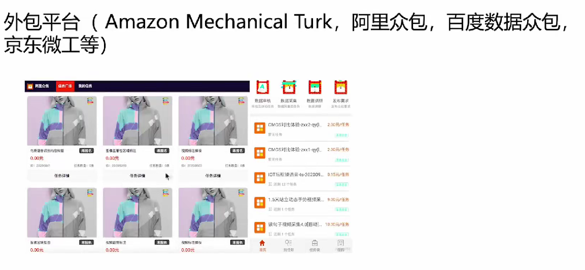
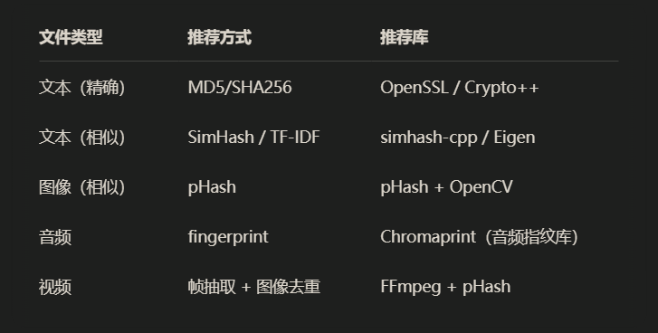
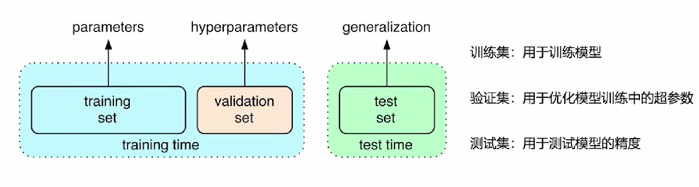
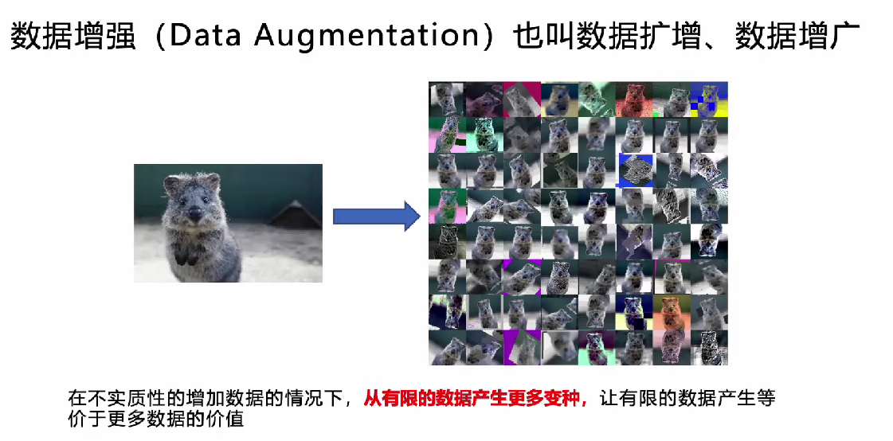
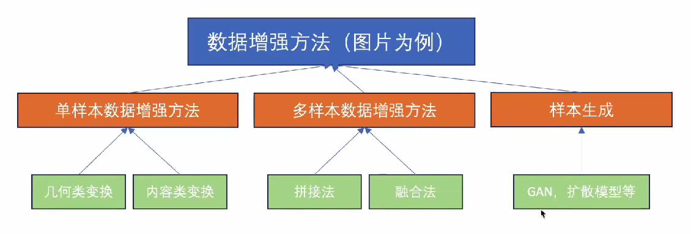

# 数据获取：图像和视频数据爬取

##  开源数据集

特点：数据质量高，成本低。

### 🔹 通用开源数据集平台

1. **Kaggle**
   - 地址：https://www.kaggle.com/datasets
   - 描述：提供机器学习比赛和大量公开数据集，涵盖图像、文本、音频、表格等各种格式。支持直接在Notebook中操作数据。
2. **Google Dataset Search**
   - 地址：https://datasetsearch.research.google.com/
   - 描述：类似于“Google for datasets”，可搜索互联网上各种领域的数据集。
3. **UCI Machine Learning Repository**
   - 地址：https://archive.ics.uci.edu/ml/index.php
   - 描述：经典的机器学习数据集库，适合初学者使用，多为表格类结构化数据。
4. **Papers with Code**
   - 地址：https://paperswithcode.com/datasets
   - 描述：结合论文、代码和数据集，适合查找最新研究中用到的数据。
5. **Hugging Face Datasets**
   - 地址：https://huggingface.co/datasets
   - 描述：主要用于自然语言处理，但也支持音频、图像等数据类型。支持直接加载到`Transformers`框架中。

------

### 🔹 图像/计算机视觉数据集平台

1. **ImageNet**
   - 地址：http://www.image-net.org/
   - 描述：深度学习图像分类领域的基准数据集。
2. **COCO (Common Objects in Context)**
   - 地址：https://cocodataset.org/
   - 描述：广泛用于目标检测、分割等任务。
3. **Open Images Dataset by Google**
   - 地址：https://storage.googleapis.com/openimages/web/index.html
   - 描述：大规模的标注图像数据集，支持分类、检测、分割等任务。
4. **VisualData**
   - 地址：https://www.visualdata.io/
   - 描述：收录各种开源视觉数据集的导航站。

------

### 🔹 语言/NLP 数据集平台

1. **GLUE / SuperGLUE**
   - 用于评估语言理解模型性能的标准数据集集合。
2. **Common Crawl**
   - 地址：https://commoncrawl.org/
   - 描述：提供大规模网页抓取数据，用于预训练语言模型如GPT。

------

### 🔹 音频/语音数据集平台

1. **LibriSpeech**
   - 描述：广泛用于语音识别训练的数据集，来自LibriVox有声书。
2. **VoxCeleb**
   - 用于说话人识别、验证等任务。

## 外包平台

通过付费的方式，让用户来上传数据，可定制化高，成本不低。

## 自己采集与标注

特点：质量高，效率低，成本高。

自己去收集相关数据，用标注工具对数据进行标注得到属于自己且符合需求的数据集。

## 爬虫

github 开源上找到的一个爬虫工具，有界面：https://github.com/NaiboWang/EasySpider

更多的可以去网上查，这类工具太多的。

# 数据整理：对数据进行整理、清洗和去噪

## 数据检查与清洗

图片：去除损坏的图片和动态图片，尺寸异常的图片。

文本：去除停用词和特殊符号。

归一化：对文件类型和文件名进行归一化处理，比方说图片的类型统一为 .jpg。

内容纠错：拼写纠正，语法纠正等。

## 数据去重

对相同或相似文件的去重，下面看看常见去重的方法：

## 数据集划分

# 数据标注：工具与使用

[【label studio使用教程】](https://www.bilibili.com/video/BV1K3zwYQEgT/?share_source=copy_web&vd_source=e8496cb5bcebb8e07071b0d1d9803fa7) 

# 数据增强

- 降低数据采集成本与标注成本

- 模型过拟合分险降低，提高模型泛化能力

## 单样本数据增强

## 多样本数据增强

## 样本生成

