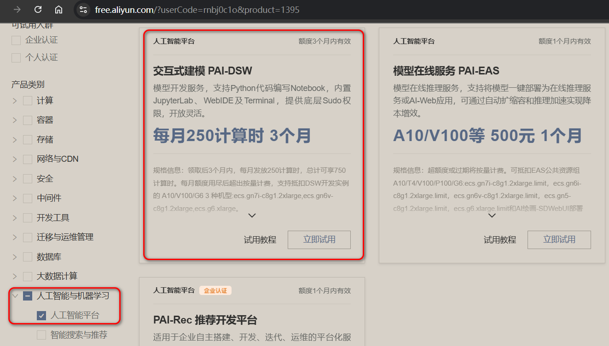
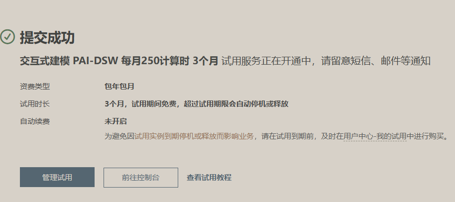
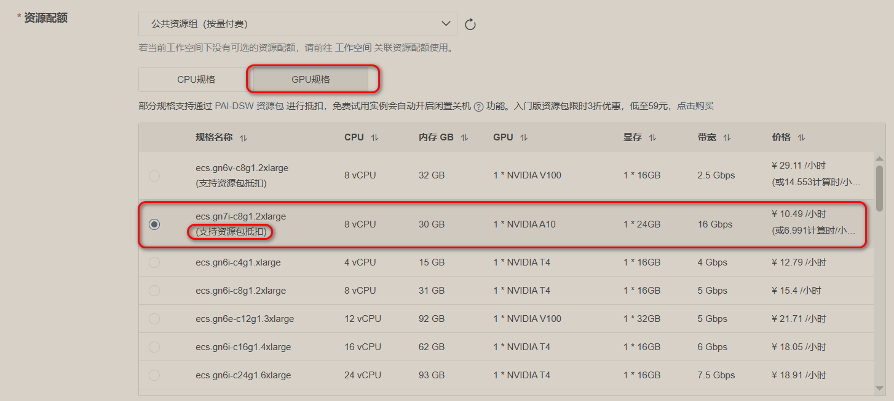
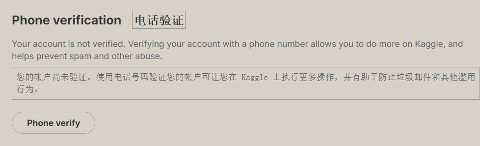
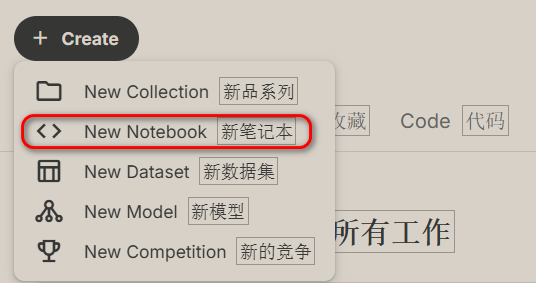
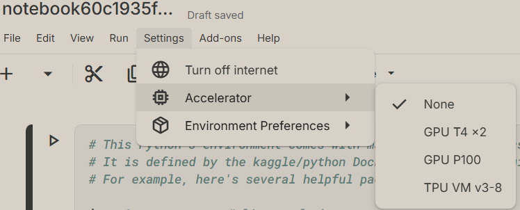
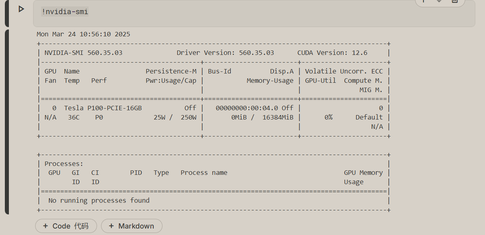
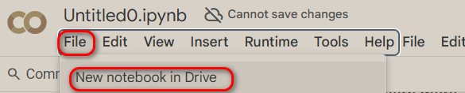
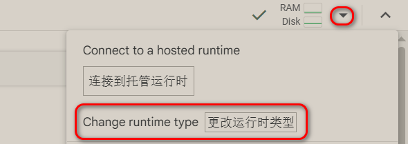
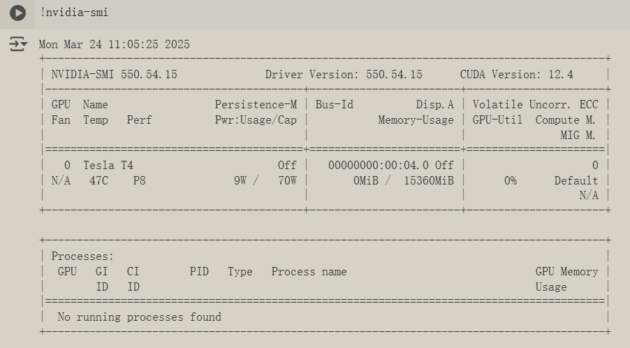

# 申请阿里云的免费GPU/CPU资源（步骤麻烦）

地址：https://free.aliyun.com/?userCode=rnbj0c1o

点击立即使用，申请成功：

创建实例，选择资源：

# 申请Kaggle的免费GPU/CPU资源

网址：https://www.kaggle.com/

登陆成功之后，点击 Your Work ，然后点击右上方 settings 进行手机号验证：

再次点击 Your Work ，点击 Create：

我们就可以看到 两个 GPU 资源可以选择：

添加一份代码并执行，看看 GPU 信息：

# 申请Google的免费GPU/CPU资源

网址：https://colab.research.google.com/

更改为 GPU 运行：

输出信息：

