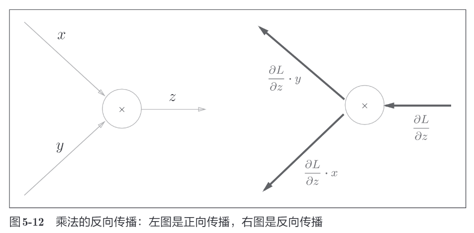

# 神经网络的学习

## 从数据中学习

神经网络的特征就是可以从数据中学习。所谓“从数据中学习”，是指可以由数据自动决定权重参数的值。


神经网络的优点是对所有的问题都可以用同样的流程来解决。

比如，不管要求解的问题是识别5，还是识别狗，抑或是识别人脸，神经网络都是通过不断地学习所提供的数据，尝试发现待求解的问题的模式。

也就是说，**与待处理的问题无关，神经网络可以将数据直接作为原始数据**，进行“端对端”的学习。

&nbsp;

机器学习中，一般将数据分为**训练数据**和**测试数据**两部分来进行学习和实验等。

首先，使用训练数据进行学习，寻找最优的参数；然后，使用测试数据评价训练得到的模型的实际能力。

为什么需要将数据分为训练数据和测试数据呢？因为我们**追求的是模型的泛化能力**。为了正确评价模型的泛化能力，就必须划分训练数据和测试数据。

**泛化能力是指处理未被观察过的数据（不包含在训练数据中的数据）的能力。**获得泛化能力是机器学习的最终目标。比如，在识别手写数字的问题中，泛化能力可能会被用在自动读取明信片的邮政编码的系统上。此时，手写数字识别就必须具备较高的识别“某个人”写的字的能力。注意这里不是“特定的某个人写的特定的文字”，而是“任意一个人写的任意文字”。如果系统只能正确识别已有的训练数据，那有可能是只学习到了训练数据中的个人的习惯写法。

因此，仅仅用一个数据集去学习和评价参数，是无法进行正确评价的。这样会导致可以顺利地处理某个数据集，但无法处理其他数据集的情况。顺便说一下，**只对某个数据集过度拟合的状态称为过拟合**。 避 免过拟合也是机器学习的一个重要课题。

&nbsp;

还有的将数据分为训练数据、验证数据和测试数据：

- 训练数据：用于模型的训练。
- 验证数据：评估模型的性能，防止过拟合。
- 测试数据：用于模型的最终评估。

数据划分的比例推荐：8:1:1 或 6:2:2（数据量特别大可以考虑）

注意点：

- 确保数据集的划分是随机的，以避免数据集之间存在偏差
- 确保每个数据集中的样本都覆盖不同的类别和特征
- 避免训练过程中用于验证数据集或测试数据集中的数据
- 所有数据都进行过预处理

## 监督学习和非监督学习

**监督学习**：就像老师在教你，每道题都有答案。

**非监督学习**：就像你自己摸索规律，没有人告诉你答案。

监督学习会有人工标签，通过训练训练数据得到模型和测试数据来验证模型的能力；而非监督学习没有标签，就是把训练数据进行训练得到规律，没有验证的测试数据。

## 过拟合、欠拟合

过拟合：训练数据集表现很好，测试集表现很差

- 原因1：网络过于复杂，难以学习出优秀的模型
- 原因2：数据量不够

欠拟合：训练数据集表现极差，测试集更没有什么好说

- 原因1：网络复杂性低，如用线性去企图训练非线性的模型
- 原因2：数据量不够


欠拟合：你画了一条直线，但点是明显曲线分布，太简单。

合理拟合：你画了一条平滑的曲线，贴合大多数点。

过拟合：你画了一条蜿蜒曲线，精确穿过每个点，太复杂。

## 损失函数

用来衡量模型的预测值和真实值之间的差距。

可以理解为损失函数就是给模型的一种打分机制，分数越高，说明模型越差；分数越低，说明模型越准。

因此，**损失函数的值越小，模型越优秀！**

损失函数可以使用任意函数，但**一般用均方误差和交叉熵误差**等。

### 均方误差

$$ \text{MSE} = \frac{1}{n} \sum_{i = 1}^{n} (\hat{y}_{i} - y_{i})^{2} $$

$$\hat{y}_{i}$$：模型针对第 i 个样本给出的预测值。

$$y_{i}^{2}$$：第 i 个样本真实的观测值。

$$n$$：代表用于计算 MSE 的样本总数。

$$\hat{y}_{i} - y_{i}^{2}$$：计算每个样本上模型预测值与真实值的误差平方。

均方误差会计算神经网络的输出和正确解监督数据的各个元素之差的平方，再求总和。

```python
def mse(y_true, y_pred):
    return np.mean((y_true - y_pred) ** 2)
```

### 交叉熵误差

$$ E = - \sum_{k} t_{k} \log y_{k} $$

交叉熵本质上衡量的是两个概率分布（真实标签分布和模型预测概率分布 ）之间的差异。

```python
def cross_entropy(y, t):
    delta = 1e-7
    return -np.sum(t * np.log(y + delta))
```

### mini-batch学习

前面介绍的损失函数的例子中考虑的都是针对单个数据的损失函数。如果要求所有训练数据的损失函数的总和，以交叉熵误差为例：


我们从全部数据中选出一部分，作为全部数据的“近似”。

神经网络的学习也是从训练数据中选出一批数据（称为mini-batch，小批量），然后对每个 mini-batch 进行学习。比如，从 60000 个训练数据中**随机**选择 100 笔，再用这 100 笔数据进行学习。这种学习方式称为 mini-batch 学习。

## 梯度

在深度学习中：

- **梯度 = 损失函数对参数的偏导数**
- 作用是：告诉我们**如何调整模型参数（比如权重和偏置）以减小损失（误差）**

## 神经网络的学习步骤

神经网络存在合适的权重和偏置，调整权重和偏置以便拟合训练数据的过程称为“学习”。

神经网络的学习分成下面4个步骤：

1. 从训练数据中随机选出一部分数据，这部分数据称为 mini-batch。我们的目标是减小 mini-batch 的损失函数的值。
2. 为了减小  mini-batch 的损失函数的值，需要求出各个权重参数的梯度。梯度表示损失函数的值减小最多的反向。
3. 将权重参数沿梯度方向进行微笑更新。
4. 重复 1、2、3步骤。

# 误差反向传播法

## 正向传播和反向传播

### 正向传播

**目标**：把输入通过网络“传递”，计算出**输出**和**损失**

过程：

1. 输入数据（比如一张图片，一个特征向量）
2. 每一层根据前一层的输出、当前层的权重和偏置计算当前层的输出（通常包括线性计算 + 激活函数）
3. 最后一层输出结果（如分类概率）
4. 与真实标签对比，用损失函数计算误差（loss）

数学示意（假设只有一层）：

```tex
z = w * x + b      ← 线性变换
a = σ(z)           ← 激活函数
L = loss(a, y)     ← 损失函数
```

### 反向传播

**目标**：根据损失，反向计算每个参数对损失的“贡献”（即**梯度**），以便优化参数

过程：

1. 从输出层开始，计算损失对输出的偏导
2. 应用链式法则，一层层向后传播，求每层参数的梯度
3. 梯度用于更新参数（优化器来做）

数学思路（链式法则）：

假设我们想求损失对某个参数 www 的偏导：

```
∂L/∂w = ∂L/∂a × ∂a/∂z × ∂z/∂w
```

这是梯度传播的核心思想，误差逐层“反传”。

## 计算图

### 用计算图求解

问题 1：太郎在超市买了 2 个 100 日元一个的苹果，消费税是 10%，请计算支付金额


用另外一种来表示上面这种图，利于后序内容推进：


问题 2：太郎在超市买了 2 个苹果、3 个橘子。其中，苹果每个 100 日元，橘子每个 150 日元。消费税是 10%，请计算支付金额


上面就是正向传播，而反向传播将在接下来的导数计算中发挥重要作用。

### 局部计算

计算图的特征是可以通过传递“局部计算”获得最终结果。

“局部”这个词的意思是“与自己相关的某个小范围”。局部计算是指，无论全局发生了什么，都能只根据与自己相关的信息输出接下来的结果。


综上，计算图可以集中精力于局部计算。无论全局的计算有多么复杂，各个步骤所要做的就是对象节点的局部计算。

虽然局部计算非常简单，但是通过传递它的计算结果，可以获得全局的复杂计算的结果。

### 为何用计算图解题

通过前面的学习我们知道计算图有两个优点：

1. 无论全局是多么复杂的计算，都可以通过局部计算使各个节点致力于简单的计算，从而简化问题。
2. 利用计算图可以将中间的计算结果全部保存起来。

实际上，使用计算图最大的原因是，可以通过**反向传播高效计算导数**。


这里只求了关于苹果的价格的导数，不过“支付金额关于消费税的导数”“支付金额关于苹果的个数的导数”等也都可以用同样的方式算出来。

并且，计算中途求得的导数的结果（中间传递的导数）可以被共享，从而可以高效地计算多个导数。

## 求偏导

**偏导数**就是固定其他变量不变，只对**其中一个变量求导数**。

$$f(x,y)=x^2+3xy+y^2$$

对 x 求偏导，那么 y 视为常数：


对 y 求偏导，那么 x 视为常数：


详细讲讲 对 x 求偏导的过程：

1. 对 x 求偏导，那么其他变量全部为常数
2. 常数的导数为 0，原式就可以简化为 $$x^2+3xy$$
3. 继续求导，$$x^2$$ 求导结果为 $$2x$$，$$x$$ 求导结果为 1，因此总的求导结果为 $$2x+3y$$

## 链式法则

### 计算图的反向传播


解释：


### 什么是链式法则

复合函数是由多个函数构成的函数：z = ( x + y )^2^

$$\begin{aligned}z&=t^2\\t&=x+y\end{aligned}$$

链式法则是关于复合函数的导数的性质，定义如下：

如果某个函数由复合函数表示，则该复合函数的导数可以用构成复合函数的各个函数的导数的乘积表示。


现在我们使用链式法则，试着求它的导数。为此，我们先求偏导：


然后，我们就可以求出它的导数：


## 链式法则和计算图


反向传播的计算顺序是，先将节点的输入信号乘以节点的局部导数（偏导数），然后再传递给下一个节点。

比如，反向传播时，`**2` 节点的输入信号是 $$\frac{\partial z}{\partial z}$$。将其乘以局部导数$$\frac{\partial z}{\partial t}$$（因为正向传播时输入是 t、输出是 z，所以这个节点的局部导数是 $$\frac{\partial z}{\partial t}$$）。

z = t^2^ ，求关于 t 的偏导 为 2t（因为正向传播时输入是 t、输出是 z），和输入信号 $$\frac{\partial z}{\partial z}$$ （不就是 1 嘛）相乘得到 1 * 2t。

t = x + y，求关于  x 的偏导 为 1，和输入信号 1 * 2t 相乘 ，即 2 (x + y) * 1。


## 反向传播

### 加法节点的反向传播

z = x + y 的导数：

$$ \frac{\partial z}{\partial x} = 1 $$

$$ \frac{\partial z}{\partial y} = 1 $$


因为加法节点的反向传播只是将输入信号输出到下一个节点，看一个具体的例子：


### 乘法节点的反向传播

z = xy 的导数：

$$ \frac{\partial z}{\partial x} = y $$

$$ \frac{\partial z}{\partial y} = x $$

乘法的反向传播会将上游的值乘以正向传播时的输入信号的“翻转值”后传递给下游：



看一个具体的例子：


## 简单层的实现

 层的实现有两个共通的接口：forward（正向传播） 和 backward（反向传播）

### 乘法层

```python
class MulLayer:
    def __init__(self):	// 接收正向传播的 x 和 y
        self.x = None
        self.y = None

    def forward(self, x, y):
        self.x = x
        self.y = y
        out = x * y
        return out

    def backward(self, dout):
        dx = dout * self.y  # 翻转x和y
        dy = dout * self.x
        return dx, dy
```

forward 将 x 和 y 相乘输出。

backward 将从上游传来的导数（dout）乘以正向传播的翻转值，然后传给下游。

### 加法层

```python
class AddLayer:
    def __init__(self):
        pass

    def forward(self, x, y):
        out = x + y
        return out

    def backward(self, dout):
        dx = dout * 1
        dy = dout * 1
        return dx, dy
```

## 激活函数层的实现

### ReLU层


如果正向传播时的输入 x 大于0，则反向传播会将上游的值原封不动地传给下游。

反过来，如果正向传播时的 x 小于等于0，则反向传播中传给下游的信号将停在此处。

```python
class Relu:
    def __init__(self):
        self.mask = None

    def forward(self, x):
        self.mask = (x <= 0)  # 创建掩码，将 x 中小于等于 0 的元素对应位置设为True，其余为False
        out = x.copy()  # 复制输入数组x，避免修改原始数据
        out[self.mask] = 0  # 将掩码中为 True（即x中小于等于 0）的位置对应的元素设为 0
        return out

    def backward(self, dout):
        dout[self.mask] = 0 # 在反向传播时，将掩码中为 True（即前向传播中 x 小于等于 0）位置对应的梯度设为 0
        dx = dout  # 其余位置的梯度保持不变
        return dx
```


