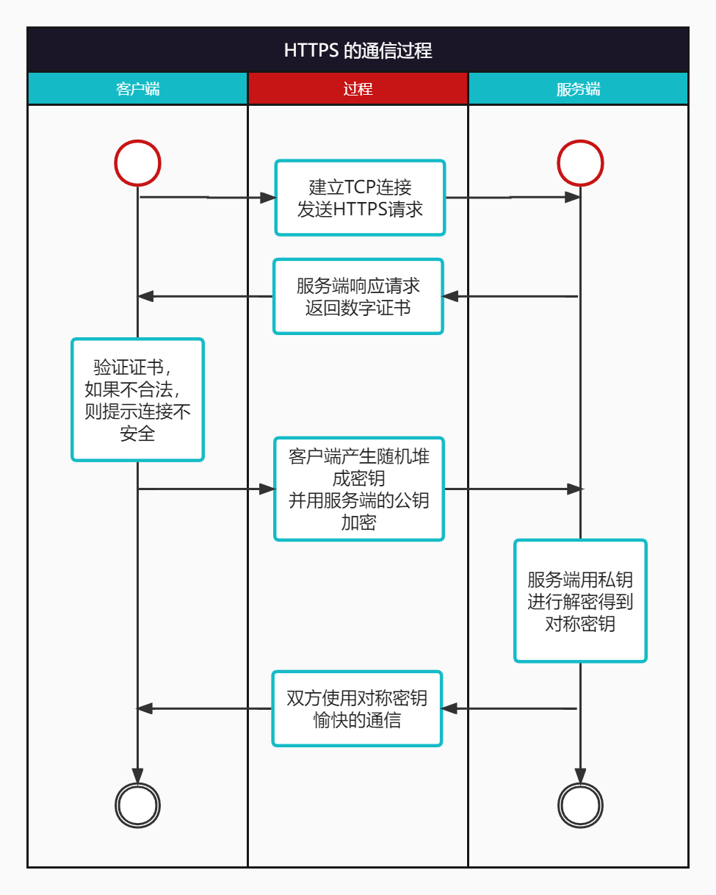

对称加密用同一个密钥进行加解密，非对称加密用公钥加密私钥解密。因此，非对称加密流程要比对称加密复杂，效率就比对称加密低效。网络通信的数据要进行加密，而对称加密和非对称加密都是一种加密方式，对称加密相较于非对称加密不安全，是因为加解密都是同一个密钥，一旦在网络中被截获就会被破解，消息传输不再安全。非对称加密的私钥是不会在网络中传输的，不存在被截获的可能，而共享的公钥本来就是给别人看，无所谓安全不安全。既要安全性，又要加密数据的高效率，HTTPS的加密流程就达到这两个目标了。

简单来讲，非对称加密完成客户端对称加密的密钥交换，双方后续就用对称加密的方式进行通信。

大致流程如下：

1. 客户端向服务器发起 HTTPS 请求，服务器返回数字证书（证书包含**服务器的公钥**、服务器的域名信息以及证书的颁发机构等）。
2. 客户端检验数字证书的合法性（包括检查证书的颁发机构是否受信任、证书是否过期、证书中的域名是否与服务器的域名匹配等），验证通过之后，取出服务器的公钥。
3. 客户端生成一个随机数，用于生成对称加密的会话密钥，并且用服务器的公钥对其加密，传输给服务器。
4. 服务器收到客户端消息，用私钥进行解密，得到客户端的密钥信息。
5. 从此，服务器和客户端都将采用对称加密的方式加密数据并进行通信。

