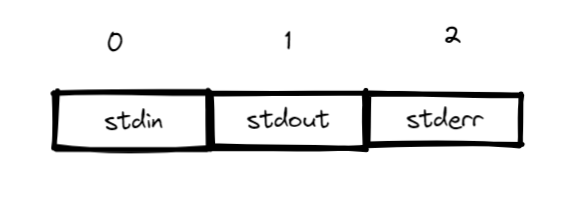
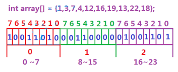
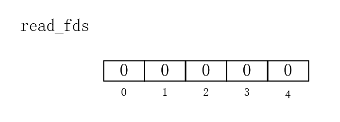
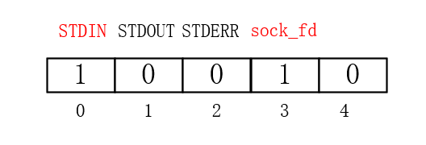
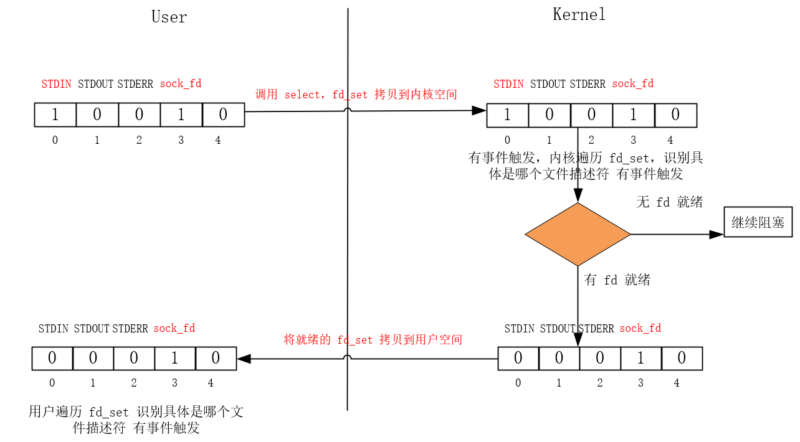

## 接口

通过 fd_set 创建一个文件描述符集合，通过下面的方法可以对该集合进行操作：

`FD_ZERO(&fdset)`：将文件描述符集合清空。

`FD_SET(fd, &fdset)`：将文件描述符 `fd` 添加到集合中。

`FD_CLR(fd, &fdset)`：将文件描述符 `fd` 从集合中移除。

`FD_ISSET(fd, &fdset)`：检查 `fd` 是否在集合中。

从参数类型就可以知道，fd_set 中可以添加多个文件描述符（通常是 1024 个），而后面介绍的 select 就是 监听 fd_set 集合中的所有文件描述符，即 select 不只可以监听 socket 文件描述符。

接着，我们看看 select 接口：

```c++
int select(int nfds, fd_set *readfds, fd_set *writefds, fd_set *exceptfds, struct timeval *timeout);

```

参数说明：

- **nfds**：文件描述符的数量，通常是待监控的文件描述符中最大值加 1。
- **readfds**：指向一个 `fd_set` 集合，用于监控是否有数据可读的文件描述符。如果不关心可读事件，可以传递 `NULL`。
- **writefds**：指向一个 `fd_set` 集合，用于监控是否可以写入的文件描述符。如果不关心可写事件，可以传递 `NULL`。
- **exceptfds**：指向一个 `fd_set` 集合，用于监控异常事件的文件描述符。如果不关心异常事件，可以传递 `NULL`。
- **timeout**：指向一个 `timeval` 结构体，用于指定 `select` 调用的超时时间。如果传递 `NULL`，`select` 将无限期等待；如果传递一个超时值，`select` 会在超时后返回。

返回值：

- 成功时，返回**准备就绪的文件描述符数量**。
- 返回 0 表示超时。
- 返回 -1 表示出错。

由于 select 不知道是哪些文件描述符的事件有发生，所以每次都是通过遍历，再利用 FD_ISSET 判断具体的文件描述符发生的事件，再进行后续处理。

select 实现多路复用的方式是，将已连接的 Socket 都放到一个文件描述符集合，然后调用 select 函数将文件描述符集合拷贝到内核里，让内核来检查是否有网络事件产生，检查的方式很粗暴，就是通过遍历文件描述符集合的方式，当检查到有事件产生后，将此 Socket 标记为可读或可写， 接着再把整个文件描述符集合拷贝回用户态里，然后用户态还需要再通过遍历的方法找到可读或可写的 Socket，然后再对其处理。

所以，对于 select 这种方式，需要进行 2 次「遍历」文件描述符集合，一次是在内核态里，一次是在用户态里，而且还会发生 2 次「拷贝」文件描述符集合，先从用户空间传入内核空间，由内核修改后，再传出到用户空间中。

## select 注意点

### 清空 fd_set 集合

fd_set 集合**必须在下次使用前利用 FD_ZERO 清空**，否则该集合中将会继续记录着上一次触发的事件，可不代表我们还关心这些文件描述符，唯有清空才能保证本次的文件描述符集合是我们关心的。

### 时刻记录监听的文件描述符个数

由于 select 不知道具体的文件描述符发生的事件，只能通过遍历的方式去做。那么为了保证不会遗漏触发事件的文件描述符，就需要时刻记录。这个记录值往往就是   我们着重填写的 select 的第一个参数，它代表内核遍历的范围。

### select 的 第一个参数

select 的 第一个参数往往容易被错误使用，它代表着要监控的 fd_set 数组中的最大范围。Linux 中有三个文件描述符的下标是固定的，见下图：



因此，监听的其他文件描述符，最小也是为 3。所以我们会初始化 max_fd = 3 作为初值。

再通过 FD_SET 添加文件描述符的时候，随时更新 max_fd 为最大的文件描述符值即可，然后传入 select 作为第一个参数的时候，记得是 max_fd + 1。至于后续有些文件描述符不再监听，我们也不用再意，只要确保待监听的文件描述符在范围以内即可。

### 同一个文件描述符同一时刻不可以多次加入 fd_set 集合中

同一个文件描述符**不能也不需要**多次加入到 `fd_set` 中。即使多次调用 `FD_SET()`，最终只会在 `fd_set` 中保留一个，不会起到任何额外的作用。

每个文件描述符在 `fd_set` 中**对应一个唯一的比特位**，`FD_SET()` 只是设置该位为 1。多次调用 `FD_SET()` 对同一个文件描述符只是重复设置相同的位，没有任何附加效果。

文件描述符是唯一的，通过公式计算得到的下标作为在 fd_set 集合中的索引也是唯一，同一个文件描述符多次加入到 fd_set 中也就属于重复的无意义行为。

## 疑问

### 会出现某个文件描述符覆盖另一个文件描述符吗？

不会出现某个文件描述符覆盖另一个文件描述符的情况，因为在 `fd_set` 中，每个文件描述符都有一个唯一的比特位对应它的状态，且这些比特位的分配是基于文件描述符的值精确计算的。

```c++
index = fd / (8 * sizeof(unsigned long));   // 数组索引

bit   = fd % (8 * sizeof(unsigned long));   // 比特位

```

所谓 fd_set 就是一个位图：



假设你有两个文件描述符，`fd1 = 130` 和 `fd2 = 135`，让我们计算它们在 `fds_bits` 中的位置：相同的数组下标，不同的 bit 位。

```tex
index = 130 / 64 = 2;    // 130 映射到 fds_bits[2]

bit   = 130 % 64 = 2;    // 130 位于 fds_bits[2] 的第 2 位

```

```tex
index = 135 / 64 = 2;    // 135 也映射到 fds_bits[2] （同一个数组元素）

bit   = 135 % 64 = 7;    // 135 位于 fds_bits[2] 的第 7 位
```

### select 一次能够监听多少客户端建立连接的请求？

实际上这个问题是不正确的，select 是监听文件描述符，比方说我们用以监听客户端是否有连接的 sock_fd。对于 select 而言，如果你有状态变化，select 至少保证有一条建立连接请求的到来。

至于你要和多少个客户端建立连接，得看 sock_fd 中的全连接队列的连接对象数量以及你调用 accept 的次数。但我们通常是不建议调用多次 accept ，而是选择调用一次。

```c++
if (FD_ISSET(sock_fd, &read_fds)) {
    int client_fd = accept(sock_fd, NULL, NULL);
    // ...
}
```

等你 accept 连接之后，再次来到 select 会立即触发，因为 sock_fd  的全连接队列还有连接对象（select 默认是水平触发，也只有水平触发），接着往下执行。效率上并无二致，而且逻辑更加合理。

代码地址：[全连接队列有连接对象，select 立即返回](https://github.com/xiaoyangst/Code/tree/master/%E6%9D%82%E9%A1%B9/IO%E5%A4%9A%E8%B7%AF%E5%A4%8D%E7%94%A8/select/%E5%85%A8%E8%BF%9E%E6%8E%A5%E9%98%9F%E5%88%97%E6%9C%89%E8%BF%9E%E6%8E%A5%E5%AF%B9%E8%B1%A1)

## 实战代码

代码地址：[群聊](https://github.com/xiaoyangst/Code/tree/master/%E6%9D%82%E9%A1%B9/IO%E5%A4%9A%E8%B7%AF%E5%A4%8D%E7%94%A8/select/%E7%BE%A4%E8%81%8A)

下面这个代码单独拎出来说：

```c++
for (int i = 0; i < HOME_SIZE; ++i) {
    if (home[i] > 0) {
        FD_SET(home[i], &read_fds);
        if (home[i] > max_fd) {
            max_fd = home[i];
        }
    }
}
```

由于每次必须清空 fd_set 集合，那么每次清空之后又必须 把所有连接的客户端对应的 socket 文件描述符加入到 fd_set 集合中，监听对应的读事件。

还有一个问题，accept 和 select 都是阻塞函数。如果想要 accept 不阻塞，需要将 accept 的第一个参数，即套接字设置为非阻塞。如果想要 select 不阻塞，需要设置超时时间。实际情况我们都不会让它们阻塞。

代码地址：[select 监听 sock_fd](https://github.com/xiaoyangst/Code/tree/master/%E6%9D%82%E9%A1%B9/IO%E5%A4%9A%E8%B7%AF%E5%A4%8D%E7%94%A8/select/%E4%B9%9F%E7%9B%91%E5%90%ACsock_fd)

让 select 监听 socket_fd 套接字，等到有事件触发就往下走，等判断是新连接建立的事件再去调用 accept 更加合理。而不是像前面那样，不管有没有都去调用一次。

```c++
// 处理新连接
if (FD_ISSET(sock_fd, &read_fds)) {
    int client_fd = accept(sock_fd, NULL, NULL);
    // 后续处理逻辑
}

// 处理客户端的读事件
for (int i = 0; i < HOME_SIZE; ++i) {
    if (home[i] > 0 && FD_ISSET(home[i], &read_fds)) {
        // 后续处理逻辑
    }
}
```

## select 的缺陷

**文件描述符限制**：`select` 的最大文件描述符数量通常受系统限制（通常为 1024），这使得它不适合处理大量连接。

**性能问题**：在每次调用时，`select` 需要遍历所有的文件描述符，这可能导致性能下降，尤其是在文件描述符数量很大时。

**状态重置**：每次调用 `select` 前，必须重置监视的文件描述符集合，这增加了额外的开销。

**不支持边缘触发**：`select` 仅支持水平触发模式，不支持边缘触发，这可能导致不必要的重复事件处理。

**扩展性差**：由于使用线性扫描，`select` 难以扩展到更高的并发连接数。

由于监听集合 和 就绪集合是同一个，耦合度高，这在 epoll 中得到解决。

## select 原理

```c++
fd_set read_fds;

FD_ZERO(&read_fds);
```

得到如下位图：



添加我们关心的文件描述符到 read_fds 集合中

```
FD_SET(sock_fd, &read_fds);

FD_SET(STDIN_FILENO, &read_fds);
```

最新的位图：



调用 select 方法，把 read_fds 集合 从用户态拷贝到内核态，内核态维护着相同的但属于自己的 read_fds 集合。如果集合中有事件发生，内核就会遍历 read_fds 集合，关心的文件描述符且发生事件的位置设置为1，其余设置为0。内核接着就把自己维护的 read_fds 拷贝到用户态度 read_fds 集合中。select 此刻就解除阻塞，接下来的代码就会遍历 read_fds 来判断哪个文件描述符触发，然后执行相应的处理逻辑。



为什么再次使用 fd_set 都得 清空 一次 ？

从图中就可以看到答案，早先监听的文件描述符因为在内核中没有被触发过，导致被置为 0，如果不重置为 0 并且 再次把监听的文件描述符加入其中，而是选择继续拿来使用，那就会导致原先我们关心的部分文件描述符不会被触发，只是监听上次触发的文件描述符，并且会越来越少，毕竟不能保证每次都能触发上次的文件描述符。

说到这里，你就会提出这样一个问题，即 FD_SET 是把标志位置为 1。那么，为什么每次都需要 FD_ZERO，直接调用 FD_SET 把关心的文件描述符添加一下，一样实现让 fd_set 中包含所有关心的文件描述符。

这确实是一个好问题，但是依旧应该选择 再次使用 FD_ZERO 把 fd_set 清空 一次，因为之前触发的文件描述符我们不一定还感兴趣。每次清空，可以保证加入到 fd_set 中的文件描述符是我们当前感兴趣的。

```c++
for (int i = 0; i < HOME_SIZE; ++i) {
    if (home[i] > 0) {
        FD_SET(home[i], &read_fds);
        if (home[i] > max_fd) {
            max_fd = home[i];
        }
    }
}
```

就拿这份代码举例，home 数组记录连接服务器的客户端文件描述符。如果某个客户端断开连接，我们自然是要将它从数组中移除，那么你要是不使用 FD_ZERO 把 fd_set 清空，fd_set 集合中不就可能包含已经被移除的文件描述符吗？关心一个不该关心或不存在的文件描述符，这是多么荒唐的事情。

至此，我们再次强调，务必每次使用 fd_set 之前，用 FD_ZERO 清空一次。


