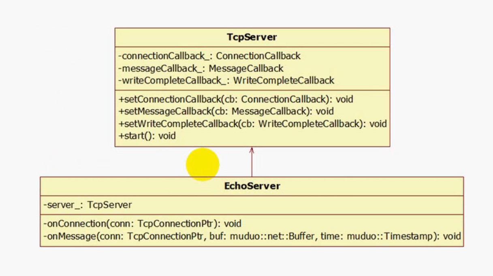

TCP 网络编程最本质的是处理三个半事件：

1. 连接建立：服务器 accept（被动）接受连接，客户端 connect（主动）发起连接。

2. 连接断开：主动断开（close、shutdown），被动断开（read 调用返回值 等于 0）。

3. 消息到达：表示有可读事件，即文件描述符可读。

4. 消息发送完毕：半个。这是因为消息发送到内核缓冲区中，就代表写事件完成，至于消息会不会最终到达对端，就不得而知。

消息发送对于低流量的服务，倒也不必关心半事件。对于高流量的服务就不可以，因为流量太大会导致内核缓冲区满，那么用户层需要将剩余的消息暂时保存到用户自己的缓冲区中，等到文件描述符变得可写，再继续往里面写入消息。通常要我们自己设计一个 Buffer 来解决这个问题。

我们看到 TcpServer 提供的设置三个半事件的回调接口。connectionCallback_ 对应连接建立和连接断开两个事件，内部会判断对方是建立连接还是断开连接。messageCallback_ 对应消息到达事件。writeCallback_ 对应消息发送半个事件。