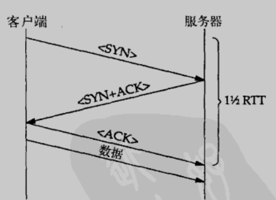

TCP 是一个复杂的协议，在基本数据报服务的基础上添加了可靠性和流量控制功能，而 UDP 只添加了一个校验和,所以看起来 UDP 可能要比 TCP 快一个数量级或更多。基于这种假设很多应用程序的程序员都认为只有使用 UDP 才能获得可接受的性能。在某些情况下，UDP 运行的是比 TCP 快得多，但并不总是这样的。我们会看到，**有时 TCP 比 UDP 运行的好得多**。

1. 两种协议的 CPU 处理主要都是在进行数据复制和校验，因此，这部分看不出太大的差别
2. 为了提供可靠性，接收端 TCP 必须发送 ACK，这就增加了两端程序必须处理的内容，但是工作量可能不会有我们预想的那么多。首先，接受端可用通过它要发回给对等实体的数据来捎带给ACK。实际上，很多 TCP 实现都会将 ACK 延迟几个毫秒发送，以防止本端应用程序有对输入分段的应答要发送。第二，TCP 没必要为每个段产生一个 ACK。正常情况下，大部分 TCP 实现都是隔一段发送一次 ACK 的
3. TCP 和 UDP 之间另一个主要区别在于 TCP 是个面向连接的协议，必须进行连接的建立和拆除，即三次握手和四次挥手。我们假设拆除连接（四次挥手）的时间基本上可用并入数据交换的时间之中，将注意力集中在连接建立阶段发生的事情上。如下图所示，分组从一台主机发送到其对等实体再发送回来所需的时间。正如我们看到的那样，连接建立要花费一又二分之一个往返时间。如果客户端和服务器之间的连接维持的时间足够长(比如,有大量数据在客户端和服务器之间传送)，这一个半 RTT 会由所有的数据传输分摊，不会对性能产生很严重的影响。但如果有个简单事务，客户端发送一条请求，服务器对其进行应答，那么连接建立时间在整个事务所用时就会占据很大一部分

我们预计，应用程序中仅包含简单的请求/应答会话时，UDP 的性能会比 TCP 好，当连接持续的时间很长，并且传输了大量数据时，TCP 的性能会比 UDP 好得多。实际情况中，还需要各写一份代码进行测试。

---

⭐️内容取自译者陈涓、赵振平《TCP/IP高效编程：改善网络程序的44个技巧》，仅从中取出个人以为需要纪录的内容。不追求内容的完整性，却也不会丢失所记内容的逻辑性。如果需要了解细致，建议读原书。

