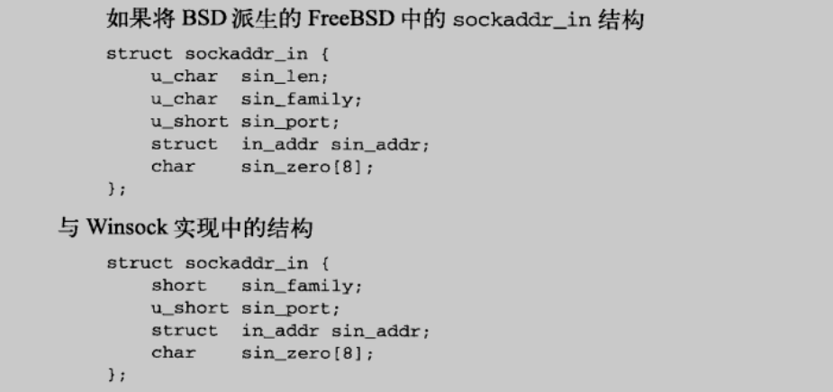

我们看到下面两种实现中确实都有另外一个字段 sin_zero。尽管很少用到这个字段（用于将sockaddr_in结构补足 16 字节长），但还是必须将其设置为 0。

因为必须要将 sin_zero 清零，所以在使用之前，将整个地址结构清零就成了一种惯常的做法。通过这种方式，可以清除所有其它字段，而且还可以避免于未正式说明的字段及用法发送可能的冲突。

---

⭐️内容取自译者陈涓、赵振平《TCP/IP高效编程：改善网络程序的44个技巧》，仅从中取出个人以为需要纪录的内容。不追求内容的完整性，却也不会丢失所记内容的逻辑性。如果需要了解细致，建议读原书。