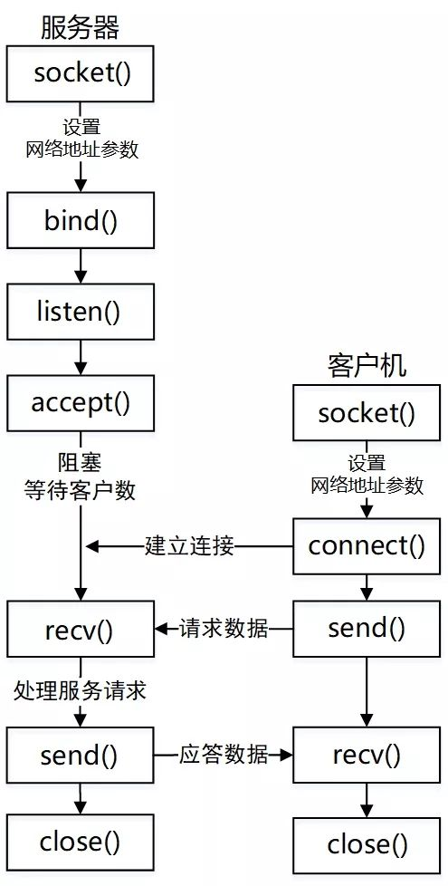
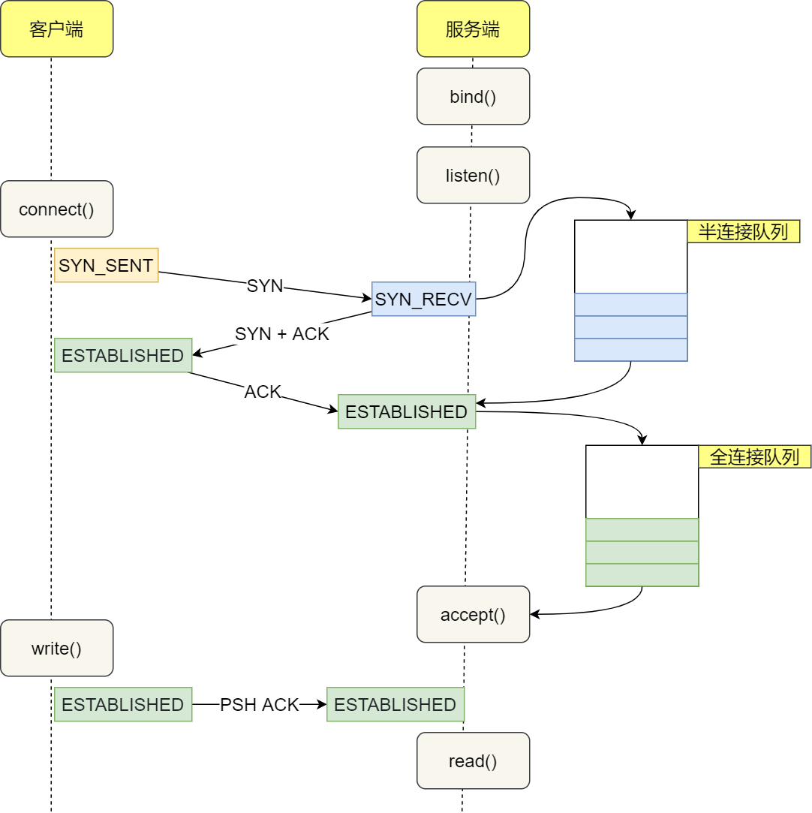
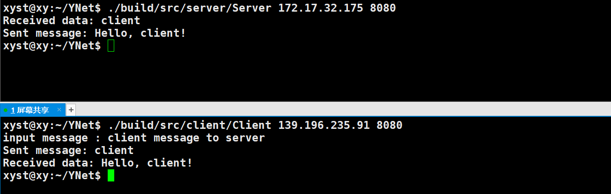

基本套接字 API 概览

`socket()`: 创建一个套接字

`bind()`: 绑定套接字到一个地址和端口

`listen()`: 监听端口上的连接请求（用于服务器）

`accept()`: 接受连接请求（用于服务器）

`connect()`: 连接到一个远程地址（用于客户端）

`send()`: 发送数据

`recv()`: 接收数据

`close()`: 关闭套接字

注：在 UNIX 中，可以像文件描述符那样，直接用套接字描述符来调用 read 和 write。但正如我们曾经提到的那样，Windows 并没有用套接字语法重载这些系统调用，因此，只能用 recv 和 send 来代替。除了包含一个额外参数，这些调用与 read 和 write 是一样的。如果你用的UDP的话，那么你应该使用 recvform 和 sendto。

## socket

功能：返回一个文件描述符，它是一个用于标识新创建的套接字的引用

```c++
#include <sys/types.h>         
#include <sys/socket.h>

int socket(int domain, int type, int protocol);

/*
  int socket_fd = socket(AF_INET, SOCK_STREAM, 0);
  if (socket_fd < 0) {
    perror("socket error");
    return -1;
  }
  */
```

`domain`（指定通信的协议族） 核心参数:：

- AF_LOCAL: 本地进程间通信
- AF_INET（常用）: 远端基于IPV4进程间通信
- AF_INET6: 远端基于IPV6进程间通信

`type`（指定套接字的类型） 核心参数：

- SOCK_STREA（常用）: 流套接字，提供面向连接的稳定数据传输（TCP）
- SOCK_DGRAM: 数据报套接字，提供无连接的数据传输（UDP）
- SOCK_RAW: 原始套接字，提供对底层协议的直接访问

`protocol`（指定要使用的协议） 核心参数：通常为 0，表示自动选择合适的协议。对于 AF_INET 和 SOCK_STREAM ，0 通常表示 TCP，对于 AF_INET 和 SOCK_DGRA，0 通常表示 UDP

## bind

功能：绑定套接字到一个地址和端口

```c++
#include <sys/types.h>         
#include <sys/socket.h>

int bind(int sockfd, const struct sockaddr *addr,socklen_t addrlen);

/*
  struct sockaddr_in server_addr;
  memset(&server_addr, 0, sizeof(server_addr));
  server_addr.sin_family = AF_INET;
  server_addr.sin_port = htons(port);
  server_addr.sin_addr.s_addr = inet_addr(ip.c_str());
  
  int ret = bind(socket_fd, (struct sockaddr *)&server_addr, sizeof(server_addr));
  if (ret < 0) {
    perror("bind error");
    return -1;
  }
*/
```

sockfd: 就是前面 socket 创建成功的返回值

addr: 结构体 sockaddr，用于**存放服务端的协议族、端口和地址信息**。客户端的 connect 函数和服务端的 bind 函数需要这个结构体

addrlen: 是参数 addr 的长度，用 sizeof 计算 

---

```c++
struct sockaddr {
    unsigned short sa_family;    // 协议族 (AF_INET, AF_INET6, etc.)
    char sa_data[14];            // 地址数据 (协议相关)
};
```

存放协议族、端口和地址信息。客户端的 connect 函数和服务端的 bind 函数需要这个结构体。

sockaddr 结构体是为了统一地址结构的表示方法，统一接口函数，但是这个结构体并不方便使用，因此定义了等价的 sockaddr_in 结构体，它的大小和 sockaddr 结构体相同，可以强制转换成 sockaddr。

```c++
struct sockaddr_in {
    short int sin_family;         // 协议族 (AF_INET)
    unsigned short int sin_port;  // 16位端口号 ，大端序。用htons(整数的端口)转换。
    struct in_addr sin_addr;      // IP地址
    unsigned char sin_zero[8];    // 填充，使得结构体大小与sockaddr一致（不用管）
};
 
struct in_addr {
    unsigned long s_addr;         // 32位的IP地址，大端序 (使用网络字节序)
};
```

因此，在实际的网络编程中，先定义 sockaddr_in结构体把相关信息存储之后，再强制转换成 sockaddr，毕竟提供的API接受的类型是 sockaddr。

## listen

功能：将一个套接字设置为被动模式，以便接收来自远程主机的连接请求

```c++
#include <sys/types.h>          
#include <sys/socket.h>

int listen(int sockfd, int backlog);

/*
  #define LISTEN_NUM 10
  
  ret = listen(socket_fd, LISTEN_NUM);
  if (ret < 0) {
    perror("listen error");
    return -1;
  }
*/
```

`sockfd`: 就是前面 socket 创建成功的返回值，而且必须 bind 之后的 sockfd

`backlog`: 会影响到半连接队列和全连接队列的大小



从上面这种图可以看到，listen 接受到客户端连接请求之后，开始进行三次握手。如果第一次握手成功，连接被加入到半连接队列；如果第三次握手也成功，连接被加入到全连接队列。三次握手成功，加入到全连接队列的连接可以用于后续通信，而 accept 实际上就是去全连接队列里面去取这些连接出来用于通信的。

那么多大的 backlog 是合适的？

- 如果你的接口处理连接的速度要求非常高，或者做压力测试，很有必要调高这个值
- 如果业务接口本身性能不好，accept 取走已连接的速度较慢，那么把 backlog 调的再大也没有用，只会增加连接失败的可能性

关于 backlog 传递的值究竟会为多少（你传递的值未必就会成为实际的 backlog 最终值），需要去看内核的实现，详细可见此文：[三次握手背后的秘密：半连接队列和全连接队列](https://www.yuque.com/xiaoyang-wyxle/gdb3m3/xntqpx4a75l074qg)

## accept

功能： 系统调用 sockfd 的全连接队列中的第一个连接请求，创建一个新的连接套接字，并返回一个新的文件描述符

```c++
#include <sys/types.h>  
#include <sys/socket.h>

int accept(int sockfd, struct sockaddr *addr, socklen_t *addrlen);
int accept4(int sockfd, struct sockaddr *addr, socklen_t *addrlen, int flags);

/*
  struct sockaddr_in client_addr;
  socklen_t client_len = sizeof(client_addr);
  int listen_fd = accept(socket_fd, (struct sockaddr *)&client_addr, &client_len);
  if (listen_fd < 0) {
    perror("accept error");
    return -1;
  }
*/
```

`sockfd`: 就是前面 socket 创建成功的返回值，而且必须 listen 之后的 sockfd

`addr`: 指向 `sockaddr` 结构体的指针，用于**存储客户端的地址信息**（新连接的对等实体地址）。如果不需要客户端地址，可以传递 `NULL`。

`flags` (accept4 专用): 额外的标志，可以是以下值的按位或组合：

- SOCK_NONBLOCK: 使返回的文件描述符变为非阻塞模式
- SOCK_CLOEXEC: 在执行 exec 系列函数时自动关闭文件描述符

也就是，我们后续服务器和客户端实际通信的套接字是 accept 函数返回的文件描述符。此前的 socket 创建并返回的文件描述符仅仅用于添加相关信息并和客户端成功建立连接，并不用于后续通信，却是后续通信不可或缺的基础。

注：这里的 addr 参数是新建的客户端的结构体，而非之前创建用于 bind 参数的 addr 参数（它属于服务端）。

## recv

功能：用于从套接字接收消息

```c++
#include <sys/types.h>
#include <sys/socket.h>

ssize_t recv(int sockfd, void *buf, size_t len, int flags);

/*
  char buf[1024] = {0};
  ssize_t bytes_read = recv(listen_fd, buf, sizeof(buf) - 1,0);
  if (bytes_read < 0) {
    perror("read error");
  } else if (bytes_read == 0) {
    std::cout << "Client disconnected." << std::endl;
  } else {
    buf[bytes_read] = '\0'; 
    std::cout << "Received data: " << buf << std::endl;
  }
*/
```

`sockfd`: 一个有效的套接字文件描述符，从中接收数据。就是之前调用 accept 之后返回的套接字文件描述符

`buf`: 一个指向接收数据的缓冲区的指针

`len`: 缓冲区的长度，即最多接收的字节数

`flags`: 控制接收操作的标志。常用的标志包括：

- 0: 默认标志，无特殊行为。
- MSG_DONTWAIT: 使操作非阻塞
- MSG_PEEK: 查看数据但不将其从缓冲区中移除
- MSG_WAITALL: 等待所有请求的数据被接收

## send

功能：用于从套接字发送消息

```c++
#include <sys/types.h>
#include <sys/socket.h>

ssize_t send(int sockfd, const void *buf, size_t len, int flags);

/*
  const char *message = "Hello, client!";
  ssize_t bytes_sent = send(listen_fd, message, std::strlen(message), 0);
  if (bytes_sent < 0) {
    std::cerr << "Error sending message" << std::endl;
  } else {
    std::cout << "Sent " << bytes_sent << " bytes to client" << std::endl;
  }
*/
```

`sockfd`: 一个有效的套接字文件描述符，通过该套接字发送数据

`buf`: 指向包含待发送数据的缓冲区的指针

`len`: 缓冲区中待发送数据的长度

`flags`: 控制发送操作的标志。常用的标志包括：

- 0: 默认标志，无特殊行为
- MSG_DONTWAIT: 使操作非阻塞
- MSG_OOB: 发送带外数据
- MSG_NOSIGNAL: 阻止发送 SIGPIPE 信号

## connect

功能：用于连接服务端

```c++
#include <sys/types.h>          /* See NOTES */
#include <sys/socket.h>

 int connect(int sockfd, const struct sockaddr *addr,socklen_t addrlen);

/*
    // 配置服务器地址
    server_addr.sin_family = AF_INET;
    server_addr.sin_port = htons(12345); // 服务器端口号
    server_addr.sin_addr.s_addr = inet_addr("127.0.0.1"); // 服务器地址

    // 连接到服务器
    if (connect(sockfd, (struct sockaddr *)&server_addr, sizeof(server_addr)) < 0) {
        perror("connect");
        close(sockfd);
        exit(EXIT_FAILURE);
    }
*/
```

## 阻塞与非阻塞

阻塞：在进程/线程中，发起一个调用时，**在调用返回之前，进程/线程会阻塞等待**，等待中的进程/线程会让出CPU

非阻塞：在进程/线程中，发起一个调用时，**会立即返回**

前面介绍的 API 中，会阻塞的四个函数有 connect()、accept()、send()、recv()

阻塞IO与非阻塞IO的应用场景：

- 在穿透的网络服务端程序中（每连接每线程/进程），采用阻塞IO
- 在IO复用的模型中，事件循环（select、poll、epoll）不能被阻塞在任何环节，应该采用非阻塞IO

## 实战代码

服务端

```c++
#include <iostream>
#include <cstring>
#include <netinet/in.h>
#include <arpa/inet.h>
#include <sys/socket.h>
#include <unistd.h>

#define LISTEN_NUM 10

int main(int argc, char *argv[]) {
  if (argc != 3) {
    std::cout << "./server 172.17.32.175 8888" << std::endl;
    return -1;
  }

  std::string ip = argv[1];
  int port = std::stoi(argv[2]);

  int socket_fd = socket(AF_INET, SOCK_STREAM, 0);
  if (socket_fd < 0) {
    perror("socket error");
    return -1;
  }

  struct sockaddr_in server_addr;
  memset(&server_addr, 0, sizeof(server_addr));
  server_addr.sin_family = AF_INET;
  server_addr.sin_port = htons(port);
  server_addr.sin_addr.s_addr = inet_addr(ip.c_str());

  int ret = bind(socket_fd, (struct sockaddr *)&server_addr, sizeof(server_addr));
  if (ret < 0) {
    perror("bind error");
    return -1;
  }

  ret = listen(socket_fd, LISTEN_NUM);
  if (ret < 0) {
    perror("listen error");
    return -1;
  }

  struct sockaddr_in client_addr;
  socklen_t client_len = sizeof(client_addr);
  int listen_fd = accept(socket_fd, (struct sockaddr *)&client_addr, &client_len);
  if (listen_fd < 0) {
    perror("accept error");
    return -1;
  }

  char buf[1024] = {0};
  ssize_t bytes_read = recv(listen_fd, buf, sizeof(buf) - 1,0);
  if (bytes_read < 0) {
    perror("read error");
  } else if (bytes_read == 0) {
    std::cout << "Client disconnected." << std::endl;
  } else {
    buf[bytes_read] = '\0';
    std::cout << "Received data: " << buf << std::endl;
  }

  const char *message = "Hello, client!";
  ssize_t bytes_sent = send(listen_fd, message, std::strlen(message), 0);
  if (bytes_sent < 0) {
    perror("send error");
    return -1;
  } else {
    std::cout << "Sent message: " << message << std::endl;
  }


  close(listen_fd);
  close(socket_fd);

  return 0;
}
```

客户端

```c++
#include <iostream>
#include <cstring>
#include <netinet/in.h>
#include <arpa/inet.h>
#include <sys/socket.h>
#include <unistd.h>

int main(int argc, char *argv[]) {
  if (argc != 3) {
    std::cout << "Usage: " << argv[0] << " <server_ip> <server_port> <message>" << std::endl;
    return -1;
  }

  std::string server_ip = argv[1];
  int server_port = std::stoi(argv[2]);
  std::string message;
  std::cout<<"input message : ";
  std::cin>>message;

  int sock_fd = socket(AF_INET, SOCK_STREAM, 0);
  if (sock_fd < 0) {
    perror("socket error");
    return -1;
  }

  struct sockaddr_in server_addr;
  memset(&server_addr, 0, sizeof(server_addr));
  server_addr.sin_family = AF_INET;
  server_addr.sin_port = htons(server_port);
  inet_pton(AF_INET, server_ip.c_str(), &server_addr.sin_addr);

  int ret = connect(sock_fd, (struct sockaddr *)&server_addr, sizeof(server_addr));
  if (ret < 0) {
    perror("connect error");
    return -1;
  }

  ssize_t bytes_sent = send(sock_fd, message.c_str(), message.size(), 0);
  if (bytes_sent < 0) {
    perror("send error");
    return -1;
  } else {
    std::cout << "Sent message: " << message << std::endl;
  }

  char buf[1024] = {0};
  ssize_t bytes_read = recv(sock_fd, buf, sizeof(buf) - 1,0);
  if (bytes_read < 0) {
    perror("read error");
  } else if (bytes_read == 0) {
    std::cout << "Server disconnected." << std::endl;
  } else {
    buf[bytes_read] = '\0';
    std::cout << "Received data: " << buf << std::endl;
  }

  close(sock_fd);
  return 0;
}
```

通信效果：



---

⭐️内容取自译者陈涓、赵振平《TCP/IP高效编程：改善网络程序的44个技巧》，仅从中取出个人以为需要纪录的内容。不追求内容的完整性，却也不会丢失所记内容的逻辑性。如果需要了解细致，建议读原书。