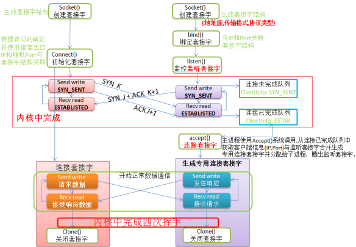
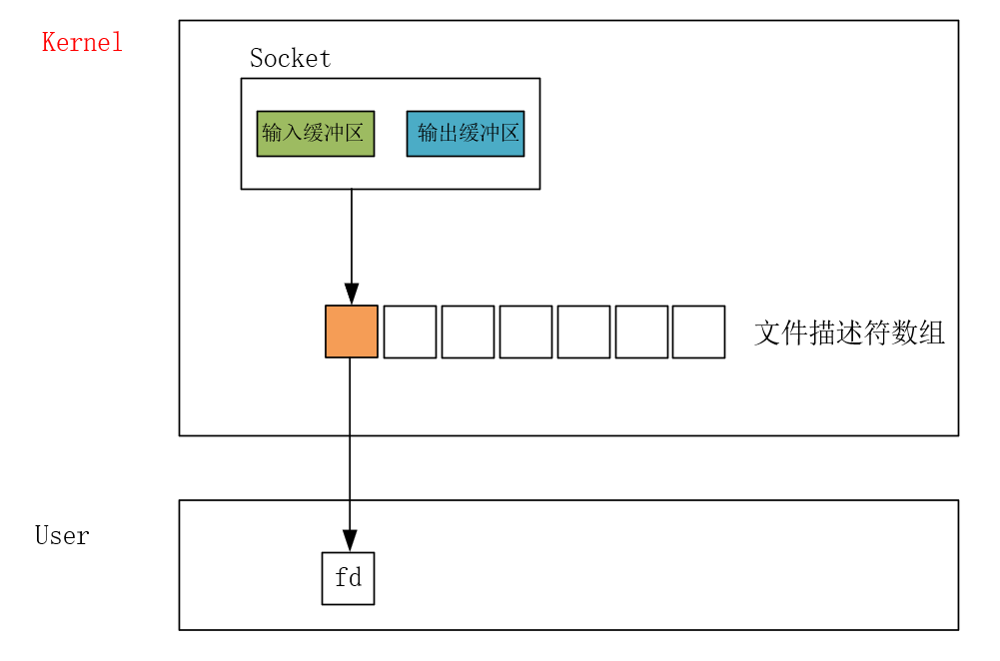
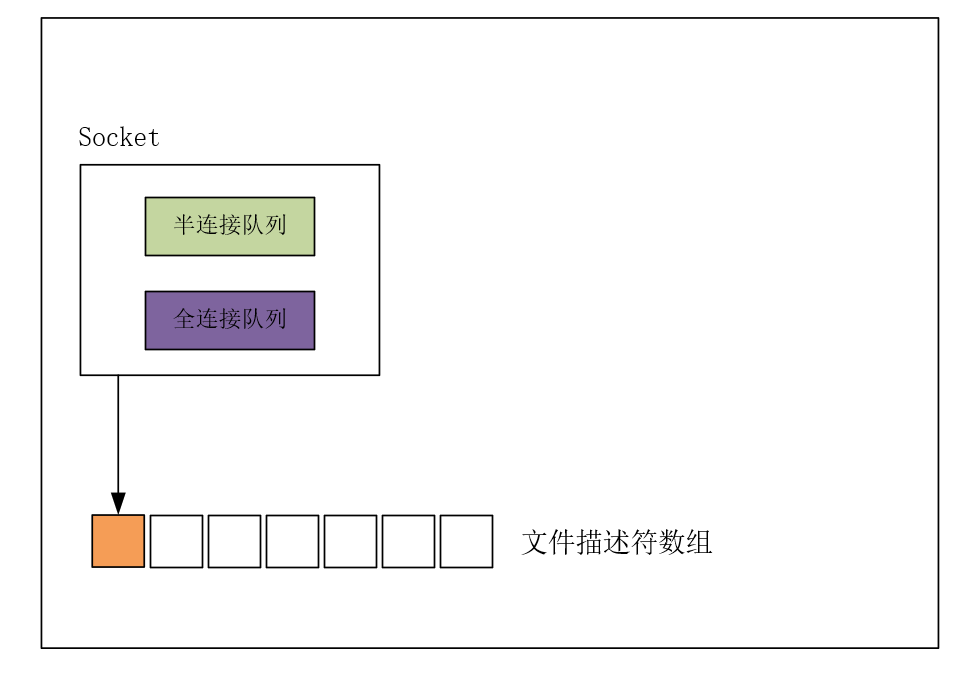
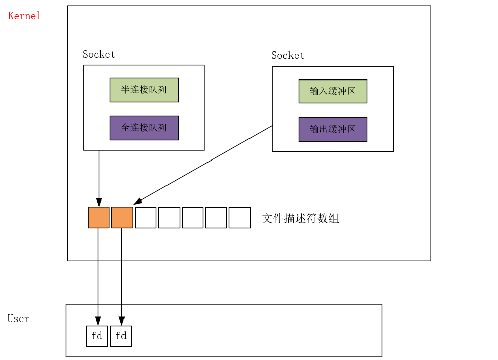

通过 socket 函数创建 Socket 套接字对象，核心的组成部分是输入缓冲区和输出缓冲区。该对象的指针记录在一个内核维护的文件描述符数组中，对应的数组下标将作为返回值 fd 用以给用户态使用。

通常，我们让服务端监听在某个【IP,PORT】上，用以给客户端连接。

服务端创建 Socket 对象，还用不到输入输出缓冲区，因此会将其 free 掉，维护半连接队列和全连接队列处理客户端的连接请求。

bind 绑定【IP,PORT】，listen 监听在【IP,PORT】，客户端 connect 到服务器，三次握手在由内核来完成。其流程为：

1. 客户端发起第一次握手，服务器把本次请求维护在半连接队列中。
2. 服务器回复客户端的请求，完成第二次握手。
3. 客户端发起第三次握手，三次握手完成，服务器就视为连接成功，将其从半连接队列移除，移动到全连接队列中维护。

当三次握手完成，连接对象移入全连接队列。accept 方法就是从全连接队列中取出一个已经成功建立的连接对象，**内核会为该连接对象分配一个新的套接字文件描述符**，对应的数组下标将作为返回值 fd 用以给用户态使用。这个新的文件描述符是与特定的客户端连接关联，它含有输入缓冲区和输出缓冲区，专用于与对应客户端进行数据传输。

简单回顾，客户端创建的 Socket 对象就是用以与服务器通信，但是服务器创建的 Socket 对象并不是，而是用以完成监听客户端连接并成功建立连接的任务。

成功连接的对象维护在服务器 Socket 对象的全连接队列中，调用 accept 函数，内核就会从全连接队列中取出一个连接对象，为其创建 Socket 对象，此前的 Socket 对象是用以监听客户端连接，当前创建的 新的 Socket 对象是用以实际通信。

调用 send 发送消息，recv 接受消息。

- send 本质上是把应用程序数据拷贝到 Socket 对象的 输出缓冲区，仅此而已，至于如何在网络数据传输，已经何时把数据放在网络上传输，都与 send 接口无关。
- recv 本质上是把 Socket 对象的 输入缓冲区 的数据拷贝到应用程序中。

说到底，send 和 recv 依旧还是在和本机打交道，网络上的事情是交由操作系统去完成。

等到无需通信，就会选择关闭套接字，四次挥手的过程也是由内核完成。

推荐阅读：[Linux-收发网络数据包的过程](https://xiaoyangst.github.io/2024/09/25/Linux-%E6%94%B6%E5%8F%91%E7%BD%91%E7%BB%9C%E6%95%B0%E6%8D%AE%E5%8C%85%E7%9A%84%E8%BF%87%E7%A8%8B/#%E6%8E%A5%E6%94%B6%E7%BD%91%E7%BB%9C%E6%95%B0%E6%8D%AE%E5%8C%85)