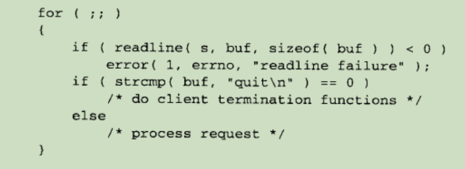

亦如在程序中接受用户的输入前，要对用户的输入进行“安全检测”，以防止恶意输入破坏应用程序的正常运行。可见，防御性编程在编码中是必备的意识，网络编程中也要考虑各种概率看似很小的事件，做出相应的处理动作。

## 检测客户端的终止

这段代码中，如果客户端发送字符串"quit"代表客户端要退出，服务器这边就可以正常和客户端断开连接。如果客户端发生故障或者异常导致没有发生字符串"quit"，那么服务器这边就会频繁执行最后一条分支语句。

可以只在读操作上设置一个定时器，如果客户端在某段时间区间内没有发出请求，服务器就假定客户端已经不存在了。很多 FTP 服务器就是这么做的：如果客户端在某段时间区间内没有发送任何请求，服务器就放弃连接。用一个显式定时器或者像心跳实例那样使用 select 定时器，就可以很方便地解决这个问题。

## 检测无效输入

即客户端恶意输入无效字符，服务器如果没有进行“拦截检测”，可能会造成程序崩溃。崩溃最常见的两种原因是缓冲器溢出和指针丢失。

`缓冲区溢出`是由于写入的数据超过了缓冲区的大小，从而覆盖了相邻的内存区域。为了防止缓冲区溢出，可以采取以下措施：

1. **使用安全函数**：使用库中提供的安全函数，例如 `strncpy` 代替 `strcpy`，`snprintf` 代替 `sprintf` 等
2. **手动检查长度**：在写入数据之前，手动检查输入数据的长度是否超过了缓冲区的大小

`指针丢失`通常是由于未正确初始化指针或错误释放内存导致的。为了防止指针丢失，可以采取以下措施：

1. **初始化指针**：确保所有指针在使用之前都被初始化
2. **检查指针有效性**：在使用指针之前，检查指针是否为空（`nullptr`）
3. **正确管理内存**：C++11 提供的智能指针

---

⭐️内容取自译者陈涓、赵振平《TCP/IP高效编程：改善网络程序的44个技巧》，仅从中取出个人以为需要纪录的内容。不追求内容的完整性，却也不会丢失所记内容的逻辑性。如果需要了解细致，建议读原书。