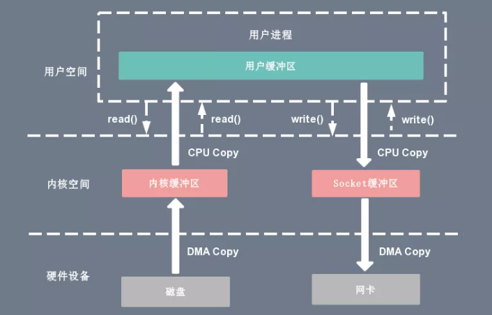
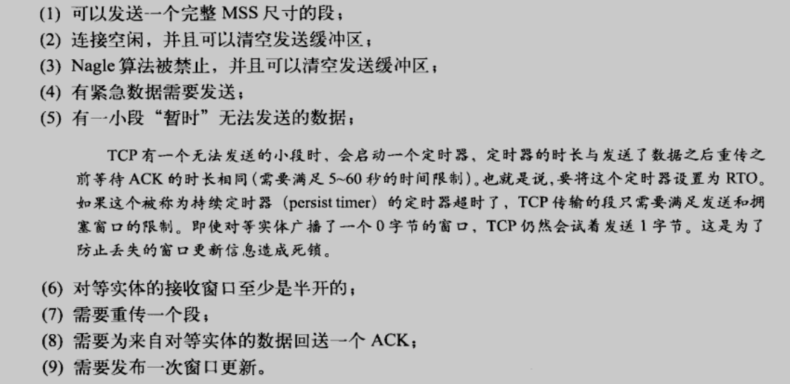

## 从应用程序角度看写操作

用户程序对一条 TCP 连接进行写调用时，首先会将数据从用户缓冲区复制到内核中去。从此之后，可能发生的情况就与连接的状态有关了。TCP 可能发送全部、部分或者不发送数据。稍后会对 TCP 的这个决定做进一步的研究，但首先要从用户应用程序的角度来看看这个写操作的动作。

假设一个 n 字节的写操作返回值 n 时，这 n 字节已经被发送给对等实体，甚至已经被确认了，这是很有诱惑力的一种想法。但事情并不是这样的。TCP 会尽可能地将它所能发送的数据都发送出去（有可能一个也没有），然后立即返回值 n。应用程序无法判定发送了多少数据，也无法判断对等实体是否对其进行了确认。

总的来说，除非 TCP 发送缓冲区满了，否则写操作是不会被阻塞的。也就是说，写操作基本上总是能立即返回的，但它们返回时并不能保证对所写数据进行了哪些处理。

从应用程序的角度来看，数据已经写入，因此 TCP 的“可靠传输”要保证它抵达对等实体。实际上，写操作返回时，写操作写出的部分或全部数据可能还在排队等待传输，所以，此时不管是主机还是对等应用程序崩溃了，数据都会丢失。

通过对这些情况进行总结，我们认为，对 TCP 连接使用写操作时，最好将写操作理解成将数据复制到发生队列，并通知 TCP 此队列中有新数据的一种操作。可以将 TCP 的行为作为收到这种通知后的结果，但要把它看作本质上异步于写操作的一种行为。

## 从TCP角度看写操作

如前所述，写操作负责将数据从应用程序的写缓冲区搬移到内核中去，并通知 TCP 有来自应用程序的新数据需要处理。现在来看看 TCP 使用的一些标准，这些标准决定了 TCP 能否将刚到达的数据立即发送出去，如果可以，发送多少。

满足下列一项就会发送：

