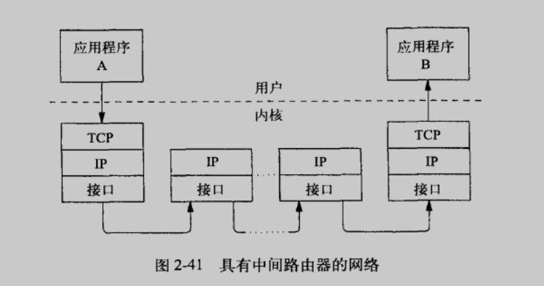

我们会误以为只要基于 TCP 编程，那么通信的数据必然能够到达对端主机，毕竟 TCP 是可靠的传输协议。然而， TCP 是处在传输层的协议，其可靠性只针对传输层，但是消息最终要达到应用层才算有价值。从传输层到应用层的消息会不会出现问题，可不由 TCP 来保证。

数据流从应用程序 A 通过它所在主机的 TCP/IP 栈向下传输，经过几台中间路由器，通过应用程序 B 所在主机的TCP/IP 栈向上传输，最后抵达应用程序 B。一个 TCP 段离开应用程序 A 所在主机的 TCP 层时，会被封装到一个数据报中，传送给其对等实体主机。它所走的路由可能要经过很多路由器，但如下图所示，这些路由器都没有TCP层，它们只是转发了IP数据报。

当一个段抵达应用程序 B 所在主机的 TCP 层时，唯一可以确定的就是这个段已经到达了，但它可能损坏了，可能是重复的数据，可能是错序的，或者是由于其他一些原因无法接受的。注意，发送端 TCP 无法对这些抵达接收端 TCP的段做出任何保证。但接收端 TCP 要向发送端 TCP 确认，也就是说它 ACK 的数据以及在此数据之前到达的所有数据在 TCP 层都已经正确收到了，发送端 TCP 可以安全地删除这些数据的副本了。这并不意味着已经将数据传送，或者总是可以将数据传送给应用程序。比如，接收端主机可能在刚刚对数据进行了 ACK，但应用程序还没有将其读走之前，就崩溃了。

## 故障模式

TCP 是一个端对端协议，也就是说它自己要在对等实体之间提供可靠的传输机制。但是，认识到“端点”位于对等的 TCP层，而不是对等的应用程序中是非常重要的。要求进行端到端确认的应用程序必须自身提供此项功能。

看看其他一些“常见的”故障模式。只要两个对等实体仍然连着，TCP 就能保证将数据按序无损坏地传送。只有连接中断时才会出现故障。什么类型的事件会造成这种中断呢?有三种情况可能引发这类问题：

1. 永久或临时的网络中断
2. 对等的应用程序崩溃
3. 运行对等应用程序的主机崩溃

## 网络中断

路由器或骨干链路损毁，某人被本地以太网电缆绊倒，踢松了网线……很多原因都会造成网络的中断。在端点之外发生的损坏通常都是临时的，因为路由协议会发现问题，并使路由绕开出问题的节点。

端点出现问题，通常没有备用的路径，所以问题会一直存在，直到端点修复为止。

除非中间路由器发送一条ICMP报文，说明目的网络或主机不可达，否则应用程序及其 TCP/IP 栈都无法立即获知中断的发生。在这种情况下，发送端最终会超时，并重新发送所有未被确认的段。在发送端 TCP 放弃发送、丢弃连接并报告错误之前会一直持续这种操作。

在传统 BSD 栈中，发送端 TCP 会在重传 12 次(大约 9 分钟)之后放弃。如果读操作被挂起，会返回一条错误状况，并将 errno 置为 ETIMEDOUT。如果没有挂起的读操作，接下来的写操作就会失败，根据信号是忽略还是捕获，写操作失败时会携带一个 SIGPIPE 信号，或 EPIPE 错误。

如果某个中间路由器无法转发包含段的 IP 数据报，它会向源端主机发送一个 ICMP 报文，说明目的网络或主机不可达。在这种情况下，有些实现会返回 ENETUNREACH 或 EHOSTUNREACH 作为错误原因。

## 对等实体崩溃

接下来，我们来看看如果对等应用程序崩溃或者终止，会发生什么情况。首先要意识到从应用程序的角度来看，对等实体崩溃与对等实体调用 c1ose 及 exit 是无法区分的。**在这两种情况下，对等实体的 TCP 都会向我们的 TCP 发送一个 FIN**。FIN 作为 EOF 使用，表示发送它的那一端已经没有数据发送了。这并不（一定）表示发送 FIN 的这一端已经退出了，甚至无法说明它不愿意接收更多数据。

## 对等实体的主机崩溃

要研究的最后一种故障模式是对等实体主机的崩溃。这种故障模式与对等实体崩溃不同，因为对等实体的 TCP 无法通过 FIN 来通知我们的应用程序，其对等实体已经不在运行了。

在对等实体主机重启之前，这个错误看起来和网络故障一样：对等实体的TCP不再应答了。和网络故障的情况一样，我们的应用程序 TCP 会持续重传未经确认的段。最终，如果对等实体主机没有重启，它就会放弃并向应用程序返回一条 ETIMEDOUT 错误。

如果在我们的 TCP 放弃并丢弃连接之前，对等实体主机就重启了，会发生什么情况呢？在这种情况下，会有重传的段到达对等实体刚刚重启的主机，而这台主机并没有连接记录。在这种情况下，TCP 技术规范要求接收端主机向发送端主机回送一个 RST。这样发送端主机才会丢弃连接，应用程序才会收到一条 ECONNRESET 错误(如果它有挂起的读操作的话)，或者会在下一条写操作时得到一个 SIGPIPE 信号或 EPIPE 错误。

---

⭐️内容取自译者陈涓、赵振平《TCP/IP高效编程：改善网络程序的44个技巧》，仅从中取出个人以为需要纪录的内容。不追求内容的完整性，却也不会丢失所记内容的逻辑性。如果需要了解细致，建议读原书。