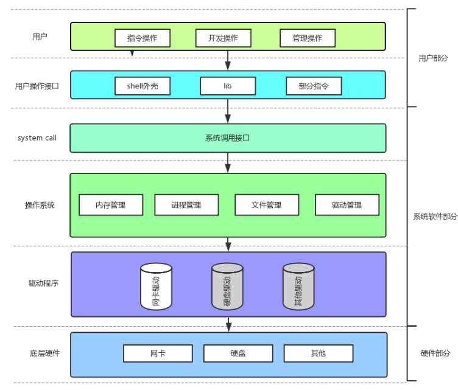
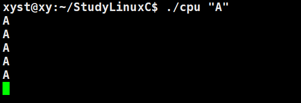
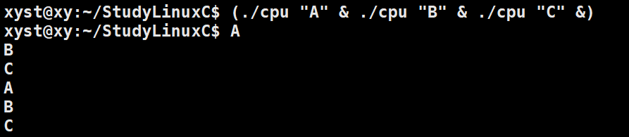
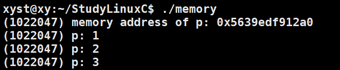
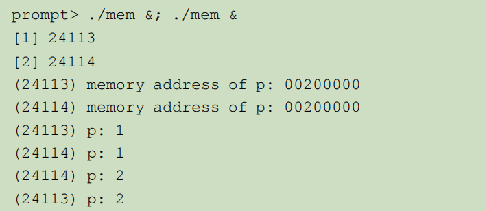
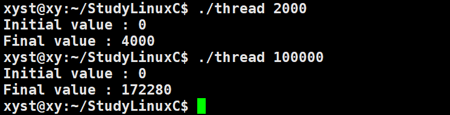

## 概述

一个正在运行的程序称之为进程，运行的动作发生就是不断从内存中取指令并执行指令，直到程序最终完成。

实际上，有一类软件负责让程序运行变得容易（甚至允许你同时允许多个程序），允许程序共享内容，让程序能够与设备交互，以及其它类型的有趣的工作。这些软件称为**操作系统**，因为他们负责确保系统既易于使用又正确高效地运行。

操作系统作为硬件和应用程序的中间人，负责把硬件资源更加方便地提供给应用程序使用。如果要实现这点，操作系统主要利用一种通用的技术，称为**虚拟化**。即操作系统将物理资源（如处理器、内存或磁盘）转换为更通用、更强大且更易于使用的虚拟形式。应用程序通过操作系统提供的一些接口（API），间接使用硬件资源。每个 CPU、内存和磁盘都是系统的资源（resource），因此操作系统扮演的主要角色就是管理这些资源，以做到高效或公平，或者实际上考虑其他许多可能的目标。



## 虚拟化CPU

```c++
#include <stdio.h>
#include <stdlib.h>
#include <unistd.h>

void Spin(int seconds) {
  usleep(seconds * 1000000);
}

int main(int argc, char *argv[]) {
  if (argc != 2) {
    fprintf(stderr, "usage: cpu <string>\n");
    exit(1);
  }
  char *str = argv[1];
  while (1) {
    Spin(1);
    printf("%s\n", str);
  }
  return 0;
}
```

这个程序的功能是无限循环地输出用户传递给它的字符串，每次输出之间等待一秒钟。



但这一次，让我们运行同一个程序的许多不同实例。



尽管我们只有一个处理器，但这 3 个程序似乎在同时运行！

操作系统负责提供这样一种假象，即让每个正在运行的程序觉得自己独占CPU资源，实际上是操作系统在各进程间来回快速切换分配资源。将单个 CPU（或其中一小部分）转换为看似无限数量的 CPU，从而让许多程序看似同时运行，这就是所谓的虚拟化 CPU。

## 虚拟化内存

程序运行时，一直要访问内存。程序将所有数据结构保存在内存中，并通过各种指令来访问它们，例如加载和保存，或利用其他明确的指令，在工作时访问内存。不要忘记，程序的每个指令都在内存中，因此每一读取指令都会访问内存。

```c++
#include <unistd.h>
#include <stdio.h>
#include <stdlib.h>
#include <assert.h>

void Spin(int seconds) {
  usleep(seconds * 1000000); 
}

int main(int argc, char *argv[]) {
  int *p = (int *)malloc(sizeof(int)); 
  assert(p != NULL);
  printf("(%d) memory address of p: %p\n", getpid(), (void *)p); 
  *p = 0;
  while (1) {
    Spin(1);
    *p = *p + 1;
    printf("(%d) p: %d\n", getpid(), *p); 
  }
  free(p); 
  return 0;
}
```

这个程序的功能是不断地增加并打印一个整数，同时显示该整数所在的内存地址和当前进程的ID。



但这一次，让我们运行同一个程序的许多不同实例。



每个正在运行的程序都在相同的地址（00200000）处分配了内存，但每个似乎都独立更新了 00200000 处的值！就好像每个正在运行的程序都有自己的私有内存，而不是与其他正在运行的程序共享相同的物理内存。

实际上程序给进程看到的是虚拟内存，操作系统拿到这个虚拟内存会自行转换到物理内存。每个进程访问自己的私有虚拟地址空间（有时称为地址空间），操作系统以某种方式映射到机器的物理内存上。一个正在运行的程序中的内存引用不会影响其他进程（或操作系统本身）的地址空间。对于正在运行的程序，它完全拥有自己的物理内存。尽管这也是操作系统营造的假象。

## 并发

并发来指代一系列问题，这些问题在同时（甚发地）处理很多事情时出现且必须解决。并发问题首先出现在操作系统本身中，可多线程程序中同样存在相同的问题。

```c++
#include <stdio.h>
#include <stdlib.h>
#include <pthread.h>

#define Pthread_create(thread, attr, start_routine, arg) \
    pthread_create(thread, attr, start_routine, arg)

#define Pthread_join(thread, retval) pthread_join(thread, retval)

volatile int counter = 0;
int loops;

void *worker(void *arg) {
  int i;
  for (i = 0; i < loops; i++) {
    counter++;
  }
  return NULL;
}

int main(int argc, char *argv[]) {
  if (argc != 2) {
    fprintf(stderr, "usage: threads <value>\n");
    exit(1);
  }
  loops = atoi(argv[1]);

  pthread_t p1, p2;
  printf("Initial value : %d\n", counter);

  Pthread_create(&p1, NULL, worker, NULL);
  Pthread_create(&p2, NULL, worker, NULL);

  Pthread_join(p1, NULL);
  Pthread_join(p2, NULL);

  printf("Final value : %d\n", counter);

  return 0;
}
```

当我们让两个线程去求和，如果这个求和是较小不会出错，如果这个求和值很大就会不符合预期。

如下图示，第二次的测试程序中最终结果应该为200000，但是结果却为172280，这就是并发带来的问题。



这些奇怪的、不寻常的结果与指令如何执行有关，指令每次执行一条。遗憾的是，上面的程序中的关键部分是增加共享计数器的地方，它需要 3 条指令：一条将计数器的值从内存加载到寄存器，一条将其递增，另一条将其保存回内存。因为这 3 条指令不是以原子方式（atomically）执行（所有的指令一次性执行）的，所以奇怪的事情可能会发生。

## 持久性

在系统内存中，数据容易丢失，因为像DRAM 这样的设备以易失的方式存储数值。如果断电或系统崩溃，那么内存中的所有数据都会丢失。因此，我们需要硬件和软件来持久地存储数据。

操作系统中操理磁盘的软件通常称为**文件系统**。因此它负责以可靠和高效的方式，将用户创建的任何文件存储在系统的磁盘上。

操作系统为了实际写入磁盘而做了什么？首先确定新数据将驻留在磁盘上的哪个位置，然后在文件系统所维护的各种结构中对其进行记录。这样做需要向底层存储设备发出 I/O 请求，以读取现有结构或更新（写入）它们。

## 总结

我们已经了解了操作系统实际上做了什么：它取得 CPU、内存或磁盘等物理资源，并对它们进行虚拟化。它处理与并发有关的麻烦且棘手的问题。它持久地存储文件，从而使它们长期安全。

抽象是计算机科学中非常主要的手段，使得编写一个大型程序成为可能，将其划分为小而且容易理解的部分，用 C 这样的高级语言编写这样的程序不用考虑汇编，用汇编写代码不用考虑逻辑门，用逻辑门来构建处理器不用太多考虑晶体管。

设计和实现操作系统：

1. 提供高性能，即最小化操作系统的开销
2. 安全性，即在应用程序之间以及在 OS 和应用程序之间提供保护
3. 可靠性，即必须不间断运行

---

⭐️内容取自译者王海鹏《操作系统导论》，仅从中取出个人以为需要纪录的内容。不追求内容的完整性，却也不会丢失所记内容的逻辑性。如果需要了解细致，建议读原书