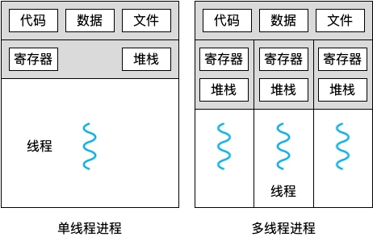
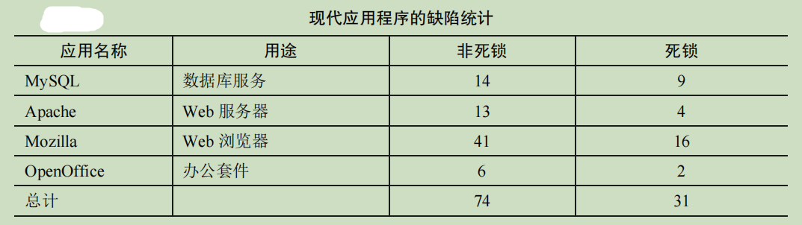
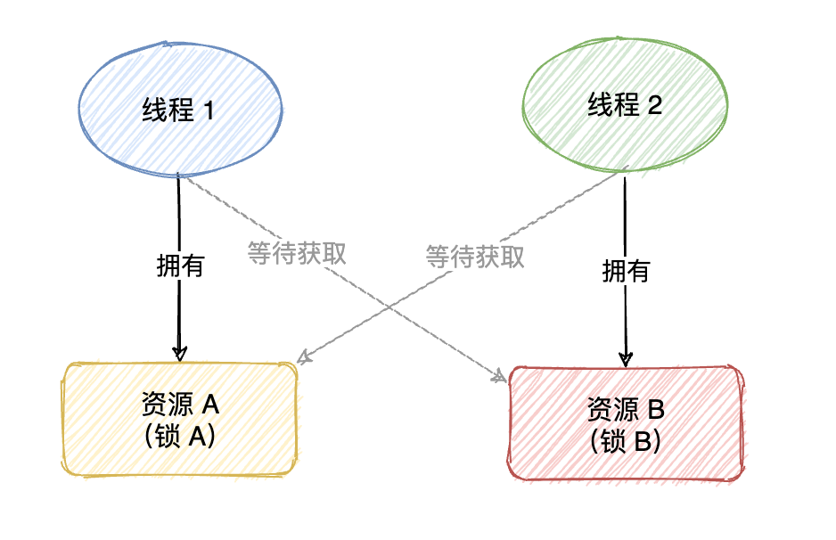

## 并发：介绍

同一进程下的多线程共享内存地址，对同一块内存地址的读不会引发数据竞争，但是修改会引发数据竞争。常用的办法是加锁保护临界区或保证修改的动作是原子的。

原子性是指当指令执行时，它会像期望那样执行更新。它不能在指令中间中断，因为这正是我们从硬件获得的保证：发生中断时，指令根本没有运行，或者运行完成，没有中间状态。



## 锁

```c++
没有加锁
    balance = balance + 1;

加锁
    lock_t mutex; 
    ...
    lock(&mutex); 
    balance = balance + 1; 	
    unlock(&mutex);
```

没有加锁前，balance = balance + 1 这个指令可以被多线程同时访问；加锁之后，保证只有一个线程访问到 balance = balance + 1 指令，确保 balance 的值正确 加 1，不会遗漏。

**锁就是一个变量**，因此我们需要声明一个某种类型的锁变量（lock variable，如上面的mutex），才能使用。这个**锁变量（简称锁）保存了锁在某一时刻的状态**。它要么是可用的（available，或 unlocked，或 free），表示没有线程持有锁，要么是被占用的（acquired，或 locked，或 held），表示有一个线程持有锁，正处于临界区。我们也可以保存其他的信息，比如持有锁的线程，或请求获取锁的线程队列，但这些信息会隐藏起来，锁的使用者不会发现。

lock 和 unlock 函数会传入一个变量，因为我们可能用不同的锁来保护不同的变量。这样可以增加并发：不同于任何临界区都使用同一个大锁（粗粒度的锁策略），通常大家会用不同的锁保护不同的数据和结构，从而允许更多的线程进入临界区（细粒度的方案）。

调用 lock()尝试获取锁，如果没有其他线程持有锁（即它是可用的），该线程会获得锁，进入临界区。这个线程有时被称为锁的持有者（owner）。如果另外一个线程对相同的锁变量（本例中的 mutex）调用 lock()，因为锁被另一线程持有，该调用不会返回。这样，当持有锁的线程在临界区时，其他线程就无法进入临界区。

锁的持有者一旦调用 unlock()，锁就变成可用了。如果没有其他等待线程（即没有其他线程调用过 lock()并卡在那里），锁的状态就变成可用了。如果有等待线程（卡在 lock()里），其中一个会（最终）注意到（或收到通知）锁状态的变化，获取该锁，进入临界区。

锁为程序员提供了最小程度的调度控制。我们把线程视为程序员创建的实体，但是被操作系统调度，具体方式由操作系统选择。**锁让程序员获得一些控制权**。通过给临界区加锁，可以保证临界区内只有一个线程活跃。**锁将原本由操作系统调度的混乱状态变得更为可控**。

## 条件变量

线程可以使用条件变量（condition variable），来等待一个条件变成真。条件变量是一个显式队列，当某些执行状态（即条件，condition）不满足时，线程可以把自己加入队列，等待（waiting）该条件。另外某个线程，当它改变了上述状态时，就可以唤醒一个或者多个等待线程（通过在该条件上发信号），让它们继续执行。

条件变量有两种相关操作：wait()和 signal()。线程要睡眠的时候（等待条件被满足，条件满足会被唤醒，即后面的signal指令），调用 wait()。当线程想唤醒等待在某个条件变量上的睡眠线程时，调用 signal()。

```c++
#include <stdio.h>
#include <stdlib.h>
#include <pthread.h>

// 定义全局变量和同步原语
int done = 0;
pthread_mutex_t m = PTHREAD_MUTEX_INITIALIZER;
pthread_cond_t c = PTHREAD_COND_INITIALIZER;

void thr_exit() {
    pthread_mutex_lock(&m);  // 锁住互斥锁
    done = 1;               
    pthread_cond_signal(&c); // 发出条件变量信号
    pthread_mutex_unlock(&m); // 解锁互斥锁
}

void *child(void *arg) {
    printf("child\n");
    thr_exit();
    return NULL;
}

void thr_join() {
    pthread_mutex_lock(&m); // 锁住互斥锁
    while (done == 0) {     // 等待条件满足
        pthread_cond_wait(&c, &m); // 等待条件变量信号
    }
    pthread_mutex_unlock(&m); // 解锁互斥锁
}

int main(int argc, char *argv[]) {
    printf("parent: begin\n");
    pthread_t p;
    pthread_create(&p, NULL, child, NULL); // 创建子线程
    thr_join(); // 等待子线程完成
    printf("parent: end\n");
    return 0;
}
```

你可能注意到一点，wait()调用有一个参数，它是互斥量。它假定在 wait()调用时，这个互斥量是已上锁状态。wait()的职责是释放锁，并让调用线程休眠（原子地）。当线程被唤醒时（在另外某个线程发信号给它后），它必须重新获取锁，再返回调用者。这样复杂的步骤也是为了避免在线程陷入休眠时，产生一些竞态条件。

## 信号量

信号量是有一个整数值的对象，可以用两个函数来操作它。在 POSIX 标准中，是 sem_wait() 和 sem_post()。因为信号量的初始值能够决定其行为，所以首先要初始化信号量，才能调用其他函数与之交互。

```c++
#include <semaphore.h> 
sem_t s; 
sem_init(&s, 0, 1);
```

其中申明了一个信号量 s，通过第三个参数，将它的值初始化为 1。sem_init() 的第二个参数，在我们看到的所有例子中都设置为 0，表示信号量是在同一进程的多个线程共享的。

信号量初始化之后，我们可以调用 sem_wait()或 sem_post()与之交互：

- 首先，sem_wait()要么立刻返回（调用 sem_wait()时，信号量的值大于等于 1），要么会让调用线程挂起，直到之后的一个 post 操作。当然，也可能多个调用线程都调用 sem_wait()，因此都在队列中等待被唤醒
- 其次，sem_post()并没有等待某些条件满足。它直接增加信号量的值，如果有等待线程，唤醒其中一个
- 最后，当信号量的值为负数时，这个值就是等待线程的个数。虽然这个值通常不会暴露给信号量的使用者，但这个恒定的关系值得了解，可能有助于记住信号量的工作原理

下面开始应用信号量

（一）用信号量作为锁

```c++
sem_t m; 
sem_init(&m, 0, X); // initialize semaphore to X; what should X be? 

sem_wait(&m); 
// 临界区
sem_post(&m);
```

我们直接把临界区用一对 sem_wait()/sem_post()环绕。但是，为了使这段代码正常工作，信号量 m 的初始值（图中初始化为 *X*）是至关重要的。*X* 应该是多少呢？

如果信号量 m 的初始化值 X 初始化为 1，线程 A 调用 sem_wait() 不会阻塞，调用之后会将 X - 1，并进入临界区。其它线程如果想要进入临界区，发现 X 为 0，会阻塞在临界区之外，因为X 为 0 ，sem_wait()会阻塞。线程 A已经进入临界区，完成相关操作之后，继续执行到 sem_post()，调用之后 X + 1，这个时候 X = 1，其它线程调用sem_wait() 不会阻塞，会有其中一个线程会被允许进入临界区。综上所述，X 初始化为 1 能够通过信号量实现锁的功能，因为锁只有两个状态（持有和没持有），所以这种用法有时也叫作二值信号量（binary semaphore）。

（二）用信号量作为条件变量

信号量也可以用在一个线程暂停执行，等待某一条件成立的场景。例如，一个线程要等待一个链表非空，然后才能删除一个元素。在这种场景下，通常一个线程等待条件成立，另外一个线程修改条件并发信号给等待线程，从而唤醒等待线程。因为等待线程在等待某些条件（condition）发生变化，所以我们将信号量作为条件变量（condition variable）。

```c++
#include <stdio.h>
#include <pthread.h>
#include <semaphore.h>

// 全局信号量
sem_t s;

void* child(void* arg) {
    printf("child\n");
    sem_post(&s); // 子线程完成后发出信号
    return NULL;
}

int main(int argc, char* argv[]) {
    // 初始化信号量，初始值为0
    sem_init(&s, 0, 0);

    printf("parent: begin\n");

    pthread_t c;
    pthread_create(&c, NULL, child, NULL); // 创建子线程

    sem_wait(&s); // 等待子线程完成
    printf("parent: end\n");

    // 销毁信号量
    sem_destroy(&s);

    return 0;
}
```

利用信号量实现父进程等待子进程再退出的功能，即父进程等待一个条件，如果条件满足就往下执行代码。比方说这里初始化信号量的值为 0，创建一个子线程去执行内部代码，主线程调用 sem_wait 等待子线程调用 sem_post之后才解除阻塞，才继续往下执行。

---

信号量还可以用于解决生产者/消费者问题，互斥锁+条件变量同样可以用于解决生产者/消费者问题。实际上，我们完全可以利用互斥锁+条件变量封装出信号量。

```c
#include <stdio.h>
#include <stdlib.h>
#include <pthread.h>

typedef struct {
    int count;
    pthread_mutex_t mutex;
    pthread_cond_t cond;
} Semaphore;

// 初始化信号量
void sem_init(Semaphore *sem, int value) {
    sem->count = value;
    pthread_mutex_init(&sem->mutex, NULL);
    pthread_cond_init(&sem->cond, NULL);
}

// 等待信号量
void sem_wait(Semaphore *sem) {
    pthread_mutex_lock(&sem->mutex);
    while (sem->count == 0) {
        pthread_cond_wait(&sem->cond, &sem->mutex);
    }
    sem->count--;
    pthread_mutex_unlock(&sem->mutex);
}

// 发出信号
void sem_post(Semaphore *sem) {
    pthread_mutex_lock(&sem->mutex);
    sem->count++;
    pthread_cond_signal(&sem->cond);
    pthread_mutex_unlock(&sem->mutex);
}

// 销毁信号量
void sem_destroy(Semaphore *sem) {
    pthread_mutex_destroy(&sem->mutex);
    pthread_cond_destroy(&sem->cond);
}
```

## 常见并发问题



我们现在来深入分析这两种类型的缺陷。对于第一类非死锁的缺陷，我们通过该研究的例子来讨论。对于第二类死锁缺陷，我们讨论人们在阻止、避免和处理死锁上完成的大量工作。

（一）非死锁缺陷

我们现在主要讨论其中两种：违反原子性缺陷和错误顺序缺陷

违反原子性可以加锁，错误顺序可以用条件变量

（二）死锁缺陷

双方各持有对方所需的资源，同时不会为了满足对方需求而自动释放来满足对方的需求，导致死锁（僵持不下，代码无法推进），对方更不可能从自己的手中抢占资源来满足个人，然后彼此傻傻等待需求被满足（即对方把资源释放）。



死锁的产生需要如下 4 个条件：

- 互斥：线程对于需要的资源进行互斥的访问（例如一个线程抢到锁）
- 持有并等待：线程持有了资源（例如已将持有的锁），同时又在等待其他资源（例如，需要获得的锁）
- 非抢占：线程获得的资源（例如锁），不能被抢占
- 循环等待：线程之间存在一个环路，环路上每个线程都额外持有一个资源，而这个资源又是下一个线程要申请的

**如上 4 个条件的任何一个没有满足，死锁就不会产生**。因此，我们首先研究一下预防死锁的方法；每个策略都设法阻止某一个条件，从而解决死锁的问题。

:christmas_tree:**破坏互斥**

通过强大的硬件指令，我们可以构造出不需要锁的数据结构。

:christmas_tree:**破坏持有并等待**

通过原子地抢锁来避免

```c++
lock(prevention); 
lock(L1); 
lock(L2); 
... 
unlock(prevention);
```

先抢到 prevention 这个锁之后，代码保证了在抢锁的过程中，不会有不合时宜的线程切换，从而避免了死锁。当然，这需要任何线程在任何时候抢占锁时，先抢到全局的 prevention锁。但是这种方法存在的问题是，你需要知道所有的锁，来保证所有锁的申请被 lock，不适宜于封装。

:christmas_tree:**破坏非抢占**

trylock()函数会尝试获得锁，或者返回−1，表示锁已经被占有。你可以稍后重试一下。

注意，另一个线程可以使用相同的加锁方式，但是不同的加锁顺序（L2 然后 L1），程序仍然不会产生死锁。但是会引来一个新的问题：活锁（livelock）。两个线程有可能一直重复这一序列，又同时都抢锁失败。这种情况下，系统一直在运行这段代码（因此不是死锁），但是又不会有进展，因此名为活锁。也有活锁的解决方法：例如，可以在循环结束的时候，先随机等待一个时间，然后再重复整个动作，这样可以降低线程之间的重复互相干扰。

关于这个方案的最后一点：使用 trylock 方法可能会有一些困难。第一个问题仍然是封装：如果其中的某一个锁，是封装在函数内部的，那么这个跳回开始处就很难实现。如果代码在中途获取了某些资源，必须要确保也能释放这些资源。例如，在抢到 L1 后，我们的代码分配了一些内存，当抢 L2 失败时，并且在返回开头之前，需要释放这些内存。当然，在某些场景下，这种方法很有效。

:christmas_tree:**破坏循环等待**

最直接的方法就是获取锁时提供一个全序（total ordering）。假如系统共有两个锁（L1 和 L2），那么我们每次都先申请 L1 然后申请 L2，就可以避免死锁。这样严格的顺序避免了循环等待，也就不会产生死锁。但是这种方法存在的问题是，你需要知道所有的锁，来保证申请锁的顺序，不适宜于封装。

---

⭐️内容取自译者王海鹏《操作系统导论》，仅从中取出个人以为需要纪录的内容。不追求内容的完整性，却也不会丢失所记内容的逻辑性。如果需要了解细致，建议读原书


